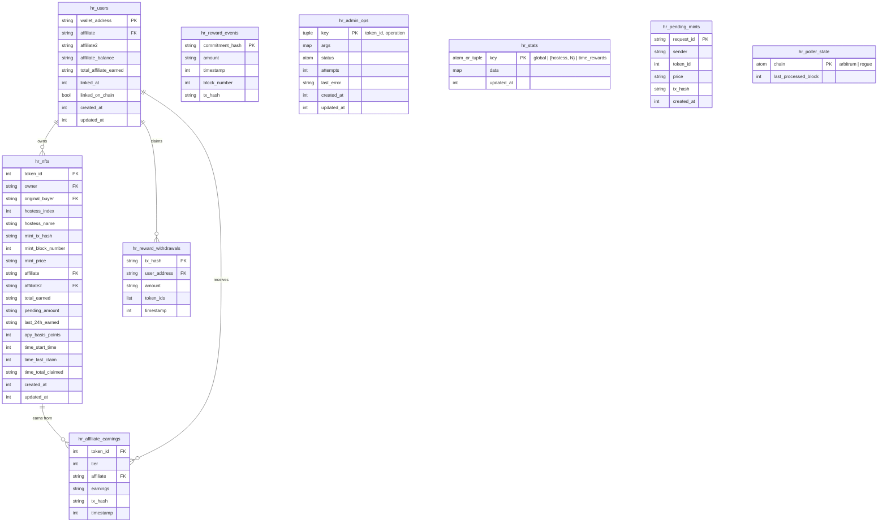

# High Rollers Elixir - Technical Planning Document

## Executive Summary

This document outlines the complete migration of the High Rollers NFT application from Node.js/SQLite to Elixir/Phoenix LiveView/Mnesia. The goal is to replicate all existing functionality while eliminating the data inconsistencies and real-time update reliability issues present in the Node.js implementation.

**Key Improvements Over Node.js Version:**
1. **Single Source of Truth**: Mnesia replaces SQLite with distributed, in-memory database
2. **Native Real-Time**: Phoenix LiveView replaces WebSocket + REST API with unified real-time updates
3. **Simplified Architecture**: No separate WebSocket server, REST routes, or polling services
4. **Cluster-Ready**: Mnesia replication across Fly.io nodes built-in
5. **Hot Code Reloading**: No server restarts needed for most code changes

---

## Current Node.js Architecture (Reference)

### Services Overview (What We're Replacing)

| Node.js Service | Purpose | Elixir Replacement |
|-----------------|---------|-------------------|
| `eventListener.js` | Poll Arbitrum for NFT events | `ArbitrumEventPoller` GenServer |
| `rewardEventListener.js` | Poll Rogue Chain for reward events | `RogueRewardPoller` GenServer |
| `earningsSyncService.js` | Batch sync NFT earnings from contract | `EarningsSyncer` GenServer |
| `timeRewardTracker.js` | Calculate time-based rewards | Pure functions in `TimeRewards` module |
| `ownerSync.js` | Sync NFT ownership from Arbitrum | N/A - handled by `ArbitrumEventPoller` backfill |
| `priceService.js` | Poll prices from Blockster/CoinGecko | Use existing `PriceTracker` in Blockster |
| `adminTxQueue.js` | Serialize admin wallet transactions | `AdminTxQueue` GenServer |
| `database.js` | SQLite database operations | Mnesia tables + helper modules |
| `websocket.js` | WebSocket broadcast server | Phoenix PubSub (built-in) |
| REST API routes | HTTP endpoints | Phoenix LiveView (no REST needed) |

### Current Node.js Data Flow Problems

1. **Multiple Sources of Truth**: SQLite + contract state + in-memory cache all diverge
2. **Race Conditions**: Multiple services write to same tables without coordination
3. **Polling Overlap**: EventListener and OwnerSync both poll for the same data
4. **WebSocket Unreliability**: Broadcasts can fail silently, no retry mechanism
5. **Stale Data**: Cached values not invalidated when underlying data changes

---

## Elixir Architecture Overview

### Application Structure

```
high_rollers/
├── lib/
│   ├── high_rollers/
│   │   ├── application.ex              # Supervision tree
│   │   ├── mnesia_initializer.ex       # Table creation/migration
│   │   │
│   │   ├── # ===== BLOCKCHAIN POLLERS =====
│   │   ├── arbitrum_event_poller.ex    # Poll Arbitrum NFT contract
│   │   ├── rogue_reward_poller.ex      # Poll NFTRewarder on Rogue Chain
│   │   │
│   │   ├── # ===== BACKGROUND SERVICES =====
│   │   ├── earnings_syncer.ex          # Sync earnings from contract
│   │   ├── admin_tx_queue.ex           # Serialize admin wallet transactions
│   │   │
│   │   ├── # ===== PURE CALCULATION MODULES =====
│   │   ├── time_rewards.ex             # Time-based reward calculations
│   │   ├── earnings.ex                 # Revenue sharing calculations
│   │   ├── hostess.ex                  # Hostess metadata and multipliers
│   │   │
│   │   ├── # ===== DATA ACCESS =====
│   │   ├── rewards.ex                  # Reward events Mnesia operations
│   │   ├── sales.ex                    # Sales/affiliates Mnesia operations
│   │   │
│   │   └── # ===== ETHEREUM INTEGRATION =====
│   │       └── contracts/
│   │           ├── nft_contract.ex     # Arbitrum NFT contract calls
│   │           └── nft_rewarder.ex     # Rogue Chain NFTRewarder calls
│   │
│   └── high_rollers_web/
│       ├── live/
│       │   ├── mint_live.ex            # NFT gallery + mint UI
│       │   ├── my_nfts_live.ex         # User's NFTs + earnings
│       │   ├── revenues_live.ex        # Revenue sharing stats
│       │   ├── affiliates_live.ex      # Affiliate program UI
│       │   └── components/
│       │       ├── nft_card.ex         # NFT display component
│       │       ├── earnings_box.ex     # Earnings display
│       │       └── hostess_stats.ex    # Per-hostess statistics
│       │
│       ├── templates/                  # Minimal - most in LiveView
│       └── router.ex
│
├── config/
│   ├── config.exs
│   ├── dev.exs
│   ├── prod.exs
│   └── runtime.exs                     # Mnesia directory, env vars
│
└── priv/
    └── mnesia/                         # Dev Mnesia data (gitignored)
```

### Supervision Tree

```elixir
defmodule HighRollers.Application do
  use Application

  @impl true
  def start(_type, _args) do
    # Add libcluster only in dev mode (production uses DNSCluster)
    libcluster_child =
      if Application.get_env(:high_rollers, :env) == :dev do
        [{Cluster.Supervisor, [Application.get_env(:libcluster, :topologies, []), [name: HighRollers.ClusterSupervisor]]}]
      else
        []
      end

    children = [
      # 1. Telemetry first
      HighRollersWeb.Telemetry,

      # 2. HTTP client pool (before anything that makes HTTP calls)
      {Finch, name: HighRollers.Finch},

      # 3. Cluster discovery (DNSCluster for prod, libcluster for dev)
      {DNSCluster, query: Application.get_env(:high_rollers, :dns_cluster_query) || :ignore},

      # 4. PubSub for real-time updates (before anything that broadcasts)
      {Phoenix.PubSub, name: HighRollers.PubSub}
    ] ++ libcluster_child ++ [
      # 5. Mnesia initialization (after cluster discovery so nodes are connected)
      {HighRollers.MnesiaInitializer, []},

      # 6. Write serializer (after Mnesia, before anything that writes)
      # CRITICAL: Prevents race conditions on hr_nfts table with multiple writers
      {HighRollers.NFTStore, []},           # Serializes hr_nfts writes (including earnings + time rewards)

      # 7. Admin transaction queue (global singleton)
      {HighRollers.AdminTxQueue, []},

      # 8. Blockchain pollers (use NFTStore for writes)
      {HighRollers.ArbitrumEventPoller, []},
      {HighRollers.RogueRewardPoller, []},

      # 9. Background sync services
      {HighRollers.EarningsSyncer, []},         # Syncs earnings from contract every 60s
      {HighRollers.OwnershipReconciler, []},    # Reconciles ownership every 5 min (global singleton)

      # 10. Phoenix endpoint last
      HighRollersWeb.Endpoint
    ]

    opts = [strategy: :one_for_one, name: HighRollers.Supervisor]
    Supervisor.start_link(children, opts)
  end
end
```

---

## Mnesia Tables

### Consistency Model: Eventual Consistency with Blockchain as Source of Truth

**CRITICAL**: Mnesia is a **cache**, not the source of truth. The blockchain contracts are authoritative:

| Data | Source of Truth | Mnesia Cache | Sync Mechanism |
|------|-----------------|--------------|----------------|
| NFT ownership | Arbitrum NFT Contract | `hr_nfts.owner` | ArbitrumEventPoller (Transfer events) |
| NFT existence | Arbitrum NFT Contract | `hr_nfts` | ArbitrumEventPoller (NFTMinted events) |
| Revenue earnings | Rogue NFTRewarder | `hr_nfts.total_earned/pending_amount` | EarningsSyncer (every 60s) |
| Time reward claims | Rogue NFTRewarder | `hr_nfts.time_last_claim` | EarningsSyncer (every 60s) |
| NFT registration | Rogue NFTRewarder | (no cache) | AdminTxQueue (on mint/transfer) |

**Consistency Guarantees**:
1. **ArbitrumEventPoller never misses events** - persists `last_processed_block`, backfills from deploy block on first run
2. **EarningsSyncer corrects drift every 60 seconds** - re-syncs earnings and claim times from contract
3. **UI shows cached data** - may be up to 60 seconds stale for earnings, but near-instant for ownership

### Cross-Table Data Dependencies

**ELIMINATED BY TABLE OPTIMIZATION**: With the unified `hr_nfts` table, there are no longer cross-table sync issues:

| Old Problem | Old Tables | Solution |
|-------------|-----------|----------|
| Owner sync on transfer | `hr_nfts` + `hr_time_rewards` | Single `owner` field in `hr_nfts` |
| Missing earnings record | `hr_nfts` + `hr_nft_earnings` | Earnings fields default to "0" in `hr_nfts` |
| Duplicate hostess data | `hr_nfts` + `hr_time_rewards` | Single `hostess_index` field |

Transfer events now only update ONE record in `hr_nfts` - no multi-table coordination needed.

### Eventual Consistency Gaps

With the optimized schema, most consistency gaps are eliminated:

| Gap | Duration | Impact | Resolution |
|-----|----------|--------|------------|
| ~~New NFT has no earnings record~~ | ~~Up to 60s~~ | **ELIMINATED** | Earnings fields default to "0" in unified hr_nfts |
| Earnings amounts stale | Up to 60s | UI shows old pending/total amounts | EarningsSyncer refreshes from contract |
| NFT registered in Mnesia but not NFTRewarder | Until AdminTxQueue succeeds (max ~7s with retries) | NFT visible but earns no revenue | Persistent queue + retry + dead letter |
| Ownership mismatch Mnesia vs NFTRewarder | Until AdminTxQueue succeeds or OwnershipReconciler runs (max 5 min) | User sees NFT but can't withdraw earnings | OwnershipReconciler auto-corrects |

**UI Handling**: Earnings fields always exist with default "0" values - no nil checks needed.

### Cross-Chain Sync Robustness

The system has **multiple layers of protection** to ensure NFTRewarder stays in sync with Arbitrum:

```
┌─────────────────────────────────────────────────────────────────────────────┐
│                        CROSS-CHAIN SYNC ARCHITECTURE                        │
└─────────────────────────────────────────────────────────────────────────────┘

     Arbitrum NFT Contract                    Rogue Chain NFTRewarder
     ═══════════════════                      ════════════════════════
              │                                         │
              ▼                                         │
     ArbitrumEventPoller                               │
     (polls every 1s)                                  │
              │                                         │
              ├──► hr_nfts (Mnesia)                    │
              │    [immediate, in-process]             │
              │                                         │
              └──► hr_pending_admin_ops (Mnesia)       │
                   [persistent, survives crash]        │
                            │                          │
                            ▼                          │
                      AdminTxQueue ──────────────────► updateOwnership()
                      (3 retries, exp backoff)         registerNFT()
                            │                          │
                    ┌───────┴───────┐                  │
                    │               │                  │
                    ▼               ▼                  │
               [success]    hr_dead_letter_ops        │
              (op deleted)  [manual review]           │
                                                       │
                            ▼                          │
                   OwnershipReconciler ◄───────────── getOwnersBatch()
                   (every 5 min)                       │
                            │                          │
                            └──► Detects mismatches, enqueues corrections
```

**Layer 1: Persistent Queue** (instant protection)
- `enqueue_register_nft()` and `enqueue_update_ownership()` write to Mnesia BEFORE returning
- Operation survives server crash, picked up on restart

**Layer 2: Retry with Backoff** (handles transient failures)
- 3 attempts: immediate → 1s → 2s → 4s
- Handles RPC timeouts, temporary network issues

**Layer 3: Dead Letter Queue** (handles persistent failures)
- Failed ops moved to `hr_dead_letter_ops` for manual review
- `retry_dead_letter(op_id)` function to retry manually

**Layer 4: Periodic Reconciliation** (catches everything else)
- OwnershipReconciler runs every 5 minutes
- Compares ALL NFTs in Mnesia against NFTRewarder contract
- Enqueues corrections for any mismatches
- Handles: missed events, partial failures, edge cases

### Design Principles

1. **Use `dirty_*` operations**: Transactions are ~10x slower and rarely needed
2. **Index frequently queried fields**: `:owner`, `:hostess_index`, `:timestamp`
3. **Append-only for events**: `reward_events`, `sales` tables never update records
4. **Use `disc_copies`**: All tables persist to disk for durability
5. **Serialize concurrent writes**: Route all updates to a table through a single GenServer when multiple processes could write to the same record

### Write Serialization Strategy

**CRITICAL**: To prevent race conditions, all updates to tables with concurrent writers are serialized:

| Table | Serializer GenServer | Writers Routed |
|-------|---------------------|----------------|
| `hr_nfts` | `NFTStore` | `ArbitrumEventPoller`, `EarningsSyncer` (ownership, earnings, time rewards) |

**Append-only tables** (no serialization needed - concurrent inserts are safe):
- `hr_reward_events` - only inserts, never updates
- `hr_reward_withdrawals` - only inserts, never updates
- `hr_affiliate_earnings` - only inserts, never updates

**Single-writer tables** (no serialization needed):
- `hr_stats` - only `EarningsSyncer` writes (compound key: :global | {:hostess, N} | :time_rewards)
- `hr_pending_mints` - only `ArbitrumEventPoller` writes
- `hr_users` - only `AffiliateController` writes

### Table Definitions

> **Note on Mnesia Indices**: The `indices` list specifies secondary indices that enable fast lookups via `dirty_index_read/3`.
> For example, `indices: [:owner]` allows `dirty_index_read(:hr_nfts, "0x123...", :owner)` to find all NFTs owned by that address.
> Without an index, you'd need `dirty_match_object` which scans the entire table.
> Indices use attribute names, not tuple positions. Mnesia handles position mapping internally.

### Table Optimization Summary

**Original**: 16 tables → **Optimized**: 9 tables (44% reduction)

| Removed | Merged Into | Reason |
|---------|-------------|--------|
| `hr_nft_earnings` | `hr_nfts` | Same primary key, always queried together |
| `hr_time_rewards` | `hr_nfts` | Subset of NFTs, eliminates owner sync issue |
| `hr_sales` | `hr_nfts` | 90% duplicate data |
| `hr_dead_letter_ops` | `hr_admin_ops` | Same structure, just different status |
| `hr_global_stats` | `hr_stats` | Single stats table with compound key |
| `hr_hostess_stats` | `hr_stats` | Single stats table with compound key |
| `hr_time_reward_stats` | `hr_stats` | Single stats table with compound key |
| `hr_buyer_affiliates` | `hr_users` | Unified user table with affiliate link |
| `hr_counters` | ❌ Removed | Use natural keys instead (commitment_hash, tx_hash, {token_id, op}) |

```elixir
defmodule HighRollers.MnesiaInitializer do
  @tables [
    # ===== NFT DATA (UNIFIED) =====
    # Combines: hr_nfts + hr_nft_earnings + hr_time_rewards + hr_sales
    # Single table for all NFT data - one read gets everything
    %{
      name: :hr_nfts,
      type: :set,
      attributes: [
        # === Core Identity ===
        :token_id,           # Primary key (integer 1-2342+)
        :owner,              # Current wallet address (string, indexed)
        :original_buyer,     # First owner at mint time (string, indexed) - never changes
        :hostess_index,      # 0-7 (integer, indexed)
        :hostess_name,       # "Penelope Fatale", etc. (string)

        # === Mint Data (formerly hr_sales) ===
        :mint_tx_hash,       # Arbitrum tx hash (string)
        :mint_block_number,  # Arbitrum block number (integer)
        :mint_price,         # Wei string
        :affiliate,          # Tier 1 affiliate address (string)
        :affiliate2,         # Tier 2 affiliate address (string)

        # === Revenue Share Earnings (formerly hr_nft_earnings, synced by EarningsSyncer) ===
        :total_earned,       # Wei string (from contract, default "0")
        :pending_amount,     # Wei string (from contract, default "0")
        :last_24h_earned,    # Wei string (calculated, default "0")
        :apy_basis_points,   # Integer (calculated, default 0)

        # === Time Rewards (formerly hr_time_rewards, only for tokens 2340-2700) ===
        :time_start_time,    # Unix timestamp when time rewards started (nil for regular NFTs)
        :time_last_claim,    # Unix timestamp of last claim (nil for regular NFTs)
        :time_total_claimed, # Total ROGUE claimed (Wei string, nil for regular NFTs)

        # === Timestamps ===
        :created_at,         # Unix timestamp (mint time)
        :updated_at          # Unix timestamp (last earnings sync)
      ],
      indices: [:owner, :original_buyer, :hostess_index]
    },

    # ===== REWARD EVENTS (Append-only log from RewardReceived events) =====
    # Keep separate - append-only history, different access pattern
    # Natural key: commitment_hash (unique bet ID from blockchain event)
    %{
      name: :hr_reward_events,
      type: :set,
      attributes: [
        :commitment_hash,    # Primary key - unique bet ID from RewardReceived event (string)
        :amount,             # Wei string
        :timestamp,          # Block timestamp (integer)
        :block_number,       # Block number (integer)
        :tx_hash             # Transaction hash (string)
      ],
      indices: [:timestamp]
    },

    # ===== REWARD WITHDRAWALS (User claims) =====
    # Keep separate - append-only history, different access pattern
    # Natural key: tx_hash (unique transaction hash)
    %{
      name: :hr_reward_withdrawals,
      type: :set,
      attributes: [
        :tx_hash,            # Primary key - unique transaction hash (string)
        :user_address,       # Wallet address (string, indexed)
        :amount,             # Wei string
        :token_ids,          # List of token IDs (list)
        :timestamp           # Unix timestamp
      ],
      indices: [:user_address]
    },

    # ===== USERS (Buyer-Affiliate Mapping) =====
    # Stores permanent buyer→affiliate link (first referrer wins)
    # Also tracks affiliate earnings balance for withdrawals
    # affiliate2 is derived: lookup affiliate's own affiliate record
    %{
      name: :hr_users,
      type: :set,
      attributes: [
        :wallet_address,     # Primary key - user's wallet (string, lowercase)
        :affiliate,          # Tier 1 affiliate address (string, indexed) - who referred this user
        :affiliate2,         # Tier 2 affiliate address (string) - who referred the affiliate (cached for efficiency)
        :affiliate_balance,  # Accumulated affiliate earnings in wei (string, default "0") - pending withdrawal
        :total_affiliate_earned, # Total affiliate earnings ever (string, default "0")
        :linked_at,          # Unix timestamp when affiliate was linked
        :linked_on_chain,    # Boolean - whether linkAffiliate() was called on contract
        :created_at,         # Unix timestamp
        :updated_at          # Unix timestamp
      ],
      indices: [:affiliate]
    },

    # ===== AFFILIATE EARNINGS =====
    # Keep separate - bag type allows multiple earnings per token_id
    # Each NFT mint creates one record per affiliate (tier 1 and/or tier 2)
    %{
      name: :hr_affiliate_earnings,
      type: :bag,            # Multiple earnings per token_id (one per tier)
      attributes: [
        :token_id,           # Token this earning is for (integer) - bag key
        :tier,               # 1 or 2 (integer)
        :affiliate,          # Affiliate address (string, indexed)
        :earnings,           # Wei string
        :tx_hash,            # Transaction hash (string)
        :timestamp           # Unix timestamp when earning occurred
      ],
      indices: [:affiliate]
    },

    # ===== PENDING MINTS (VRF waiting) =====
    # Keep separate - transient data, different lifecycle
    %{
      name: :hr_pending_mints,
      type: :set,
      attributes: [
        :request_id,         # Primary key (string)
        :sender,             # Wallet address (string)
        :token_id,           # Expected token ID (integer)
        :price,              # Wei string
        :tx_hash,            # Transaction hash (string)
        :created_at          # Unix timestamp
      ],
      indices: []
    },

    # ===== ADMIN OPERATIONS (UNIFIED) =====
    # Combines: hr_pending_admin_ops + hr_dead_letter_ops
    # Natural key: {token_id, operation} - only one pending op per NFT per operation type
    %{
      name: :hr_admin_ops,
      type: :set,
      attributes: [
        :key,                # Primary key: {token_id, operation} tuple (e.g., {1234, :register_nft})
        :args,               # Operation-specific args as map (e.g., %{hostess_index: 0, owner: "0x..."})
        :status,             # :pending | :processing | :failed | :dead_letter (atom, indexed)
        :attempts,           # Number of attempts so far (integer)
        :last_error,         # Last error message (string, nullable)
        :created_at,         # Unix timestamp
        :updated_at          # Unix timestamp
      ],
      indices: [:status]
      # Key is {token_id, operation}, so no separate token_id index needed
      # Query by token: :mnesia.dirty_read(:hr_admin_ops, {token_id, :register_nft})
      # Query by status: :mnesia.dirty_index_read(:hr_admin_ops, :pending, :status)
    },

    # ===== STATS (UNIFIED) =====
    # Combines: hr_global_stats + hr_hostess_stats + hr_time_reward_stats
    # Single table with compound key for all stats types
    %{
      name: :hr_stats,
      type: :set,
      attributes: [
        :key,                # Compound key: :global | {:hostess, 0-7} | :time_rewards (tuple/atom)
        :data,               # Map with type-specific fields (see below)
        :updated_at          # Unix timestamp
      ],
      indices: []
      # Key examples and their data maps:
      #
      # :global => %{
      #   total_rewards_received: "...",      # Wei string
      #   total_rewards_distributed: "...",   # Wei string
      #   rewards_last_24h: "...",            # Wei string
      #   overall_apy_basis_points: 0,        # Integer
      #   total_nfts: 2342,                   # Integer
      #   total_multiplier_points: 109430     # Integer
      # }
      #
      # {:hostess, 0} => %{                   # Penelope Fatale
      #   nft_count: 9,
      #   total_points: 900,                  # 9 * 100
      #   share_basis_points: 82,             # 0.82% of rewards
      #   last_24h_per_nft: "...",            # Wei string
      #   apy_basis_points: 0,
      #   special_nft_count: 5,               # How many are in 2340-2700 range
      #   time_24h_per_nft: "...",            # Wei string (time rewards)
      #   time_apy_basis_points: 0
      # }
      #
      # :time_rewards => %{
      #   pool_deposited: "...",              # Wei string
      #   pool_remaining: "...",              # Wei string
      #   pool_claimed: "...",                # Wei string
      #   nfts_started: 361                   # NFTs with active time rewards
      # }
    },

    # ===== POLLER STATE (Persisted block numbers for restart recovery) =====
    %{
      name: :hr_poller_state,
      type: :set,
      attributes: [
        :chain,              # Primary key: :arbitrum or :rogue (atom)
        :last_processed_block  # Block number (integer)
      ],
      indices: []
    }

    # NOTE: No hr_counters table needed - all tables use natural keys:
    # - hr_reward_events: commitment_hash (from blockchain event)
    # - hr_reward_withdrawals: tx_hash (from blockchain transaction)
    # - hr_admin_ops: {token_id, operation} tuple
  ]

  def tables, do: @tables
  def table_names, do: Enum.map(@tables, & &1.name)
end
```

---

## GenServer Implementations

### 1. ArbitrumEventPoller

**Purpose**: Poll Arbitrum blockchain for NFT contract events (NFTRequested, NFTMinted, Transfer)

**Replaces**: `eventListener.js` AND `ownerSync.js` (backfill logic eliminates need for OwnershipSyncer)

**Key Features**:
- **Uses GlobalSingleton** for cluster-wide single instance (prevents duplicate polling on multi-server deploy)
- Persists `last_processed_block` to Mnesia for restart recovery
- Backfills historical events from deploy block on first run
- Never misses events even if app is down for hours/days

```elixir
defmodule HighRollers.ArbitrumEventPoller do
  @moduledoc """
  Polls the Arbitrum NFT contract for events:
  - NFTRequested: New mint request (VRF pending)
  - NFTMinted: Mint completed
  - Transfer: Ownership changed

  Uses queryFilter polling (NOT WebSocket subscriptions) because Arbitrum
  RPC providers often drop WebSocket connections.

  Uses GlobalSingleton for cluster-wide single instance - only one node
  polls Arbitrum at a time, preventing duplicate RPC calls and events.

  Polls every 1 second for near-instant UI updates. GenServer state tracks
  `polling: true/false` to prevent overlapping polls - if a poll takes longer
  than 1 second, the next :poll message is skipped until the current completes.

  RESTART RECOVERY:
  - Persists last_processed_block to Mnesia after each poll
  - On restart, resumes from last_processed_block (not current block)
  - First run: backfills from contract deploy block

  This eliminates the need for a separate OwnershipSyncer - we never miss events.
  """
  use GenServer
  require Logger

  @poll_interval_ms 1_000  # 1 second - fast polling for real-time UI
  @max_blocks_per_query 1000
  @backfill_chunk_size 10_000
  @poller_state_table :hr_poller_state
  @deploy_block 150_000_000  # NFT contract deploy block on Arbitrum

  # ===== Client API =====

  def start_link(opts) do
    case HighRollers.GlobalSingleton.start_link(__MODULE__, opts) do
      {:ok, pid} -> {:ok, pid}
      {:already_registered, _pid} -> :ignore
    end
  end

  # ===== Server Callbacks =====

  @impl true
  def init(_opts) do
    # Load last processed block from Mnesia, or use deploy block for first run
    last_block = load_last_processed_block()

    {:ok, current_block} = get_current_block()

    state = %{
      last_processed_block: last_block,
      pending_mints: %{},  # request_id => %{sender, token_id, timestamp}
      polling: false       # Prevents overlapping polls
    }

    # Backfill any missed events (runs async to not block startup)
    if last_block < current_block do
      Logger.info("[ArbitrumEventPoller] Backfilling from block #{last_block} to #{current_block}")
      spawn(fn -> backfill_events(last_block, current_block) end)
    end

    # Start polling from current block (backfill handles historical)
    schedule_poll()

    Logger.info("[ArbitrumEventPoller] Started, last processed: #{last_block}, current: #{current_block}")
    {:ok, %{state | last_processed_block: current_block}}
  end

  @impl true
  def handle_info(:poll, %{polling: true} = state) do
    # Skip if already polling (prevents overlap)
    schedule_poll()
    {:noreply, state}
  end

  @impl true
  def handle_info(:poll, state) do
    state = %{state | polling: true}
    state = poll_events(state)
    state = %{state | polling: false}
    schedule_poll()
    {:noreply, state}
  end

  # ===== Private Functions =====

  defp schedule_poll do
    Process.send_after(self(), :poll, @poll_interval_ms)
  end

  defp load_last_processed_block do
    case :mnesia.dirty_read({@poller_state_table, :arbitrum}) do
      [{@poller_state_table, :arbitrum, block}] -> block
      [] -> @deploy_block  # First run: start from contract deploy
    end
  end

  defp save_last_processed_block(block) do
    :mnesia.dirty_write({@poller_state_table, :arbitrum, block})
  end

  defp poll_events(state) do
    case get_current_block() do
      {:ok, current_block} when current_block > state.last_processed_block ->
        from_block = state.last_processed_block + 1
        to_block = min(current_block, from_block + @max_blocks_per_query - 1)

        state =
          state
          |> poll_nft_requested_events(from_block, to_block)
          |> poll_nft_minted_events(from_block, to_block)
          |> poll_transfer_events(from_block, to_block)
          |> Map.put(:last_processed_block, to_block)

        # Persist to Mnesia after each successful poll
        save_last_processed_block(to_block)

        state

      _ ->
        state
    end
  end

  @doc """
  Backfill historical events from a starting block to current.
  Called on startup if we're behind, and processes events in chunks.
  """
  defp backfill_events(from_block, to_block) do
    Logger.info("[ArbitrumEventPoller] Starting backfill: #{from_block} -> #{to_block}")

    Enum.reduce_while(from_block..to_block//@backfill_chunk_size, 0, fn chunk_start, total ->
      chunk_end = min(chunk_start + @backfill_chunk_size - 1, to_block)

      # Process all event types for this chunk
      poll_nft_requested_events_backfill(chunk_start, chunk_end)
      poll_nft_minted_events_backfill(chunk_start, chunk_end)
      poll_transfer_events_backfill(chunk_start, chunk_end)

      # Save progress
      save_last_processed_block(chunk_end)

      new_total = total + (chunk_end - chunk_start + 1)
      Logger.info("[ArbitrumEventPoller] Backfill progress: #{new_total} blocks processed")

      # Rate limiting
      Process.sleep(200)

      if chunk_end >= to_block do
        {:halt, new_total}
      else
        {:cont, new_total}
      end
    end)

    Logger.info("[ArbitrumEventPoller] Backfill complete")
  end

  defp poll_nft_requested_events_backfill(from_block, to_block) do
    case HighRollers.Contracts.NFTContract.get_nft_requested_events(from_block, to_block) do
      {:ok, events} ->
        Enum.each(events, fn event ->
          # During backfill, just insert pending mint records
          HighRollers.NFTStore.insert_pending_mint(%{
            request_id: event.request_id,
            sender: event.sender,
            token_id: event.token_id,
            price: event.price,
            tx_hash: event.tx_hash
          })
        end)

      {:error, reason} ->
        Logger.warning("[ArbitrumEventPoller] Backfill NFTRequested error: #{inspect(reason)}")
    end
  end

  defp poll_nft_minted_events_backfill(from_block, to_block) do
    case HighRollers.Contracts.NFTContract.get_nft_minted_events(from_block, to_block) do
      {:ok, events} ->
        Enum.each(events, &handle_nft_minted/1)

      {:error, reason} ->
        Logger.warning("[ArbitrumEventPoller] Backfill NFTMinted error: #{inspect(reason)}")
    end
  end

  defp poll_transfer_events_backfill(from_block, to_block) do
    case HighRollers.Contracts.NFTContract.get_transfer_events(from_block, to_block) do
      {:ok, events} ->
        events
        |> Enum.reject(&(&1.from == "0x0000000000000000000000000000000000000000"))
        |> Enum.each(fn event ->
          # During backfill, only update local ownership (don't spam NFTRewarder)
          HighRollers.NFTStore.update_owner(event.token_id, event.to)
        end)

      {:error, reason} ->
        Logger.warning("[ArbitrumEventPoller] Backfill Transfer error: #{inspect(reason)}")
    end
  end

  defp poll_nft_requested_events(state, from_block, to_block) do
    case HighRollers.Contracts.NFTContract.get_nft_requested_events(from_block, to_block) do
      {:ok, events} ->
        Enum.reduce(events, state, fn event, acc ->
          handle_nft_requested(event, acc)
        end)

      {:error, reason} ->
        Logger.warning("[ArbitrumEventPoller] NFTRequested poll error: #{inspect(reason)}")
        state
    end
  end

  defp poll_nft_minted_events(state, from_block, to_block) do
    case HighRollers.Contracts.NFTContract.get_nft_minted_events(from_block, to_block) do
      {:ok, events} ->
        Enum.each(events, &handle_nft_minted/1)
        # Remove from pending_mints
        request_ids = Enum.map(events, & &1.request_id)
        update_in(state.pending_mints, &Map.drop(&1, request_ids))

      {:error, reason} ->
        Logger.warning("[ArbitrumEventPoller] NFTMinted poll error: #{inspect(reason)}")
        state
    end
  end

  defp poll_transfer_events(state, from_block, to_block) do
    case HighRollers.Contracts.NFTContract.get_transfer_events(from_block, to_block) do
      {:ok, events} ->
        # Filter out mint transfers (from = zero address)
        events
        |> Enum.reject(&(&1.from == "0x0000000000000000000000000000000000000000"))
        |> Enum.each(&handle_transfer/1)

      {:error, reason} ->
        Logger.warning("[ArbitrumEventPoller] Transfer poll error: #{inspect(reason)}")
    end

    state
  end

  defp handle_nft_requested(event, state) do
    Logger.info("[ArbitrumEventPoller] NFTRequested: requestId=#{event.request_id}, sender=#{event.sender}")

    # Store pending mint
    HighRollers.NFTStore.insert_pending_mint(%{
      request_id: event.request_id,
      sender: event.sender,
      token_id: event.token_id,
      price: event.price,
      tx_hash: event.tx_hash
    })

    # Broadcast to LiveViews
    Phoenix.PubSub.broadcast(HighRollers.PubSub, "nft_events", {:mint_requested, event})

    # Track in state for fallback polling
    put_in(state.pending_mints[event.request_id], %{
      sender: event.sender,
      token_id: event.token_id,
      timestamp: System.system_time(:second)
    })
  end

  defp handle_nft_minted(event) do
    Logger.info("[ArbitrumEventPoller] NFTMinted: tokenId=#{event.token_id}, hostess=#{event.hostess_index}")

    # Delete pending mint
    HighRollers.NFTStore.delete_pending_mint(event.request_id)

    # Insert NFT record
    hostess = HighRollers.Hostess.get(event.hostess_index)

    HighRollers.NFTStore.upsert(%{
      token_id: event.token_id,
      owner: event.recipient,
      hostess_index: event.hostess_index,
      hostess_name: hostess.name,
      mint_tx_hash: event.tx_hash,
      mint_price: event.price,
      affiliate: event.affiliate,
      affiliate2: event.affiliate2
    })

    # Insert sale record
    HighRollers.Sales.insert(%{
      token_id: event.token_id,
      buyer: event.recipient,
      hostess_index: event.hostess_index,
      hostess_name: hostess.name,
      price: event.price,
      tx_hash: event.tx_hash,
      block_number: event.block_number,
      affiliate: event.affiliate,
      affiliate2: event.affiliate2
    })

    # Insert affiliate earnings if applicable
    if event.affiliate && event.affiliate != "0x0000000000000000000000000000000000000000" do
      tier1_earnings = div(String.to_integer(event.price), 5)  # 20%
      HighRollers.Sales.insert_affiliate_earning(%{
        token_id: event.token_id,
        tier: 1,
        affiliate: event.affiliate,
        earnings: Integer.to_string(tier1_earnings),
        tx_hash: event.tx_hash
      })
    end

    if event.affiliate2 && event.affiliate2 != "0x0000000000000000000000000000000000000000" do
      tier2_earnings = div(String.to_integer(event.price), 20)  # 5%
      HighRollers.Sales.insert_affiliate_earning(%{
        token_id: event.token_id,
        tier: 2,
        affiliate: event.affiliate2,
        earnings: Integer.to_string(tier2_earnings),
        tx_hash: event.tx_hash
      })
    end

    # Register NFT in NFTRewarder on Rogue Chain (persistent queue with retry)
    # This writes to hr_pending_admin_ops BEFORE returning, guaranteeing the operation
    # survives server crashes. AdminTxQueue processes it with exponential backoff retry.
    HighRollers.AdminTxQueue.enqueue_register_nft(event.token_id, event.hostess_index, event.recipient)

    # Broadcast to all LiveViews subscribed to nft_events
    Phoenix.PubSub.broadcast(HighRollers.PubSub, "nft_events", {:nft_minted, event})

    # Broadcast to specific affiliate's LiveView for real-time earnings update
    if event.affiliate && event.affiliate != "0x0000000000000000000000000000000000000000" do
      tier1_earnings = div(String.to_integer(event.price), 5)  # 20%
      Phoenix.PubSub.broadcast(
        HighRollers.PubSub,
        "affiliate:#{String.downcase(event.affiliate)}",
        {:affiliate_earning, %{token_id: event.token_id, tier: 1, earnings: tier1_earnings}}
      )
    end

    if event.affiliate2 && event.affiliate2 != "0x0000000000000000000000000000000000000000" do
      tier2_earnings = div(String.to_integer(event.price), 20)  # 5%
      Phoenix.PubSub.broadcast(
        HighRollers.PubSub,
        "affiliate:#{String.downcase(event.affiliate2)}",
        {:affiliate_earning, %{token_id: event.token_id, tier: 2, earnings: tier2_earnings}}
      )
    end
  end

  defp handle_transfer(event) do
    Logger.info("[ArbitrumEventPoller] Transfer: tokenId=#{event.token_id}, to=#{event.to}")

    # Update local ownership in hr_nfts table
    # Update owner in unified hr_nfts table (includes time reward data for special NFTs)
    HighRollers.NFTStore.update_owner(event.token_id, event.to)

    # Update ownership on Rogue Chain (persistent queue with retry)
    # This writes to hr_pending_admin_ops BEFORE returning, guaranteeing the operation
    # survives server crashes. AdminTxQueue processes it with exponential backoff retry.
    HighRollers.AdminTxQueue.enqueue_update_ownership(event.token_id, event.to)

    # Broadcast to LiveViews
    Phoenix.PubSub.broadcast(HighRollers.PubSub, "nft_events", {:nft_transferred, event})
  end

  defp get_current_block do
    HighRollers.Contracts.NFTContract.get_block_number()
  end
end
```

### 2. RogueRewardPoller

**Purpose**: Poll NFTRewarder contract on Rogue Chain for RewardReceived and RewardClaimed events

**Replaces**: `rewardEventListener.js`

**Key Features**:
- **Uses GlobalSingleton** for cluster-wide single instance (prevents duplicate polling on multi-server deploy)
- Persists `last_processed_block` to Mnesia for restart recovery
- Backfills historical events from deploy block on first run

```elixir
defmodule HighRollers.RogueRewardPoller do
  @moduledoc """
  Polls the NFTRewarder contract on Rogue Chain for:
  - RewardReceived: When ROGUEBankroll sends rewards after losing bets
  - RewardClaimed: When users withdraw their pending rewards

  Uses GlobalSingleton for cluster-wide single instance - only one node
  polls Rogue Chain at a time, preventing duplicate RPC calls and events.

  Polls every 1 second for near-instant UI updates. GenServer state tracks
  `polling: true/false` to prevent overlapping polls - if a poll takes longer
  than 1 second, the next :poll message is skipped until the current completes.

  RESTART RECOVERY:
  - Persists last_processed_block to Mnesia after each poll
  - On restart, resumes from last_processed_block (not current block)
  - First run: backfills from NFTRewarder deploy block
  """
  use GenServer
  require Logger

  @poll_interval_ms 1_000  # 1 second - fast polling for real-time UI
  @max_blocks_per_query 5000  # Rogue Chain is faster, can query more blocks
  @backfill_chunk_size 10_000
  @poller_state_table :hr_poller_state
  @deploy_block 109_350_000  # NFTRewarder deploy block on Rogue Chain

  def start_link(opts) do
    case HighRollers.GlobalSingleton.start_link(__MODULE__, opts) do
      {:ok, pid} -> {:ok, pid}
      {:already_registered, _pid} -> :ignore
    end
  end

  @impl true
  def init(_opts) do
    {:ok, current_block} = HighRollers.Contracts.NFTRewarder.get_block_number()

    state = %{
      last_processed_block: current_block
    }

    # Backfill historical events on startup
    spawn(fn -> backfill_historical_events(current_block) end)

    schedule_poll()

    Logger.info("[RogueRewardPoller] Started from block #{current_block}")
    {:ok, state}
  end

  @impl true
  def handle_info(:poll, state) do
    state = poll_events(state)
    schedule_poll()
    {:noreply, state}
  end

  defp schedule_poll do
    Process.send_after(self(), :poll, @poll_interval_ms)
  end

  defp poll_events(state) do
    case HighRollers.Contracts.NFTRewarder.get_block_number() do
      {:ok, current_block} when current_block > state.last_processed_block ->
        from_block = state.last_processed_block + 1
        to_block = current_block

        poll_reward_received_events(from_block, to_block)
        poll_reward_claimed_events(from_block, to_block)

        %{state | last_processed_block: to_block}

      _ ->
        state
    end
  end

  defp poll_reward_received_events(from_block, to_block) do
    case HighRollers.Contracts.NFTRewarder.get_reward_received_events(from_block, to_block) do
      {:ok, events} ->
        Enum.each(events, fn event ->
          Logger.info("[RogueRewardPoller] RewardReceived: #{format_rogue(event.amount)} ROGUE")

          # Store in database
          HighRollers.Rewards.insert_event(%{
            commitment_hash: event.bet_id,
            amount: event.amount,
            timestamp: event.timestamp,
            block_number: event.block_number,
            tx_hash: event.tx_hash
          })

          # Broadcast to LiveViews
          Phoenix.PubSub.broadcast(HighRollers.PubSub, "reward_events", {:reward_received, event})
        end)

      {:error, reason} ->
        Logger.warning("[RogueRewardPoller] RewardReceived poll error: #{inspect(reason)}")
    end
  end

  defp poll_reward_claimed_events(from_block, to_block) do
    case HighRollers.Contracts.NFTRewarder.get_reward_claimed_events(from_block, to_block) do
      {:ok, events} ->
        Enum.each(events, fn event ->
          Logger.info("[RogueRewardPoller] RewardClaimed: #{format_rogue(event.amount)} ROGUE to #{short_address(event.user)}")

          # Record withdrawal
          HighRollers.Rewards.record_withdrawal(%{
            user_address: event.user,
            amount: event.amount,
            token_ids: Jason.encode!(event.token_ids),
            tx_hash: event.tx_hash
          })

          # Reset pending for claimed NFTs (EarningsSyncer will update on next sync)
          Enum.each(event.token_ids, &HighRollers.Rewards.reset_nft_pending/1)

          # Broadcast to LiveViews
          Phoenix.PubSub.broadcast(HighRollers.PubSub, "reward_events", {:reward_claimed, event})
        end)

      {:error, reason} ->
        Logger.warning("[RogueRewardPoller] RewardClaimed poll error: #{inspect(reason)}")
    end
  end

  defp backfill_historical_events(current_block) do
    # NFTRewarder deployed around block 109350000
    deploy_block = 109_350_000

    Logger.info("[RogueRewardPoller] Backfilling historical events from block #{deploy_block}")

    Enum.reduce_while(deploy_block..current_block//@backfill_chunk_size, 0, fn chunk_start, total ->
      chunk_end = min(chunk_start + @backfill_chunk_size - 1, current_block)

      case HighRollers.Contracts.NFTRewarder.get_reward_received_events(chunk_start, chunk_end) do
        {:ok, events} ->
          Enum.each(events, fn event ->
            HighRollers.Rewards.insert_event(%{
              commitment_hash: event.bet_id,
              amount: event.amount,
              timestamp: event.timestamp,
              block_number: event.block_number,
              tx_hash: event.tx_hash
            })
          end)

          new_total = total + length(events)

          if chunk_end >= current_block do
            Logger.info("[RogueRewardPoller] Backfill complete: #{new_total} events")
            {:halt, new_total}
          else
            Process.sleep(100)  # Rate limiting
            {:cont, new_total}
          end

        {:error, _} ->
          {:cont, total}
      end
    end)
  end

  defp format_rogue(wei_string) do
    wei = String.to_integer(wei_string)
    Float.round(wei / 1.0e18, 2)
  end

  defp short_address(address), do: String.slice(address, 0, 10) <> "..."
end
```

### 3. EarningsSyncer

**Purpose**: Batch sync NFT earnings from contract and calculate 24h/APY metrics

**Replaces**: `earningsSyncService.js`

**Key Features**:
- **Uses GlobalSingleton** for cluster-wide single instance (prevents duplicate syncs on multi-server deploy)
- 24h earnings per NFT is proportional to global 24h × (nft_multiplier / total_points). This is O(1) calculation, not O(n) contract queries.

```elixir
defmodule HighRollers.EarningsSyncer do
  @moduledoc """
  Background service to sync NFT earnings from NFTRewarder contract.

  Contract provides: totalEarned, pendingAmount per NFT
  Server calculates: last24h (from reward_events), APY (from 24h and NFT value)

  Key optimization: 24h earnings per NFT is proportional to global 24h:
    nft_24h = global_24h × (nft_multiplier / total_multiplier_points)

  This is O(1) - one query for global 24h, then simple multiplication per NFT.

  Uses GlobalSingleton for cluster-wide single instance.
  """
  use GenServer
  require Logger

  @sync_interval_ms 60_000  # 60 seconds
  @batch_size 100

  @multipliers [100, 90, 80, 70, 60, 50, 40, 30]  # Index 0-7

  def start_link(opts) do
    case HighRollers.GlobalSingleton.start_link(__MODULE__, opts) do
      {:ok, pid} -> {:ok, pid}
      {:already_registered, _pid} -> :ignore
    end
  end

  @impl true
  def init(_opts) do
    # Initial sync
    spawn(fn -> sync_all_nft_earnings() end)

    schedule_sync()

    Logger.info("[EarningsSyncer] Started")
    {:ok, %{syncing: false}}
  end

  @impl true
  def handle_info(:sync, %{syncing: true} = state) do
    # Skip if already syncing (prevents overlap)
    schedule_sync()
    {:noreply, state}
  end

  @impl true
  def handle_info(:sync, state) do
    state = %{state | syncing: true}
    spawn(fn ->
      sync_all_nft_earnings()
      send(self(), :sync_complete)
    end)
    schedule_sync()
    {:noreply, state}
  end

  @impl true
  def handle_info(:sync_complete, state) do
    {:noreply, %{state | syncing: false}}
  end

  defp schedule_sync do
    Process.send_after(self(), :sync, @sync_interval_ms)
  end

  defp sync_all_nft_earnings do
    all_nfts = HighRollers.NFTStore.get_all()
    total = length(all_nfts)

    if total == 0 do
      Logger.info("[EarningsSyncer] No NFTs to sync")
      return
    end

    # Step 1: Get global 24h rewards ONCE
    one_day_ago = System.system_time(:second) - 86400
    global_24h_wei = HighRollers.Rewards.get_rewards_since(one_day_ago) || 0
    total_multiplier_points = HighRollers.NFTStore.get_total_multiplier_points() || 109_390

    # Get NFT value for APY calculation
    nft_value_in_rogue_wei = get_nft_value_in_rogue_wei()

    Logger.info("[EarningsSyncer] Syncing #{total} NFTs, global 24h: #{format_rogue(global_24h_wei)} ROGUE")

    # Step 2: Batch query contract for on-chain earnings
    all_nfts
    |> Enum.chunk_every(@batch_size)
    |> Enum.each(fn batch ->
      token_ids = Enum.map(batch, & &1.token_id)

      case HighRollers.Contracts.NFTRewarder.get_batch_nft_earnings(token_ids) do
        {:ok, %{total_earned: earned_arr, pending_amounts: pending_arr, hostess_indices: hostess_arr}} ->
          # Step 3: Calculate off-chain metrics for each NFT
          Enum.zip([token_ids, earned_arr, pending_arr, hostess_arr])
          |> Enum.each(fn {token_id, total_earned, pending_amount, hostess_index} ->
            multiplier = Enum.at(@multipliers, hostess_index, 30)

            # Proportional 24h share
            last_24h_earned =
              if total_multiplier_points > 0 do
                div(global_24h_wei * multiplier, total_multiplier_points)
              else
                0
              end

            # APY in basis points
            apy_basis_points =
              if nft_value_in_rogue_wei > 0 do
                annual_projection = last_24h_earned * 365
                div(annual_projection * 10000, nft_value_in_rogue_wei)
              else
                0
              end

            # Update Mnesia
            HighRollers.Rewards.update_nft_earnings(token_id, %{
              total_earned: Integer.to_string(total_earned),
              pending_amount: Integer.to_string(pending_amount),
              last_24h_earned: Integer.to_string(last_24h_earned),
              apy_basis_points: apy_basis_points
            })
          end)

        {:error, reason} ->
          Logger.warning("[EarningsSyncer] Batch failed: #{inspect(reason)}")
      end

      # Rate limiting
      Process.sleep(200)
    end)

    # Sync time reward last_claim_time from contract (backup for missed events)
    sync_time_reward_claim_times()

    # Update global and hostess stats
    sync_global_stats(global_24h_wei, nft_value_in_rogue_wei)
    sync_hostess_stats(global_24h_wei, total_multiplier_points, nft_value_in_rogue_wei)

    # Broadcast sync complete
    stats = HighRollers.Rewards.get_global_stats()
    Phoenix.PubSub.broadcast(HighRollers.PubSub, "earnings_events", {:earnings_synced, stats})

    Logger.info("[EarningsSyncer] Sync complete")
  end

  @doc """
  Sync time reward last_claim_time from contract.

  This serves as a backup mechanism to ensure Mnesia stays in sync with the
  contract's authoritative last_claim_time. If RogueRewardPoller misses a
  RewardClaimed event (due to crash, network issue, etc.), this will correct it.

  Only syncs special NFTs (token IDs 2340-2700) that have time rewards.
  """
  defp sync_time_reward_claim_times do
    # Get special NFTs (2340-2700) from unified hr_nfts table
    special_nfts = HighRollers.NFTStore.get_special_nfts_by_owner(nil)  # All special NFTs

    if Enum.empty?(special_nfts) do
      :ok
    else
      Logger.info("[EarningsSyncer] Syncing time reward claim times for #{length(special_nfts)} special NFTs")

      special_nfts
      |> Enum.chunk_every(50)  # Smaller batches for time reward queries
      |> Enum.each(fn batch ->
        Enum.each(batch, fn nft ->
          case HighRollers.Contracts.NFTRewarder.get_time_reward_info(nft.token_id) do
            {:ok, info} ->
              # Only update if contract has newer data
              contract_last_claim = info.last_claim_time
              mnesia_last_claim = nft.time_last_claim || 0

              if contract_last_claim > mnesia_last_claim do
                Logger.info("[EarningsSyncer] Updating time_last_claim for token #{nft.token_id}: #{mnesia_last_claim} -> #{contract_last_claim}")

                # Update time reward fields in unified hr_nfts table via NFTStore
                HighRollers.NFTStore.update_time_reward(nft.token_id, %{
                  time_last_claim: contract_last_claim,
                  time_total_claimed: Integer.to_string(trunc(info.total_claimed))
                })
              end

            {:error, reason} ->
              Logger.warning("[EarningsSyncer] Failed to get time reward info for token #{nft.token_id}: #{inspect(reason)}")
          end
        end)

        # Rate limiting
        Process.sleep(100)
      end)
    end
  end

  defp sync_global_stats(global_24h_wei, nft_value_in_rogue_wei) do
    {:ok, totals} = HighRollers.Contracts.NFTRewarder.get_global_totals()

    total_nfts = HighRollers.NFTStore.count()
    total_multiplier_points = HighRollers.NFTStore.get_total_multiplier_points()

    # Overall APY (average across all NFTs)
    overall_apy =
      if nft_value_in_rogue_wei > 0 and total_nfts > 0 do
        avg_24h_per_nft = div(global_24h_wei, total_nfts)
        annual = avg_24h_per_nft * 365
        div(annual * 10000, nft_value_in_rogue_wei)
      else
        0
      end

    HighRollers.Rewards.update_global_stats(%{
      total_rewards_received: Integer.to_string(totals.total_received),
      total_rewards_distributed: Integer.to_string(totals.total_distributed),
      rewards_last_24h: Integer.to_string(global_24h_wei),
      overall_apy_basis_points: overall_apy,
      total_nfts: total_nfts,
      total_multiplier_points: total_multiplier_points
    })
  end

  defp sync_hostess_stats(global_24h_wei, total_multiplier_points, nft_value_in_rogue_wei) do
    for hostess_index <- 0..7 do
      multiplier = Enum.at(@multipliers, hostess_index, 30)
      nft_count = HighRollers.NFTStore.count_by_hostess(hostess_index)
      total_points = nft_count * multiplier

      share_basis_points =
        if total_multiplier_points > 0 do
          div(total_points * 10000, total_multiplier_points)
        else
          0
        end

      # Revenue 24h per NFT
      last_24h_per_nft =
        if total_multiplier_points > 0 do
          div(global_24h_wei * multiplier, total_multiplier_points)
        else
          0
        end

      # Revenue APY
      apy_basis_points =
        if nft_value_in_rogue_wei > 0 do
          annual = last_24h_per_nft * 365
          div(annual * 10000, nft_value_in_rogue_wei)
        else
          0
        end

      # Time rewards (for special NFTs)
      special_nft_count = HighRollers.NFTStore.count_special_by_hostess(hostess_index)
      {time_24h_per_nft, time_apy_basis_points} =
        if special_nft_count > 0 do
          HighRollers.TimeRewards.calculate_hostess_time_stats(hostess_index, nft_value_in_rogue_wei)
        else
          {0, 0}
        end

      HighRollers.Rewards.update_hostess_stats(hostess_index, %{
        nft_count: nft_count,
        total_points: total_points,
        share_basis_points: share_basis_points,
        last_24h_per_nft: Integer.to_string(last_24h_per_nft),
        apy_basis_points: apy_basis_points,
        time_24h_per_nft: Integer.to_string(time_24h_per_nft),
        time_apy_basis_points: time_apy_basis_points,
        special_nft_count: special_nft_count
      })
    end
  end

  defp get_nft_value_in_rogue_wei do
    # Get prices from Blockster's PriceTracker (already running)
    case BlocksterV2.PriceTracker.get_price("ROGUE") do
      {:ok, %{usd_price: rogue_price}} when rogue_price > 0 ->
        case BlocksterV2.PriceTracker.get_price("ETH") do
          {:ok, %{usd_price: eth_price}} when eth_price > 0 ->
            nft_value_usd = 0.32 * eth_price
            nft_value_rogue = nft_value_usd / rogue_price
            trunc(nft_value_rogue * 1.0e18)

          _ ->
            9_600_000_000_000_000_000_000_000  # 9.6M ROGUE default
        end

      _ ->
        9_600_000_000_000_000_000_000_000  # 9.6M ROGUE default
    end
  end

  defp format_rogue(wei) when is_integer(wei), do: Float.round(wei / 1.0e18, 2)
end
```

### 4. AdminTxQueue

**Purpose**: Serialize admin wallet transactions with persistent queue, retry logic, and dead letter handling

**Replaces**: `adminTxQueue.js`

**Key Features**:
- Persistent queue in Mnesia survives server restarts
- Exponential backoff retry (3 attempts: 1s → 2s → 4s)
- Dead letter queue for failed operations
- Background processor picks up pending ops on startup
- Immediate execution for user-initiated operations (withdrawals)

```elixir
defmodule HighRollers.AdminTxQueue do
  @moduledoc """
  Serialized transaction queue for NFTRewarder admin operations.

  All admin wallet transactions (registerNFT, updateOwnership, withdrawTo)
  must go through this queue to prevent nonce conflicts. The queue processes
  transactions sequentially, waiting for each to confirm before the next.

  PERSISTENCE: Operations are written to hr_pending_admin_ops before execution.
  If the server crashes, pending ops are retried on startup.

  RETRY: Failed operations retry with exponential backoff. After max retries,
  they're moved to hr_dead_letter_ops for manual review.

  Uses GlobalSingleton for cluster-wide single instance.
  """
  use GenServer
  require Logger

  @tx_delay_ms 100           # Delay between transactions
  @max_retries 3             # Max retry attempts
  @initial_backoff_ms 1_000  # Initial backoff (doubles each retry)
  @process_interval_ms 5_000 # Check for pending ops every 5 seconds

  # Unified admin ops table with status field (:pending, :processing, :failed, :dead_letter)
  @pending_table :hr_admin_ops

  # ===== Client API =====

  def start_link(opts) do
    case HighRollers.GlobalSingleton.start_link(__MODULE__, opts) do
      {:ok, pid} -> {:ok, pid}
      {:already_registered, _pid} -> :ignore
    end
  end

  @doc """
  Enqueue NFT registration (called from ArbitrumEventPoller on mint).
  Returns immediately - operation processed in background.
  """
  def enqueue_register_nft(token_id, hostess_index, owner) do
    op_id = create_pending_op(:register_nft, token_id, %{
      hostess_index: hostess_index,
      owner: owner
    })
    # Trigger immediate processing
    GenServer.cast({:global, __MODULE__}, :process_pending)
    {:ok, op_id}
  end

  @doc """
  Enqueue ownership update (called from ArbitrumEventPoller on transfer).
  Returns immediately - operation processed in background.
  """
  def enqueue_update_ownership(token_id, new_owner) do
    op_id = create_pending_op(:update_ownership, token_id, %{
      new_owner: new_owner
    })
    # Trigger immediate processing
    GenServer.cast({:global, __MODULE__}, :process_pending)
    {:ok, op_id}
  end

  @doc """
  Enqueue affiliate linking (called from AffiliateController when wallet connects).
  Calls linkAffiliate(buyer, affiliate) on the Arbitrum NFT contract.
  Returns immediately - operation processed in background.

  NOTE: This uses a different contract (Arbitrum NFT) than other operations (Rogue NFTRewarder).
  The affiliateLinker wallet must have AFFILIATE_LINKER_ROLE on the NFT contract.
  """
  def enqueue_link_affiliate(buyer, affiliate) do
    # Use buyer address as the "token_id" key for deduplication
    # This ensures only one pending link_affiliate per buyer
    op_id = create_pending_op(:link_affiliate, buyer, %{
      buyer: String.downcase(buyer),
      affiliate: String.downcase(affiliate)
    })
    # Trigger immediate processing
    GenServer.cast({:global, __MODULE__}, :process_pending)
    {:ok, op_id}
  end

  @doc """
  Execute withdrawal immediately (user-initiated, needs synchronous response).
  Returns {:ok, receipt} or {:error, reason}.
  """
  def withdraw_to(token_ids, recipient) do
    GenServer.call({:global, __MODULE__}, {:withdraw_to, token_ids, recipient}, 120_000)
  end

  @doc """
  Execute time reward claim immediately (user-initiated, needs synchronous response).
  Returns {:ok, receipt} or {:error, reason}.
  """
  def claim_time_rewards(token_ids, recipient) do
    GenServer.call({:global, __MODULE__}, {:claim_time_rewards, token_ids, recipient}, 120_000)
  end

  @doc "Get count of pending operations"
  def pending_count do
    :mnesia.dirty_index_read(@pending_table, :pending, :status) |> length()
  end

  @doc "Get count of dead letter operations"
  def dead_letter_count do
    :mnesia.dirty_index_read(@pending_table, :dead_letter, :status) |> length()
  end

  # ===== Server Callbacks =====

  @impl true
  def init(_opts) do
    case init_wallet() do
      {:ok, wallet_state} ->
        Logger.info("[AdminTxQueue] Initialized:")
        Logger.info("  Rogue Chain wallet: #{wallet_state.wallet.address}, nonce: #{wallet_state.nonce}")
        Logger.info("  Arbitrum wallet: #{wallet_state.affiliate_linker_wallet.address}, nonce: #{wallet_state.arbitrum_nonce}")

        # Schedule periodic processing of pending ops
        schedule_process_pending()

        # Process any pending ops from before restart
        pending_count = :mnesia.dirty_index_read(@pending_table, :pending, :status) |> length()
        if pending_count > 0 do
          Logger.info("[AdminTxQueue] Found #{pending_count} pending ops from previous run")
          send(self(), :process_pending)
        end

        {:ok, Map.put(wallet_state, :processing, false)}

      {:error, reason} ->
        Logger.error("[AdminTxQueue] Failed to initialize: #{inspect(reason)}")
        {:stop, reason}
    end
  end

  @impl true
  def handle_cast(:process_pending, %{processing: true} = state) do
    # Already processing, skip
    {:noreply, state}
  end

  def handle_cast(:process_pending, state) do
    new_state = process_all_pending(%{state | processing: true})
    {:noreply, %{new_state | processing: false}}
  end

  @impl true
  def handle_info(:process_pending, state) do
    if not state.processing do
      new_state = process_all_pending(%{state | processing: true})
      schedule_process_pending()
      {:noreply, %{new_state | processing: false}}
    else
      schedule_process_pending()
      {:noreply, state}
    end
  end

  @impl true
  def handle_call({:withdraw_to, token_ids, recipient}, _from, state) do
    Logger.info("[AdminTxQueue] withdrawTo: #{length(token_ids)} NFTs to #{recipient}")
    gas_limit = 500_000 + length(token_ids) * 50_000

    case execute_tx(state, :withdraw_to, [token_ids, recipient], gas_limit: gas_limit) do
      {:ok, receipt, new_state} ->
        {:reply, {:ok, receipt}, new_state}
      {:error, reason, new_state} ->
        {:reply, {:error, reason}, new_state}
    end
  end

  @impl true
  def handle_call({:claim_time_rewards, token_ids, recipient}, _from, state) do
    Logger.info("[AdminTxQueue] claimTimeRewards: #{length(token_ids)} special NFTs to #{recipient}")
    gas_limit = 600_000 + length(token_ids) * 60_000

    case execute_tx(state, :claim_time_rewards, [token_ids, recipient], gas_limit: gas_limit) do
      {:ok, receipt, new_state} ->
        {:reply, {:ok, receipt}, new_state}
      {:error, reason, new_state} ->
        {:reply, {:error, reason}, new_state}
    end
  end

  # ===== Private Functions =====

  defp schedule_process_pending do
    Process.send_after(self(), :process_pending, @process_interval_ms)
  end

  defp create_pending_op(operation, token_id, args) do
    now = System.system_time(:second)
    key = {token_id, operation}

    # Record layout for hr_admin_ops (unified schema, 8 fields total):
    # {table, key, args, status, attempts, last_error, created_at, updated_at}
    # Positions: 0=table, 1=key, 2=args, 3=status, 4=attempts, 5=last_error, 6=created_at, 7=updated_at
    record = {@pending_table, key, args, :pending, 0, nil, now, now}
    :mnesia.dirty_write(record)

    Logger.info("[AdminTxQueue] Created pending op: #{operation} for token #{token_id}")
    key
  end

  defp process_all_pending(state) do
    pending_ops = :mnesia.dirty_index_read(@pending_table, :pending, :status)
    |> Enum.sort_by(fn record -> elem(record, 6) end)  # Position 6 = created_at

    Enum.reduce(pending_ops, state, fn op_record, acc_state ->
      process_single_op(op_record, acc_state)
    end)
  end

  defp process_single_op(op_record, state) do
    # Record layout for hr_admin_ops (unified schema, 8 fields total):
    # Positions: 0=table, 1=key, 2=args, 3=status, 4=attempts, 5=last_error, 6=created_at, 7=updated_at
    {_table, {token_id, operation}, args, _status, attempts, _last_error, created_at, _updated_at} = op_record

    # Mark as processing (status at position 3, updated_at at position 7)
    now = System.system_time(:second)
    updated = put_elem(op_record, 3, :processing) |> put_elem(7, now)
    :mnesia.dirty_write(updated)

    Logger.info("[AdminTxQueue] Processing #{operation} for token #{token_id} (attempt #{attempts + 1})")

    # Execute the operation
    result = case operation do
      :register_nft ->
        execute_tx(state, :register_nft, [token_id, args.hostess_index, args.owner], contract: :rogue)
      :update_ownership ->
        execute_tx(state, :update_ownership, [token_id, args.new_owner], contract: :rogue)
      :link_affiliate ->
        # NOTE: link_affiliate goes to Arbitrum NFT contract, not Rogue NFTRewarder
        execute_tx(state, :link_affiliate, [args.buyer, args.affiliate], contract: :arbitrum)
    end

    # Key for delete is the compound {token_id, operation} tuple
    key = {token_id, operation}

    case result do
      {:ok, _receipt, new_state} ->
        # Success - delete from pending using compound key
        :mnesia.dirty_delete({@pending_table, key})
        Logger.info("[AdminTxQueue] #{operation} for token #{token_id} succeeded")
        new_state

      {:error, reason, new_state} ->
        new_attempts = attempts + 1

        if new_attempts >= @max_retries do
          # Move to dead letter status (same table, just update status)
          move_to_dead_letter(op_record, new_attempts, inspect(reason))
          Logger.error("[AdminTxQueue] #{operation} for token #{token_id} failed after #{new_attempts} attempts, moved to dead letter")
        else
          # Update attempts and schedule retry with backoff
          # Positions: 3=status, 4=attempts, 5=last_error, 7=updated_at
          backoff = @initial_backoff_ms * :math.pow(2, new_attempts - 1) |> trunc()
          updated = {@pending_table, key, args, :pending, new_attempts, inspect(reason), created_at, now}
          :mnesia.dirty_write(updated)
          Logger.warning("[AdminTxQueue] #{operation} for token #{token_id} failed (attempt #{new_attempts}), will retry in #{backoff}ms")
          Process.sleep(backoff)
        end

        new_state
    end
  end

  defp move_to_dead_letter(op_record, attempts, last_error) do
    # Record layout: {table, key, args, status, attempts, last_error, created_at, updated_at}
    {_table, key, args, _status, _attempts, _last_error, created_at, _updated_at} = op_record
    now = System.system_time(:second)

    # Update status to :dead_letter (same table, unified schema)
    dead_letter = {@pending_table, key, args, :dead_letter, attempts, last_error, created_at, now}
    :mnesia.dirty_write(dead_letter)
  end

  defp init_wallet do
    admin_key = Application.get_env(:high_rollers, :admin_private_key)
    affiliate_linker_key = Application.get_env(:high_rollers, :affiliate_linker_private_key)

    cond do
      is_nil(admin_key) or admin_key == "" ->
        {:error, :admin_private_key_not_configured}

      true ->
        # Initialize admin wallet for Rogue Chain operations
        {:ok, admin_wallet} = Ethers.Wallet.from_private_key(admin_key)
        {:ok, rogue_nonce} = HighRollers.Contracts.NFTRewarder.get_nonce(admin_wallet.address)

        # Initialize affiliate linker wallet for Arbitrum operations (optional)
        # If not configured, falls back to admin wallet (not recommended for production)
        {affiliate_linker_wallet, arbitrum_nonce} =
          if is_nil(affiliate_linker_key) or affiliate_linker_key == "" do
            Logger.warning("[AdminTxQueue] affiliate_linker_private_key not configured, using admin wallet for Arbitrum ops")
            {:ok, arb_nonce} = HighRollers.Contracts.NFTContract.get_nonce(admin_wallet.address)
            {admin_wallet, arb_nonce}
          else
            {:ok, linker_wallet} = Ethers.Wallet.from_private_key(affiliate_linker_key)
            {:ok, arb_nonce} = HighRollers.Contracts.NFTContract.get_nonce(linker_wallet.address)
            {linker_wallet, arb_nonce}
          end

        {:ok, %{
          wallet: admin_wallet,
          nonce: rogue_nonce,
          affiliate_linker_wallet: affiliate_linker_wallet,
          arbitrum_nonce: arbitrum_nonce
        }}
    end
  end

  defp execute_tx(state, method, args, opts \\ []) do
    gas_limit = Keyword.get(opts, :gas_limit, 200_000)
    contract = Keyword.get(opts, :contract, :rogue)

    # Select correct contract module based on target chain
    contract_module = case contract do
      :rogue -> HighRollers.Contracts.NFTRewarder   # Rogue Chain - NFT revenue operations
      :arbitrum -> HighRollers.Contracts.NFTContract # Arbitrum - affiliate linking
    end

    # For Arbitrum operations, we need the affiliateLinker wallet (may be different from admin wallet)
    wallet = case contract do
      :arbitrum -> state.affiliate_linker_wallet || state.wallet
      :rogue -> state.wallet
    end

    # Track nonces separately per chain
    nonce_key = case contract do
      :rogue -> :nonce
      :arbitrum -> :arbitrum_nonce
    end
    nonce = Map.get(state, nonce_key, 0)

    case contract_module.call(method, args,
           wallet: wallet,
           nonce: nonce,
           gas_limit: gas_limit
         ) do
      {:ok, tx_hash} ->
        new_state = Map.put(state, nonce_key, nonce + 1)

        case contract_module.wait_for_receipt(tx_hash) do
          {:ok, receipt} ->
            Logger.info("[AdminTxQueue] #{method} confirmed on #{contract}: #{tx_hash}")

            # For link_affiliate, mark user as linked on-chain
            if method == :link_affiliate do
              [buyer, _affiliate] = args
              HighRollers.Users.mark_linked_on_chain(buyer)
            end

            Process.sleep(@tx_delay_ms)
            {:ok, receipt, new_state}

          {:error, reason} ->
            {:error, reason, new_state}
        end

      {:error, reason} ->
        # Refresh nonce on error
        {:ok, fresh_nonce} = contract_module.get_nonce(wallet.address)
        new_state = Map.put(state, nonce_key, fresh_nonce)
        {:error, reason, new_state}
    end
  end
end
```

**Monitoring Dead Letter Queue**:
```elixir
# Check for failed operations
dead_count = HighRollers.AdminTxQueue.dead_letter_count()
if dead_count > 0 do
  Logger.warning("[Monitor] #{dead_count} operations in dead letter queue!")
end

# Manual retry of dead letter ops (admin function)
def retry_dead_letter(op_id) do
  case :mnesia.dirty_read({:hr_dead_letter_ops, op_id}) do
    [record] ->
      # Move back to pending queue with reset attempts
      {_table, id, operation, token_id, args, _attempts, _error, created_at, _failed_at} = record
      now = System.system_time(:second)
      pending = {:hr_pending_admin_ops, id, operation, token_id, args, :pending, 0, nil, created_at, now}
      :mnesia.dirty_write(pending)
      :mnesia.dirty_delete({:hr_dead_letter_ops, op_id})
      :ok
    [] ->
      {:error, :not_found}
  end
end
```

### NFT Registration Guards (Contract-Level Protection)

The NFTRewarder smart contract has built-in guards against duplicate NFT registrations:

#### Single NFT Registration (`registerNFT`)
```solidity
// NFTRewarder.sol line 616
function registerNFT(uint256 tokenId, uint8 hostessIndex, address owner) external onlyAdmin {
    if (nftMetadata[tokenId].registered) revert AlreadyRegistered();
    // ... registration logic
}
```
- **Behavior**: Reverts with `AlreadyRegistered()` error if NFT is already registered
- **Use case**: Real-time registration when `NFTMinted` event is detected
- **Elixir handling**: `AdminTxQueue` catches revert and moves to dead letter after 3 retries

#### Batch NFT Registration (`batchRegisterNFTs`)
```solidity
// NFTRewarder.sol lines 675-676
function batchRegisterNFTs(uint256[] calldata tokenIds, uint8[] calldata hostessIndices, address[] calldata owners) external onlyAdmin {
    for (uint256 i = 0; i < tokenIds.length; i++) {
        if (nftMetadata[tokenIds[i]].registered) continue;  // Silent skip
        // ... registration logic
    }
}
```
- **Behavior**: Silently skips already-registered NFTs (no revert)
- **Use case**: Bulk registration of pre-existing NFTs during migration
- **Idempotent**: Safe to call multiple times with same data

#### Time Reward Activation (`batchStartTimeRewardManual`)
```solidity
// NFTRewarder.sol lines 843-846
function batchStartTimeRewardManual(uint256[] calldata tokenIds, uint64[] calldata startTimes) external onlyAdmin {
    for (uint256 i = 0; i < tokenIds.length; i++) {
        if (nftTimeRewards[tokenIds[i]].startTime > 0) continue;  // Already started
        // ... activation logic
    }
}
```
- **Behavior**: Silently skips NFTs that already have time rewards activated
- **Use case**: Bulk activation of special NFTs (tokens 2340-2700)

#### Pre-Existing NFT Migration Script

For migrating 2,342 existing NFTs (109,430 total multiplier points):

```javascript
// register-all-nfts.js (Node.js version, Elixir equivalent in DataMigration module)
const { ethers } = require("ethers");

async function registerAllNFTs() {
    const nfts = await db.getAllNFTs();  // From SQLite
    const BATCH_SIZE = 100;

    for (let i = 0; i < nfts.length; i += BATCH_SIZE) {
        const batch = nfts.slice(i, i + BATCH_SIZE);
        const tokenIds = batch.map(n => n.token_id);
        const hostessIndices = batch.map(n => n.hostess_index);
        const owners = batch.map(n => n.owner);

        // batchRegisterNFTs silently skips already-registered NFTs
        const tx = await nftRewarder.batchRegisterNFTs(tokenIds, hostessIndices, owners);
        await tx.wait();
        console.log(`Registered batch ${i/BATCH_SIZE + 1}: ${batch.length} NFTs`);
    }
}
```

**Key Points**:
- `batchRegisterNFTs` is idempotent - running twice won't cause issues
- Existing registrations are silently skipped
- No need to query contract to check which NFTs are already registered
- For new mints, use `AdminTxQueue.enqueue_register_nft/3` which handles retries

### 5. OwnershipReconciler

**Purpose**: Periodic reconciliation of NFT ownership between Arbitrum (source of truth) and Rogue Chain NFTRewarder

**Why needed**: Even with retry logic, ownership can drift if:
- AdminTxQueue was down during transfers
- Dead letter ops were never manually retried
- Contract call succeeded but event was missed
- Edge cases in distributed system

**Runs**: Every 5 minutes, compares Mnesia ownership (synced from Arbitrum) against NFTRewarder contract

```elixir
defmodule HighRollers.OwnershipReconciler do
  @moduledoc """
  Periodic reconciliation of NFT ownership between Mnesia and NFTRewarder contract.

  Mnesia is kept in sync with Arbitrum NFT Contract by ArbitrumEventPoller.
  This reconciler ensures NFTRewarder on Rogue Chain matches Mnesia.

  PROCESS:
  1. Get all NFTs from Mnesia (hr_nfts)
  2. Batch query NFTRewarder for current owners
  3. Compare and enqueue corrections for mismatches

  Runs every 5 minutes. Uses GlobalSingleton to run on single node in cluster.
  """
  use GenServer
  require Logger

  @reconcile_interval_ms :timer.minutes(5)
  @batch_size 100  # Query contract in batches

  def start_link(opts) do
    case HighRollers.GlobalSingleton.start_link(__MODULE__, opts) do
      {:ok, pid} -> {:ok, pid}
      {:already_registered, _pid} -> :ignore
    end
  end

  @doc "Force immediate reconciliation (for testing/manual trigger)"
  def reconcile_now do
    GenServer.cast({:global, __MODULE__}, :reconcile)
  end

  @doc "Get last reconciliation stats"
  def get_stats do
    GenServer.call({:global, __MODULE__}, :get_stats)
  end

  # ===== Server Callbacks =====

  @impl true
  def init(_opts) do
    Logger.info("[OwnershipReconciler] Started, will reconcile every #{div(@reconcile_interval_ms, 60_000)} minutes")
    schedule_reconcile()

    {:ok, %{
      last_run: nil,
      last_duration_ms: nil,
      mismatches_found: 0,
      corrections_queued: 0
    }}
  end

  @impl true
  def handle_cast(:reconcile, state) do
    new_state = do_reconcile(state)
    {:noreply, new_state}
  end

  @impl true
  def handle_info(:reconcile, state) do
    new_state = do_reconcile(state)
    schedule_reconcile()
    {:noreply, new_state}
  end

  @impl true
  def handle_call(:get_stats, _from, state) do
    {:reply, state, state}
  end

  # ===== Private Functions =====

  defp schedule_reconcile do
    Process.send_after(self(), :reconcile, @reconcile_interval_ms)
  end

  defp do_reconcile(state) do
    start_time = System.monotonic_time(:millisecond)
    Logger.info("[OwnershipReconciler] Starting reconciliation...")

    # Get all NFTs from Mnesia
    all_nfts = HighRollers.NFTStore.get_all()
    total_count = length(all_nfts)
    Logger.info("[OwnershipReconciler] Checking #{total_count} NFTs against NFTRewarder")

    # Process in batches
    {mismatches, corrections} =
      all_nfts
      |> Enum.chunk_every(@batch_size)
      |> Enum.reduce({0, 0}, fn batch, {mismatch_acc, correction_acc} ->
        {batch_mismatches, batch_corrections} = reconcile_batch(batch)
        {mismatch_acc + batch_mismatches, correction_acc + batch_corrections}
      end)

    duration = System.monotonic_time(:millisecond) - start_time

    if mismatches > 0 do
      Logger.warning("[OwnershipReconciler] Found #{mismatches} mismatches, queued #{corrections} corrections (#{duration}ms)")
    else
      Logger.info("[OwnershipReconciler] No mismatches found (#{duration}ms)")
    end

    %{state |
      last_run: DateTime.utc_now(),
      last_duration_ms: duration,
      mismatches_found: mismatches,
      corrections_queued: corrections
    }
  end

  defp reconcile_batch(nfts) do
    token_ids = Enum.map(nfts, & &1.token_id)

    # Try batch query first, fall back to individual queries
    contract_owners = case HighRollers.Contracts.NFTRewarder.get_owners_batch(token_ids) do
      {:ok, owners} ->
        owners

      {:error, _reason} ->
        # Fallback: query individually (slower but always works)
        Logger.warning("[OwnershipReconciler] Batch query failed, falling back to individual queries")
        query_owners_individually(nfts)
    end

    # Compare and find mismatches
    mismatches = Enum.zip(nfts, contract_owners)
    |> Enum.filter(fn {nft, contract_owner} ->
      # Normalize addresses for comparison
      mnesia_owner = String.downcase(nft.owner)
      contract_owner_lower = String.downcase(contract_owner)

      # Check for mismatch (skip zero address - NFT not registered yet)
      contract_owner_lower != "0x0000000000000000000000000000000000000000" and
        mnesia_owner != contract_owner_lower
    end)

    # Queue corrections
    corrections = Enum.map(mismatches, fn {nft, _contract_owner} ->
      Logger.warning("[OwnershipReconciler] Mismatch for token #{nft.token_id}: Mnesia=#{nft.owner}, Contract=different")
      HighRollers.AdminTxQueue.enqueue_update_ownership(nft.token_id, nft.owner)
      1
    end) |> Enum.sum()

    {length(mismatches), corrections}
  end

  # Fallback when batch query is not available or fails
  defp query_owners_individually(nfts) do
    Enum.map(nfts, fn nft ->
      case HighRollers.Contracts.NFTRewarder.get_nft_owner(nft.token_id) do
        {:ok, owner} -> owner
        {:error, _} -> "0x0000000000000000000000000000000000000000"  # Skip this NFT
      end
    end)
  end
end
```

**Contract Helper for Batch Queries**:
```elixir
# In HighRollers.Contracts.NFTRewarder
@doc "Batch query NFT owners from contract"
def get_owners_batch(token_ids) when is_list(token_ids) do
  # NFTRewarder has getOwnersBatch(uint256[] tokenIds) -> address[]
  case call_read(:get_owners_batch, [token_ids]) do
    {:ok, owners} -> {:ok, owners}
    {:error, reason} -> {:error, reason}
  end
end

@doc "Get single NFT owner from contract (fallback)"
def get_nft_owner(token_id) do
  case call_read(:nft_owners, [token_id]) do
    {:ok, owner} -> {:ok, owner}
    {:error, reason} -> {:error, reason}
  end
end
```

### NFTRewarder Contract Upgrade: getOwnersBatch

**TODO**: Add `getOwnersBatch()` to the NFTRewarder contract (requires UUPS upgrade).

```solidity
// Add to NFTRewarder.sol
/**
 * @notice Batch query NFT owners
 * @param tokenIds Array of NFT token IDs to query
 * @return owners Array of owner addresses (same order as tokenIds)
 */
function getOwnersBatch(uint256[] calldata tokenIds) external view returns (address[] memory owners) {
    owners = new address[](tokenIds.length);
    for (uint256 i = 0; i < tokenIds.length; i++) {
        owners[i] = nftOwners[tokenIds[i]];
    }
    return owners;
}
```

**Upgrade Steps**:
1. Add function to NFTRewarder.sol
2. Compile: `npx hardhat compile`
3. Deploy new implementation: `npx hardhat run scripts/upgrade-nftrewarder.js --network rogueMainnet`
4. Verify on Roguescan

**Until upgrade is deployed**, OwnershipReconciler will use the individual query fallback which is slower but functional.

### 6. NFTStore (Write Serializer)

**Purpose**: Serialize all writes to `hr_nfts` table and provide read access to NFT data

**Why needed**: Centralizes all NFT data access through a single GenServer. While `ArbitrumEventPoller` is currently the sole writer, serialization ensures safe concurrent access and future-proofing.

```elixir
defmodule HighRollers.NFTStore do
  @moduledoc """
  Centralized access to the hr_nfts Mnesia table.

  Provides both read and write operations for NFT records.
  All writes are serialized through this GenServer.

  Writers:
  - ArbitrumEventPoller (on NFTMinted and Transfer events)
  """
  use GenServer
  require Logger

  @table :hr_nfts

  # ===== Client API =====

  def start_link(opts) do
    GenServer.start_link(__MODULE__, opts, name: __MODULE__)
  end

  @doc "Insert or update an NFT record (serialized)"
  def upsert(attrs) do
    GenServer.call(__MODULE__, {:upsert, attrs})
  end

  @doc "Update NFT owner (serialized)"
  def update_owner(token_id, new_owner) do
    GenServer.call(__MODULE__, {:update_owner, token_id, new_owner})
  end

  @doc "Get NFT by token_id (read - no serialization needed)"
  def get(token_id) do
    case :mnesia.dirty_read({@table, token_id}) do
      [record] -> record_to_map(record)
      [] -> nil
    end
  end

  @doc "Get all NFTs owned by address (read - no serialization needed)"
  def get_by_owner(owner) do
    owner_lower = String.downcase(owner)
    :mnesia.dirty_index_read(@table, owner_lower, :owner)
    |> Enum.map(&record_to_map/1)
  end

  @doc "Get all NFTs (read - no serialization needed)"
  def get_all do
    # Use dirty_select for efficiency - returns all records without needing exact tuple size
    :mnesia.dirty_select(@table, [{{@table, :_, :_, :_, :_, :_, :_, :_, :_, :_, :_, :_, :_, :_, :_, :_, :_, :_, :_, :_}, [], [:'$_']}])
    |> Enum.map(&record_to_map/1)
  end

  @doc "Count NFTs (read - no serialization needed)"
  def count, do: :mnesia.table_info(@table, :size)

  def count_by_hostess(hostess_index) do
    :mnesia.dirty_index_read(@table, hostess_index, :hostess_index) |> length()
  end

  def get_total_multiplier_points do
    get_all()
    |> Enum.reduce(0, fn nft, acc ->
      acc + HighRollers.Hostess.multiplier(nft.hostess_index)
    end)
  end

  @doc "Count special NFTs (2340-2700) by hostess type"
  def count_special_by_hostess(hostess_index) do
    :mnesia.dirty_index_read(@table, hostess_index, :hostess_index)
    |> Enum.filter(fn record -> elem(record, 1) >= 2340 and elem(record, 1) <= 2700 end)  # Position 1 = token_id
    |> length()
  end

  @doc """
  Get all special NFTs (token_ids 2340-2700) by owner.
  Pass nil to get ALL special NFTs regardless of owner.
  """
  def get_special_nfts_by_owner(owner) do
    records = if owner do
      owner_lower = String.downcase(owner)
      :mnesia.dirty_index_read(@table, owner_lower, :owner)
    else
      # Get all NFTs - use dirty_select for efficiency
      :mnesia.dirty_select(@table, [{{@table, :_, :_, :_, :_, :_, :_, :_, :_, :_, :_, :_, :_, :_, :_, :_, :_, :_, :_, :_}, [], [:'$_']}])
    end

    records
    |> Enum.filter(fn record ->
      token_id = elem(record, 1)  # Position 1 = token_id
      token_id >= 2340 and token_id <= 2700
    end)
    |> Enum.map(&record_to_map/1)
  end

  @doc "Update time reward fields for a special NFT (serialized)"
  def update_time_reward(token_id, attrs) do
    GenServer.call(__MODULE__, {:update_time_reward, token_id, attrs})
  end

  @doc "Record a time reward claim (serialized)"
  def record_time_claim(token_id, claimed_amount) do
    GenServer.call(__MODULE__, {:record_time_claim, token_id, claimed_amount})
  end

  @doc "Get counts for all hostess types (0-7) as a map"
  def get_counts_by_hostess do
    Enum.reduce(0..7, %{}, fn index, acc ->
      Map.put(acc, index, count_by_hostess(index))
    end)
  end

  # ===== Pending Mints (separate table: hr_pending_mints) =====

  @pending_table :hr_pending_mints

  @doc "Insert a pending mint record (VRF waiting)"
  def insert_pending_mint(attrs) do
    record = {@pending_table,
      attrs.request_id,
      attrs.sender,
      attrs.token_id,
      attrs.price,
      attrs.tx_hash,
      System.system_time(:second)
    }
    :mnesia.dirty_write(record)
    :ok
  end

  @doc "Delete a pending mint record (VRF completed)"
  def delete_pending_mint(request_id) do
    :mnesia.dirty_delete({@pending_table, request_id})
    :ok
  end

  # ===== Server Callbacks =====

  @impl true
  def init(_opts) do
    Logger.info("[NFTStore] Started - serializing writes to hr_nfts")
    {:ok, %{}}
  end

  @impl true
  def handle_call({:upsert, attrs}, _from, state) do
    now = System.system_time(:second)
    existing = get(attrs.token_id)
    created_at = if existing, do: existing.created_at, else: now

    # Unified hr_nfts schema (20 fields) - preserves existing values if not provided
    record = {@table,
      # Core Identity (positions 1-5)
      attrs.token_id,
      String.downcase(attrs.owner),
      String.downcase(attrs[:original_buyer] || attrs.owner),
      attrs.hostess_index,
      attrs.hostess_name,
      # Mint Data (positions 6-10)
      attrs[:mint_tx_hash],
      attrs[:mint_block_number],
      attrs[:mint_price],
      attrs[:affiliate] && String.downcase(attrs[:affiliate]),
      attrs[:affiliate2] && String.downcase(attrs[:affiliate2]),
      # Revenue Share Earnings (positions 11-14) - preserve existing or default to "0"
      (existing && existing.total_earned) || attrs[:total_earned] || "0",
      (existing && existing.pending_amount) || attrs[:pending_amount] || "0",
      (existing && existing.last_24h_earned) || attrs[:last_24h_earned] || "0",
      (existing && existing.apy_basis_points) || attrs[:apy_basis_points] || 0,
      # Time Rewards (positions 15-17) - nil for regular NFTs
      (existing && existing.time_start_time) || attrs[:time_start_time],
      (existing && existing.time_last_claim) || attrs[:time_last_claim],
      (existing && existing.time_total_claimed) || attrs[:time_total_claimed],
      # Timestamps (positions 18-19)
      created_at,
      now
    }

    :mnesia.dirty_write(record)
    {:reply, :ok, state}
  end

  @impl true
  def handle_call({:update_owner, token_id, new_owner}, _from, state) do
    result =
      case :mnesia.dirty_read({@table, token_id}) do
        [record] ->
          # Position 2 = owner, Position 19 = updated_at (0-indexed in 20-field record)
          updated = put_elem(record, 2, String.downcase(new_owner))
          updated = put_elem(updated, 19, System.system_time(:second))
          :mnesia.dirty_write(updated)
          :ok

        [] ->
          {:error, :not_found}
      end

    {:reply, result, state}
  end

  @impl true
  def handle_call({:update_time_reward, token_id, attrs}, _from, state) do
    # hr_nfts unified schema (20 fields):
    # Positions: 15=time_start_time, 16=time_last_claim, 17=time_total_claimed, 19=updated_at
    result =
      case :mnesia.dirty_read({@table, token_id}) do
        [record] ->
          now = System.system_time(:second)
          updated = record
          |> then(fn r -> if attrs[:time_start_time], do: put_elem(r, 15, attrs[:time_start_time]), else: r end)
          |> then(fn r -> if attrs[:time_last_claim], do: put_elem(r, 16, attrs[:time_last_claim]), else: r end)
          |> then(fn r -> if attrs[:time_total_claimed], do: put_elem(r, 17, attrs[:time_total_claimed]), else: r end)
          |> put_elem(19, now)  # Position 19 = updated_at
          :mnesia.dirty_write(updated)
          :ok

        [] ->
          {:error, :not_found}
      end

    {:reply, result, state}
  end

  @impl true
  def handle_call({:record_time_claim, token_id, claimed_amount}, _from, state) do
    # hr_nfts unified schema (20 fields):
    # Positions: 16=time_last_claim, 17=time_total_claimed, 19=updated_at
    result =
      case :mnesia.dirty_read({@table, token_id}) do
        [record] ->
          now = System.system_time(:second)
          current_total = elem(record, 17) || "0"  # Position 17 = time_total_claimed
          current_total_int = String.to_integer(current_total)
          new_total = Integer.to_string(current_total_int + claimed_amount)

          updated = record
          |> put_elem(16, now)        # Position 16 = time_last_claim
          |> put_elem(17, new_total)  # Position 17 = time_total_claimed
          |> put_elem(19, now)        # Position 19 = updated_at

          :mnesia.dirty_write(updated)
          Logger.info("[NFTStore] Recorded time claim for token #{token_id}: #{claimed_amount} wei")
          :ok

        [] ->
          {:error, :not_found}
      end

    {:reply, result, state}
  end

  # ===== Helpers =====

  # Record layout matches unified hr_nfts schema (20 fields total):
  # {table, token_id, owner, original_buyer, hostess_index, hostess_name,
  #  mint_tx_hash, mint_block_number, mint_price, affiliate, affiliate2,
  #  total_earned, pending_amount, last_24h_earned, apy_basis_points,
  #  time_start_time, time_last_claim, time_total_claimed, created_at, updated_at}
  defp record_to_map({@table, token_id, owner, original_buyer, hostess_index, hostess_name,
                      mint_tx_hash, mint_block_number, mint_price, affiliate, affiliate2,
                      total_earned, pending_amount, last_24h_earned, apy_basis_points,
                      time_start_time, time_last_claim, time_total_claimed,
                      created_at, updated_at}) do
    %{
      token_id: token_id,
      owner: owner,
      original_buyer: original_buyer,
      hostess_index: hostess_index,
      hostess_name: hostess_name,
      mint_tx_hash: mint_tx_hash,
      mint_block_number: mint_block_number,
      mint_price: mint_price,
      affiliate: affiliate,
      affiliate2: affiliate2,
      total_earned: total_earned,
      pending_amount: pending_amount,
      last_24h_earned: last_24h_earned,
      apy_basis_points: apy_basis_points,
      time_start_time: time_start_time,
      time_last_claim: time_last_claim,
      time_total_claimed: time_total_claimed,
      created_at: created_at,
      updated_at: updated_at
    }
  end
end
```

### 7. Time Reward Operations (via NFTStore)

**Purpose**: Time reward data is stored in the unified `hr_nfts` table

**Architecture**: Since time reward fields are part of hr_nfts (positions 15-17), all time reward operations go through NFTStore. No separate TimeRewardStore module is needed.

**Time reward fields in hr_nfts (positions 15-17)**:
- Position 15: `time_start_time` - Unix timestamp when time rewards started
- Position 16: `time_last_claim` - Unix timestamp of last claim
- Position 17: `time_total_claimed` - Total ROGUE claimed (Wei string)

**NFTStore extensions for time rewards**:

```elixir
# In NFTStore module - additional functions for time rewards

@doc "Record a time reward claim"
def record_time_claim(token_id, claimed_amount) do
  GenServer.call(__MODULE__, {:record_time_claim, token_id, claimed_amount})
end

@doc "Get all special NFTs (token_ids 2340-2700) with time rewards by owner"
def get_special_nfts_by_owner(owner) do
  owner_lower = String.downcase(owner)
  :mnesia.dirty_index_read(@table, owner_lower, :owner)
  |> Enum.filter(fn record ->
    token_id = elem(record, 1)  # Position 1 = token_id
    token_id >= 2340 and token_id <= 2700
  end)
  |> Enum.map(&record_to_map/1)
end

# Additional handler in NFTStore GenServer
@impl true
def handle_call({:record_time_claim, token_id, claimed_amount}, _from, state) do
  # hr_nfts unified schema (20 fields):
  # Positions: 0=table, 1=token_id, 2=owner, ..., 15=time_start_time, 16=time_last_claim, 17=time_total_claimed, ...
  result =
    case :mnesia.dirty_read({@table, token_id}) do
      [record] ->
        now = System.system_time(:second)
        current_total = elem(record, 17) || "0"  # Position 17 = time_total_claimed
        current_total_int = String.to_integer(current_total)
        new_total = Integer.to_string(current_total_int + claimed_amount)

        updated = record
        |> put_elem(16, now)        # Position 16 = time_last_claim
        |> put_elem(17, new_total)  # Position 17 = time_total_claimed
        |> put_elem(19, now)        # Position 19 = updated_at

        :mnesia.dirty_write(updated)
        Logger.info("[NFTStore] Recorded time claim for token #{token_id}: #{claimed_amount} wei")
        :ok

      [] ->
        {:error, :not_found}
    end

  {:reply, result, state}
end
```

**Note**: Time reward owner updates happen through the existing `update_owner/2` function since owner is stored in the unified hr_nfts table.

---

## Pure Calculation Modules

### TimeRewards Module

**Purpose**: All time-based reward calculations (no state, no side effects)

```elixir
defmodule HighRollers.TimeRewards do
  @moduledoc """
  Pure calculation functions for time-based rewards.

  Special NFTs (2340-2700) earn time-based rewards for 180 days after minting.
  Each hostess type has a different rate per second.

  NO STATE - all functions are pure and take data as arguments.
  """

  @special_nft_start 2340
  @special_nft_end 2700
  @duration_seconds 180 * 24 * 60 * 60  # 180 days

  # Rates per second in wei (from NFTRewarder contract)
  @time_reward_rates %{
    0 => 2_125_029_000_000_000_000,  # Penelope (100x)
    1 => 1_912_007_000_000_000_000,  # Mia (90x)
    2 => 1_700_492_000_000_000_000,  # Cleo (80x)
    3 => 1_487_470_000_000_000_000,  # Sophia (70x)
    4 => 1_274_962_000_000_000_000,  # Luna (60x)
    5 => 1_062_454_000_000_000_000,  # Aurora (50x)
    6 => 849_946_000_000_000_000,    # Scarlett (40x)
    7 => 637_438_000_000_000_000     # Vivienne (30x)
  }

  @doc "Check if token ID is a special NFT with time rewards"
  def special_nft?(token_id), do: token_id >= @special_nft_start and token_id <= @special_nft_end

  @doc """
  Get time reward info for an NFT by token_id.
  Fetches data from unified hr_nfts table (via NFTStore) and calculates pending rewards.
  Returns zero_reward() for non-special NFTs.
  """
  def get_nft_time_info(token_id) do
    if special_nft?(token_id) do
      # All NFT data including time rewards is in unified hr_nfts table
      case HighRollers.NFTStore.get(token_id) do
        nil -> zero_reward()
        nft ->
          calculate_pending(%{
            start_time: nft.time_start_time,
            last_claim_time: nft.time_last_claim,
            hostess_index: nft.hostess_index,
            total_claimed: nft.time_total_claimed
          })
      end
    else
      zero_reward()
    end
  end

  @doc "Get rate per second in wei for a hostess type"
  def rate_per_second_wei(hostess_index), do: Map.get(@time_reward_rates, hostess_index, 0)

  @doc "Get rate per second in ROGUE (float)"
  def rate_per_second(hostess_index), do: rate_per_second_wei(hostess_index) / 1.0e18

  @doc "Calculate pending time reward for an NFT"
  def calculate_pending(%{start_time: nil}), do: zero_reward()
  def calculate_pending(%{start_time: 0}), do: zero_reward()

  def calculate_pending(%{
    start_time: start_time,
    last_claim_time: last_claim_time,
    hostess_index: hostess_index,
    total_claimed: total_claimed
  }) do
    now = System.system_time(:second)
    end_time = start_time + @duration_seconds
    current_time = min(now, end_time)
    time_remaining = max(0, end_time - now)
    claim_time = last_claim_time || start_time

    # Time elapsed since last claim
    time_elapsed = max(0, current_time - claim_time)

    rate_wei = rate_per_second_wei(hostess_index)
    pending_wei = div(rate_wei * time_elapsed, round(1.0e18))

    # Total for 180 days
    total_for_180_days_wei = div(rate_wei * @duration_seconds, round(1.0e18))

    # Total earned since start
    total_earned = rate_per_second(hostess_index) * max(0, current_time - start_time)

    # 24h earnings (overlap calculation)
    one_day_ago = now - 86400
    window_start = max(start_time, one_day_ago)
    window_end = min(end_time, now)
    last_24h = if window_end > window_start do
      rate_per_second(hostess_index) * (window_end - window_start)
    else
      0
    end

    percent_complete = min(100, (now - start_time) / @duration_seconds * 100)

    %{
      pending: pending_wei,
      pending_wei: Integer.to_string(pending_wei),
      rate_per_second: rate_per_second(hostess_index),
      time_remaining: time_remaining,
      total_for_180_days: total_for_180_days_wei,
      last_24h: last_24h,
      total_earned: total_earned,
      total_claimed: total_claimed || 0,
      start_time: start_time,
      end_time: end_time,
      is_special: true,
      has_started: true,
      percent_complete: Float.round(percent_complete, 2)
    }
  end

  @doc "Calculate hostess time stats for APY display"
  def calculate_hostess_time_stats(hostess_index, nft_value_in_rogue_wei) do
    rate_wei = rate_per_second_wei(hostess_index)

    # 24h earnings = rate * 86400
    time_24h_wei = div(rate_wei * 86400, round(1.0e18))

    # APY: (total_for_180_days × 365/180) / nft_value × 10000
    total_180_days_wei = div(rate_wei * @duration_seconds, round(1.0e18))
    annualized = div(total_180_days_wei * 365, 180)

    time_apy =
      if nft_value_in_rogue_wei > 0 do
        div(annualized * 10000 * round(1.0e18), nft_value_in_rogue_wei)
      else
        0
      end

    {time_24h_wei, time_apy}
  end

  @doc "Calculate global 24h time rewards across all special NFTs"
  def calculate_global_24h(time_reward_nfts) do
    now = System.system_time(:second)
    one_day_ago = now - 86400

    Enum.reduce(time_reward_nfts, {0, List.duplicate(0, 8)}, fn nft, {global, hostess_list} ->
      if nft.start_time && nft.start_time > 0 do
        end_time = nft.start_time + @duration_seconds
        rate = rate_per_second(nft.hostess_index)

        window_start = max(nft.start_time, one_day_ago)
        window_end = min(end_time, now)

        nft_24h = if window_end > window_start do
          rate * (window_end - window_start)
        else
          0
        end

        new_hostess = List.update_at(hostess_list, nft.hostess_index, &(&1 + nft_24h))
        {global + nft_24h, new_hostess}
      else
        {global, hostess_list}
      end
    end)
  end

  defp zero_reward do
    %{
      pending: 0,
      pending_wei: "0",
      rate_per_second: 0,
      time_remaining: 0,
      total_for_180_days: 0,
      last_24h: 0,
      total_earned: 0,
      total_claimed: 0,
      start_time: 0,
      end_time: 0,
      is_special: false,
      has_started: false,
      percent_complete: 0
    }
  end
end
```

### Hostess Module

**Purpose**: Static hostess metadata and configuration

```elixir
defmodule HighRollers.Hostess do
  @moduledoc """
  Static hostess metadata and configuration.
  Hostess types are immutable - determined at mint time.
  """

  @hostesses [
    %{index: 0, name: "Penelope Fatale", rarity: "0.5%", multiplier: 100,
      image: "https://ik.imagekit.io/blockster/penelope.jpg",
      description: "The rarest of them all - a true high roller's dream"},
    %{index: 1, name: "Mia Siren", rarity: "1%", multiplier: 90,
      image: "https://ik.imagekit.io/blockster/mia.jpg",
      description: "Her song lures the luckiest players"},
    %{index: 2, name: "Cleo Enchante", rarity: "3.5%", multiplier: 80,
      image: "https://ik.imagekit.io/blockster/cleo.jpg",
      description: "Egyptian royalty meets casino glamour"},
    %{index: 3, name: "Sophia Spark", rarity: "7.5%", multiplier: 70,
      image: "https://ik.imagekit.io/blockster/sophia.jpg",
      description: "Electrifying presence at every table"},
    %{index: 4, name: "Luna Mirage", rarity: "12.5%", multiplier: 60,
      image: "https://ik.imagekit.io/blockster/luna.jpg",
      description: "Mysterious as the moonlit casino floor"},
    %{index: 5, name: "Aurora Seductra", rarity: "25%", multiplier: 50,
      image: "https://ik.imagekit.io/blockster/aurora.jpg",
      description: "Lights up every room she enters"},
    %{index: 6, name: "Scarlett Ember", rarity: "25%", multiplier: 40,
      image: "https://ik.imagekit.io/blockster/scarlett.jpg",
      description: "Red hot luck follows her everywhere"},
    %{index: 7, name: "Vivienne Allure", rarity: "25%", multiplier: 30,
      image: "https://ik.imagekit.io/blockster/vivienne.jpg",
      description: "Classic elegance with a winning touch"}
  ]

  def all, do: @hostesses
  def get(index) when index >= 0 and index <= 7, do: Enum.at(@hostesses, index)
  def get(_), do: nil

  def multiplier(index), do: get(index)[:multiplier] || 30
  def name(index), do: get(index)[:name] || "Unknown"
  def multipliers, do: [100, 90, 80, 70, 60, 50, 40, 30]

  @doc """
  Returns all hostesses with their current mint counts.
  Queries NFTStore for counts by hostess_index.
  """
  def all_with_counts do
    counts = HighRollers.NFTStore.get_counts_by_hostess()

    Enum.map(@hostesses, fn hostess ->
      count = Map.get(counts, hostess.index, 0)
      Map.put(hostess, :count, count)
    end)
  end

  @doc """
  Returns ImageKit-optimized image URL for a hostess.
  """
  def image(index) do
    case get(index) do
      nil -> nil
      hostess -> hostess.image
    end
  end

  @doc """
  Returns ImageKit-optimized thumbnail URL (128x128) for a hostess.
  """
  def thumbnail(index) do
    case image(index) do
      nil -> nil
      url -> "#{url}?tr=w-128,h-128,fo-auto"
    end
  end
end
```

---

## Data Access Modules

> **Note**: NFT data access is handled by `NFTStore` GenServer (see GenServer Implementations section).
> This ensures all writes are serialized to prevent race conditions.

### Rewards Module

**Purpose**: All Mnesia operations for reward data

```elixir
defmodule HighRollers.Rewards do
  @moduledoc """
  Mnesia operations for reward events, withdrawals, and stats.

  NOTE: NFT earnings updates go through NFTStore GenServer (since earnings
  fields are now part of the unified hr_nfts table).
  """

  @events_table :hr_reward_events
  @withdrawals_table :hr_reward_withdrawals
  @stats_table :hr_stats

  # ===== REWARD EVENTS =====

  def insert_event(attrs) do
    # Use commitment_hash as natural key (unique bet ID from blockchain event)
    record = {@events_table,
      attrs.commitment_hash,
      attrs.amount,
      attrs.timestamp,
      attrs.block_number,
      attrs.tx_hash
    }

    :mnesia.dirty_write(record)
    :ok
  end

  def get_rewards_since(timestamp) do
    # Sum all amounts where timestamp > given timestamp
    :mnesia.dirty_select(@events_table, [
      {{@events_table, :_, :"$1", :"$2", :_, :_},
       [{:>, :"$2", timestamp}],
       [:"$1"]}
    ])
    |> Enum.reduce(0, fn amount_str, acc ->
      acc + String.to_integer(amount_str)
    end)
  end

  def get_events(limit \\ 50, offset \\ 0) do
    :mnesia.dirty_match_object({@events_table, :_, :_, :_, :_, :_})
    |> Enum.sort_by(fn record -> elem(record, 3) end, :desc)  # Sort by timestamp
    |> Enum.drop(offset)
    |> Enum.take(limit)
    |> Enum.map(&event_to_map/1)
  end

  # ===== WITHDRAWALS =====

  def record_withdrawal(attrs) do
    # Use tx_hash as natural key (unique transaction hash)
    record = {@withdrawals_table,
      attrs.tx_hash,
      String.downcase(attrs.user_address),
      attrs.amount,
      attrs.token_ids,
      System.system_time(:second)
    }

    :mnesia.dirty_write(record)
    :ok
  end

  # ===== GLOBAL STATS =====
  # Uses hr_stats table with compound key :global

  def get_global_stats do
    case :mnesia.dirty_read({@stats_table, :global}) do
      [{@stats_table, :global, data, _updated_at}] -> data
      [] -> nil
    end
  end

  def update_global_stats(attrs) do
    record = {@stats_table,
      :global,
      %{
        total_rewards_received: attrs.total_rewards_received,
        total_rewards_distributed: attrs.total_rewards_distributed,
        rewards_last_24h: attrs.rewards_last_24h,
        overall_apy_basis_points: attrs.overall_apy_basis_points,
        total_nfts: attrs.total_nfts,
        total_multiplier_points: attrs.total_multiplier_points
      },
      System.system_time(:second)
    }

    :mnesia.dirty_write(record)
    :ok
  end

  # ===== HOSTESS STATS =====
  # Uses hr_stats table with compound key {:hostess, 0-7}

  def update_hostess_stats(hostess_index, attrs) do
    record = {@stats_table,
      {:hostess, hostess_index},
      %{
        nft_count: attrs.nft_count,
        total_points: attrs.total_points,
        share_basis_points: attrs.share_basis_points,
        last_24h_per_nft: attrs.last_24h_per_nft,
        apy_basis_points: attrs.apy_basis_points,
        time_24h_per_nft: attrs.time_24h_per_nft,
        time_apy_basis_points: attrs.time_apy_basis_points,
        special_nft_count: attrs.special_nft_count
      },
      System.system_time(:second)
    }

    :mnesia.dirty_write(record)
    :ok
  end

  def get_all_hostess_stats do
    Enum.map(0..7, fn index ->
      case :mnesia.dirty_read({@stats_table, {:hostess, index}}) do
        [{@stats_table, {:hostess, ^index}, data, _updated_at}] ->
          Map.put(data, :hostess_index, index)
        [] ->
          %{hostess_index: index}
      end
    end)
  end

  # ===== TIME REWARD STATS =====
  # Uses hr_stats table with compound key :time_rewards

  def get_time_reward_stats do
    case :mnesia.dirty_read({@stats_table, :time_rewards}) do
      [{@stats_table, :time_rewards, data, _updated_at}] -> data
      [] -> nil
    end
  end

  def update_time_reward_stats(attrs) do
    record = {@stats_table,
      :time_rewards,
      %{
        pool_deposited: attrs.pool_deposited,
        pool_remaining: attrs.pool_remaining,
        pool_claimed: attrs.pool_claimed,
        nfts_started: attrs.nfts_started
      },
      System.system_time(:second)
    }

    :mnesia.dirty_write(record)
    :ok
  end

  # ===== HELPERS =====

  defp event_to_map({@events_table, commitment_hash, amount, timestamp, block_number, tx_hash}) do
    %{
      commitment_hash: commitment_hash,
      amount: amount,
      timestamp: timestamp,
      block_number: block_number,
      tx_hash: tx_hash
    }
  end
end
```

> **Note**: NFT earnings are now stored in the unified `hr_nfts` table.
> Use `NFTStore.update_earnings/2` and `NFTStore.get/1` to access earnings data.

### Sales Module

**Purpose**: Mnesia operations for sales data (mint data stored in hr_nfts) and affiliate earnings

```elixir
defmodule HighRollers.Sales do
  @moduledoc """
  Mnesia operations for mint/sales data and affiliate earnings.

  NOTE: Sale data is stored as mint fields in hr_nfts (via NFTStore).
  This module handles affiliate earnings and provides convenience queries.
  """

  @affiliate_earnings_table :hr_affiliate_earnings

  @doc "Record mint data in hr_nfts table (delegates to NFTStore)"
  def insert(attrs) do
    # Mint data is stored in hr_nfts - use NFTStore.upsert/1
    # This function exists for clarity and to match the original API
    HighRollers.NFTStore.upsert(attrs)
  end

  @doc "Insert affiliate earning record (bag table - allows multiple per token)"
  def insert_affiliate_earning(attrs) do
    record = {@affiliate_earnings_table,
      attrs.token_id,
      attrs.tier,
      String.downcase(attrs.affiliate),
      attrs.earnings,
      attrs.tx_hash,
      System.system_time(:second)
    }

    :mnesia.dirty_write(record)
    :ok
  end

  @doc "Get affiliate stats (total earnings, count) for an address"
  def get_affiliate_stats(address) do
    address = String.downcase(address)

    # Get all earnings for this affiliate using index
    earnings = :mnesia.dirty_index_read(@affiliate_earnings_table, address, :affiliate)

    tier1 = Enum.filter(earnings, fn record -> elem(record, 2) == 1 end)
    tier2 = Enum.filter(earnings, fn record -> elem(record, 2) == 2 end)

    %{
      tier1_count: length(tier1),
      tier1_total: sum_earnings(tier1),
      tier2_count: length(tier2),
      tier2_total: sum_earnings(tier2),
      total_earned: sum_earnings(tier1) + sum_earnings(tier2)
    }
  end

  @doc "Get recent affiliate earnings for an address"
  def get_affiliate_earnings(address, limit \\ 50) do
    address = String.downcase(address)

    :mnesia.dirty_index_read(@affiliate_earnings_table, address, :affiliate)
    |> Enum.sort_by(fn record -> elem(record, 6) end, :desc)  # Sort by timestamp
    |> Enum.take(limit)
    |> Enum.map(&earning_to_map/1)
  end

  defp sum_earnings(records) do
    Enum.reduce(records, 0, fn record, acc ->
      acc + String.to_integer(elem(record, 4))  # earnings field
    end)
  end

  defp earning_to_map({@affiliate_earnings_table, token_id, tier, affiliate, earnings, tx_hash, timestamp}) do
    %{
      token_id: token_id,
      tier: tier,
      affiliate: affiliate,
      earnings: earnings,
      tx_hash: tx_hash,
      timestamp: timestamp
    }
  end
end
```

### Users Module

**Purpose**: User management and affiliate linking

```elixir
defmodule HighRollers.Users do
  @moduledoc """
  Mnesia operations for user data and affiliate links.
  """

  @users_table :hr_users

  @doc "Get or create a user record"
  def get_or_create(wallet_address) do
    address = String.downcase(wallet_address)

    case :mnesia.dirty_read({@users_table, address}) do
      [record] ->
        user_to_map(record)

      [] ->
        now = System.system_time(:second)
        record = {@users_table,
          address,
          nil,           # affiliate
          nil,           # affiliate2
          "0",           # affiliate_balance
          "0",           # total_affiliate_earned
          nil,           # linked_at
          false,         # linked_on_chain
          now,           # created_at
          now            # updated_at
        }
        :mnesia.dirty_write(record)
        user_to_map(record)
    end
  end

  @doc "Set affiliate for a user (first referrer wins - only sets if nil)"
  def set_affiliate(wallet_address, affiliate_address) do
    address = String.downcase(wallet_address)
    affiliate = String.downcase(affiliate_address)

    case :mnesia.dirty_read({@users_table, address}) do
      [{@users_table, ^address, nil, _, balance, total, _, linked, created, _}] ->
        # No affiliate yet - set it
        # Look up affiliate's affiliate for tier 2
        affiliate2 = get_affiliate_of(affiliate)

        record = {@users_table,
          address,
          affiliate,
          affiliate2,
          balance,
          total,
          System.system_time(:second),  # linked_at
          linked,
          created,
          System.system_time(:second)   # updated_at
        }
        :mnesia.dirty_write(record)
        {:ok, :linked}

      [{@users_table, ^address, existing, _, _, _, _, _, _, _}] when not is_nil(existing) ->
        # Already has affiliate
        {:ok, :already_linked}

      [] ->
        # Create user with affiliate
        affiliate2 = get_affiliate_of(affiliate)
        now = System.system_time(:second)
        record = {@users_table,
          address,
          affiliate,
          affiliate2,
          "0",
          "0",
          now,    # linked_at
          false,  # linked_on_chain
          now,    # created_at
          now     # updated_at
        }
        :mnesia.dirty_write(record)
        {:ok, :created_and_linked}
    end
  end

  @doc "Get users referred by an affiliate address"
  def get_by_affiliate(affiliate_address) do
    affiliate = String.downcase(affiliate_address)

    :mnesia.dirty_index_read(@users_table, affiliate, :affiliate)
    |> Enum.map(&user_to_map/1)
  end

  defp get_affiliate_of(address) do
    case :mnesia.dirty_read({@users_table, String.downcase(address)}) do
      [{@users_table, _, affiliate, _, _, _, _, _, _, _}] -> affiliate
      [] -> nil
    end
  end

  defp user_to_map({@users_table, address, affiliate, affiliate2, balance, total, linked_at, linked_on_chain, created, updated}) do
    %{
      wallet_address: address,
      affiliate: affiliate,
      affiliate2: affiliate2,
      affiliate_balance: balance,
      total_affiliate_earned: total,
      linked_at: linked_at,
      linked_on_chain: linked_on_chain,
      created_at: created,
      updated_at: updated
    }
  end
end
```

---

## LiveViews

### Wallet State Management

The following section (WalletHook) has been read and remains valid. Continue reading from here:

```elixir
defmodule HighRollersWeb.WalletHook do
  @moduledoc """
  on_mount hook that attaches wallet state handling to all LiveViews.

  Usage in router.ex:
      live_session :default, on_mount: [HighRollersWeb.WalletHook] do
        live "/", MintLive
        ...
      end
  """
  import Phoenix.LiveView
  import Phoenix.Component

  def on_mount(:default, _params, _session, socket) do
    socket =
      socket
      |> assign(:wallet_connected, false)
      |> assign(:wallet_address, nil)
      |> attach_hook(:wallet_events, :handle_event, &handle_wallet_event/3)

    {:cont, socket}
  end

  defp handle_wallet_event("wallet_connected", %{"address" => address}, socket) do
    socket =
      socket
      |> assign(:wallet_connected, true)
      |> assign(:wallet_address, String.downcase(address))

    {:halt, socket}
  end

  defp handle_wallet_event("wallet_disconnected", _params, socket) do
    socket =
      socket
      |> assign(:wallet_connected, false)
      |> assign(:wallet_address, nil)

    {:halt, socket}
  end

  defp handle_wallet_event(_event, _params, socket) do
    {:cont, socket}
  end
end
```

### MintLive

**Purpose**: Main NFT gallery and minting page

```elixir
defmodule HighRollersWeb.MintLive do
  use HighRollersWeb, :live_view

  alias HighRollers.{NFTStore, Hostess, Rewards}

  @impl true
  def mount(_params, _session, socket) do
    if connected?(socket) do
      # Subscribe to NFT events for real-time updates
      Phoenix.PubSub.subscribe(HighRollers.PubSub, "nft_events")
      Phoenix.PubSub.subscribe(HighRollers.PubSub, "reward_events")
    end

    hostesses = load_hostess_stats()
    recent_sales = NFTStore.get_recent_sales(10)
    global_stats = Rewards.get_global_stats()

    {:ok, assign(socket,
      hostesses: hostesses,
      recent_sales: recent_sales,
      global_stats: global_stats,
      minting: false,
      pending_mint: nil
    )}
  end

  @impl true
  def handle_info({:nft_minted, event}, socket) do
    # Update hostess stats
    hostesses = update_hostess_count(socket.assigns.hostesses, event.hostess_index)

    # Add to recent sales
    recent_sales = [sale_from_event(event) | Enum.take(socket.assigns.recent_sales, 9)]

    {:noreply, assign(socket, hostesses: hostesses, recent_sales: recent_sales)}
  end

  @impl true
  def handle_info({:mint_requested, event}, socket) do
    # Check if this is our pending mint
    if socket.assigns.wallet_address &&
       String.downcase(event.sender) == socket.assigns.wallet_address do
      {:noreply, assign(socket, pending_mint: event)}
    else
      {:noreply, socket}
    end
  end

  @impl true
  def handle_info({:reward_received, _event}, socket) do
    # Refresh global stats
    global_stats = Rewards.get_global_stats()
    {:noreply, assign(socket, global_stats: global_stats)}
  end

  # ... render functions ...

  defp load_hostess_stats do
    Enum.map(0..7, fn index ->
      hostess = Hostess.get(index)
      count = NFTStore.count_by_hostess(index)
      stats = Rewards.get_all_hostess_stats() |> Enum.find(&(&1.hostess_index == index))

      %{
        index: index,
        name: hostess.name,
        image: hostess.image,
        multiplier: hostess.multiplier,
        count: count,
        apy_basis_points: stats[:apy_basis_points] || 0,
        last_24h_per_nft: stats[:last_24h_per_nft] || "0"
      }
    end)
  end

  defp update_hostess_count(hostesses, index) do
    Enum.map(hostesses, fn h ->
      if h.index == index, do: %{h | count: h.count + 1}, else: h
    end)
  end

  defp sale_from_event(event) do
    %{
      token_id: event.token_id,
      hostess_name: Hostess.get(event.hostess_index).name,
      buyer: event.recipient,
      price: event.price,
      timestamp: System.system_time(:second)
    }
  end
end
```

---

## More Complete Sections Follow...

The following sections remain valid as previously defined:
- SalesLive (lines 3803-3970)
- MyNFTsLive (lines 3975-4300)
- RevenuesLive (lines 4303-4700)
- AffiliatesLive (lines 4960-5180)
- HealthController (lines 5275-5388)
- RateLimit Plug (lines 5393-5475)

---

## EarningsSyncer (Updated for Unified Schema)

Now uses `NFTStore.update_earnings/2` instead of separate `hr_nft_earnings` table:

```elixir
defmodule HighRollers.EarningsSyncer do
  @moduledoc """
  Background service that syncs NFT earnings from the NFTRewarder contract.

  Runs every 60 seconds to:
  1. Batch query earnings for all NFTs from contract
  2. Calculate 24h earnings and APY
  3. Update hr_nfts table via NFTStore (earnings fields)
  4. Update global and per-hostess stats

  Uses NFTStore for all earnings updates to maintain write serialization.
  """
  use GenServer
  require Logger

  @sync_interval_ms 60_000  # 60 seconds

  def start_link(opts) do
    GenServer.start_link(__MODULE__, opts, name: __MODULE__)
  end

  @impl true
  def init(_opts) do
    # Initial sync after short delay to let other services start
    Process.send_after(self(), :sync, 5_000)

    Logger.info("[EarningsSyncer] Started, syncing every #{@sync_interval_ms}ms")
    {:ok, %{last_sync: nil}}
  end

  @impl true
  def handle_info(:sync, state) do
    Logger.debug("[EarningsSyncer] Starting sync")

    case sync_all_earnings() do
      :ok ->
        Logger.debug("[EarningsSyncer] Sync complete")

      {:error, reason} ->
        Logger.warning("[EarningsSyncer] Sync failed: #{inspect(reason)}")
    end

    schedule_next_sync()
    {:noreply, %{state | last_sync: System.system_time(:second)}}
  end

  defp schedule_next_sync do
    Process.send_after(self(), :sync, @sync_interval_ms)
  end

  defp sync_all_earnings do
    # Get all token IDs from Mnesia
    nfts = HighRollers.NFTStore.get_all()
    token_ids = Enum.map(nfts, & &1.token_id)

    # Batch query earnings from contract (100 at a time)
    token_ids
    |> Enum.chunk_every(100)
    |> Enum.each(fn batch ->
      case HighRollers.Contracts.NFTRewarder.get_batch_nft_earnings(batch) do
        {:ok, earnings_list} ->
          # Update each NFT's earnings via NFTStore
          Enum.each(earnings_list, fn %{token_id: token_id} = earnings ->
            HighRollers.NFTStore.update_earnings(token_id, %{
              total_earned: earnings.total_earned,
              pending_amount: earnings.pending_amount,
              last_24h_earned: calculate_24h_earnings(token_id, earnings),
              apy_basis_points: calculate_apy(earnings)
            })
          end)

        {:error, reason} ->
          Logger.warning("[EarningsSyncer] Batch query failed: #{inspect(reason)}")
      end

      # Rate limiting
      Process.sleep(100)
    end)

    # Update stats
    update_global_stats()
    update_hostess_stats()

    :ok
  end

  defp calculate_24h_earnings(_token_id, _earnings) do
    # TODO: Compare with 24h ago snapshot
    "0"
  end

  defp calculate_apy(_earnings) do
    # TODO: Calculate based on 24h earnings * 365 / mint_price
    0
  end

  defp update_global_stats do
    # Aggregate from all NFTs
    nfts = HighRollers.NFTStore.get_all()

    total_earned = Enum.reduce(nfts, 0, fn nft, acc ->
      acc + String.to_integer(nft.total_earned || "0")
    end)

    total_pending = Enum.reduce(nfts, 0, fn nft, acc ->
      acc + String.to_integer(nft.pending_amount || "0")
    end)

    HighRollers.Rewards.update_global_stats(%{
      total_rewards_received: Integer.to_string(total_earned + total_pending),
      total_rewards_distributed: Integer.to_string(total_earned),
      rewards_last_24h: "0",  # TODO: Calculate
      overall_apy_basis_points: 0,  # TODO: Calculate
      total_nfts: length(nfts),
      total_multiplier_points: calculate_total_multiplier_points(nfts)
    })
  end

  defp update_hostess_stats do
    nfts = HighRollers.NFTStore.get_all()

    Enum.each(0..7, fn hostess_index ->
      hostess = HighRollers.Hostess.get(hostess_index)
      hostess_nfts = Enum.filter(nfts, &(&1.hostess_index == hostess_index))

      HighRollers.Rewards.update_hostess_stats(hostess_index, %{
        nft_count: length(hostess_nfts),
        total_points: length(hostess_nfts) * hostess.multiplier,
        share_basis_points: 0,  # TODO: Calculate
        last_24h_per_nft: "0",  # TODO: Calculate
        apy_basis_points: 0,    # TODO: Calculate
        time_24h_per_nft: "0",  # TODO: Calculate
        time_apy_basis_points: 0,  # TODO: Calculate
        special_nft_count: Enum.count(hostess_nfts, &is_special_nft?/1)
      })
    end)
  end

  defp calculate_total_multiplier_points(nfts) do
    Enum.reduce(nfts, 0, fn nft, acc ->
      hostess = HighRollers.Hostess.get(nft.hostess_index)
      acc + hostess.multiplier
    end)
  end

  defp is_special_nft?(nft) do
    nft.token_id >= 2340 && nft.token_id <= 2700
  end
end
```

---

## Removed: EarningsStore GenServer

> **REMOVED**: The `EarningsStore` GenServer is no longer needed because earnings data
> is now stored in the unified `hr_nfts` table. All earnings updates go through
> `NFTStore.update_earnings/2` which serializes writes to prevent race conditions.

The original `EarningsStore` code (lines 2380-2503 of the previous version) has been removed.
For reference, the functionality it provided is now handled by:

- `NFTStore.update_earnings(token_id, attrs)` - Update earnings fields in hr_nfts
- `NFTStore.get(token_id)` - Get NFT with earnings data included
- `NFTStore.reset_pending(token_id)` - Reset pending_amount to "0" after withdrawal

---

## Phoenix LiveView Implementation

### Frontend Architecture

**CRITICAL**: The Elixir frontend must look and behave exactly like the Node.js version. We reuse the same HTML structure, Tailwind classes, and UI patterns.

#### Single-Page App with LiveView Navigation

The app uses **Phoenix LiveView with live navigation** - a single persistent WebSocket connection that handles all tab switching without full page reloads.

```
┌─────────────────────────────────────────────────────────────┐
│  Header (wallet connect, balance display)                   │
├─────────────────────────────────────────────────────────────┤
│  Hero Banner (mint CTA, special NFTs info)                  │
├─────────────────────────────────────────────────────────────┤
│  Tab Navigation Bar (sticky)                                │
│  [Mint] [Live Sales] [Affiliates] [My NFTs*] [My Earnings]  │
├─────────────────────────────────────────────────────────────┤
│                                                             │
│  Tab Content (LiveView - changes based on current tab)      │
│                                                             │
└─────────────────────────────────────────────────────────────┘
                    * My NFTs only visible when wallet connected
```

#### Router Configuration

```elixir
defmodule HighRollersWeb.Router do
  use HighRollersWeb, :router

  pipeline :browser do
    plug :accepts, ["html"]
    plug :fetch_session
    plug :fetch_live_flash
    plug :put_root_layout, html: {HighRollersWeb.Layouts, :root}
    plug :protect_from_forgery
    plug :put_secure_browser_headers
  end

  pipeline :api do
    plug :accepts, ["json"]
  end

  # ===== API Routes (for JavaScript client) =====
  scope "/api", HighRollersWeb do
    pipe_through :api

    # Affiliate linking - called when wallet connects
    post "/link-affiliate", AffiliateController, :link
    get "/buyer-affiliate/:buyer", AffiliateController, :get_buyer_affiliate
  end

  # ===== LiveView Routes =====
  scope "/", HighRollersWeb do
    pipe_through :browser

    # All routes use the same live session for shared state (wallet, etc.)
    live_session :default, on_mount: [{HighRollersWeb.WalletHook, :default}] do
      live "/", MintLive, :index           # Default/home - mint tab
      live "/mint", MintLive, :index       # Explicit mint route
      live "/sales", SalesLive, :index     # Live sales tab
      live "/affiliates", AffiliatesLive, :index
      live "/my-nfts", MyNFTsLive, :index  # Requires wallet (enforced in mount)
      live "/revenues", RevenuesLive, :index
    end
  end
end
```

### AffiliateController

**Purpose**: API endpoints for affiliate linking (called by JavaScript when wallet connects)

```elixir
defmodule HighRollersWeb.AffiliateController do
  use HighRollersWeb, :controller

  @doc """
  POST /api/link-affiliate

  Links a buyer to an affiliate permanently. First referrer wins.
  Also triggers on-chain linkAffiliate() via AdminTxQueue.

  Request body:
    {"buyer": "0x...", "affiliate": "0x..."}

  Response:
    {"success": true, "affiliate": "0x...", "affiliate2": "0x..." | null, "is_new": bool, "on_chain_queued": bool}
  """
  def link(conn, %{"buyer" => buyer, "affiliate" => affiliate}) do
    with {:ok, _} <- validate_address(buyer),
         {:ok, _} <- validate_address(affiliate) do

      case HighRollers.Users.link_affiliate(buyer, affiliate) do
        {:ok, result} ->
          # Queue on-chain linking if this is a new link
          on_chain_queued = if result.is_new do
            HighRollers.AdminTxQueue.enqueue_link_affiliate(buyer, result.affiliate)
            true
          else
            false
          end

          json(conn, %{
            success: true,
            affiliate: result.affiliate,
            affiliate2: result.affiliate2,
            is_new: result.is_new,
            on_chain_queued: on_chain_queued
          })

        {:error, :self_referral} ->
          conn
          |> put_status(400)
          |> json(%{error: "Cannot refer yourself"})
      end
    else
      {:error, :invalid_address} ->
        conn
        |> put_status(400)
        |> json(%{error: "Invalid address format"})
    end
  end

  def link(conn, _params) do
    conn
    |> put_status(400)
    |> json(%{error: "Missing buyer or affiliate address"})
  end

  @doc """
  GET /api/buyer-affiliate/:buyer

  Get the affiliate linked to a buyer address.
  Returns default affiliate if none linked.

  Response:
    {"buyer": "0x...", "affiliate": "0x...", "has_custom_affiliate": bool}
  """
  def get_buyer_affiliate(conn, %{"buyer" => buyer}) do
    with {:ok, _} <- validate_address(buyer) do
      case HighRollers.Users.get_user(buyer) do
        {:ok, user} ->
          json(conn, %{
            buyer: String.downcase(buyer),
            affiliate: user.affiliate || default_affiliate(),
            has_custom_affiliate: user.affiliate != nil
          })

        {:error, :not_found} ->
          json(conn, %{
            buyer: String.downcase(buyer),
            affiliate: default_affiliate(),
            has_custom_affiliate: false
          })
      end
    else
      {:error, :invalid_address} ->
        conn
        |> put_status(400)
        |> json(%{error: "Invalid address"})
    end
  end

  # ===== Helpers =====

  defp validate_address(address) when is_binary(address) do
    if Regex.match?(~r/^0x[a-fA-F0-9]{40}$/, address) do
      {:ok, address}
    else
      {:error, :invalid_address}
    end
  end
  defp validate_address(_), do: {:error, :invalid_address}

  defp default_affiliate do
    # Default affiliate address (project treasury)
    Application.get_env(:high_rollers, :default_affiliate, "0x0000000000000000000000000000000000000000")
  end
end
```

#### Dedicated URLs Per Tab

| Tab | URL Path | LiveView Module | Wallet Required |
|-----|----------|-----------------|-----------------|
| Mint | `/` or `/mint` | `MintLive` | No |
| Live Sales | `/sales` | `SalesLive` | No |
| Affiliates | `/affiliates` | `AffiliatesLive` | No |
| My NFTs | `/my-nfts` | `MyNFTsLive` | **Yes** |
| My Earnings | `/revenues` | `RevenuesLive` | No (shows connect prompt) |

#### Shared Layout with Wallet State

The root layout contains header, hero, and tab navigation. All LiveViews share wallet connection state via the live session.

```elixir
defmodule HighRollersWeb.Layouts do
  use HighRollersWeb, :html

  embed_templates "layouts/*"
end
```

**layouts/root.html.heex** - Contains:
- `<head>` with Tailwind, ethers.js CDN, meta tags
- Renders `@inner_content`

**layouts/app.html.heex** - Contains:
- Header with wallet connect/disconnect
- Hero banner section
- Tab navigation bar (highlights current tab based on `@live_action` or socket path)
- `@inner_content` for tab-specific content
- Wallet modal
- Toast container

#### Tab Navigation Component

```elixir
defmodule HighRollersWeb.Components.TabNav do
  use Phoenix.Component

  attr :current_path, :string, required: true
  attr :wallet_connected, :boolean, default: false

  def tab_nav(assigns) do
    ~H"""
    <nav class="bg-gray-800 border-b border-gray-700 sticky top-0 z-40">
      <div class="container mx-auto flex overflow-x-auto">
        <.tab_button path="/" label="Mint" current={@current_path} />
        <.tab_button path="/sales" label="Live Sales" current={@current_path} />
        <.tab_button path="/affiliates" label="Affiliates" current={@current_path} />
        <%= if @wallet_connected do %>
          <.tab_button path="/my-nfts" label="My NFTs" current={@current_path} />
        <% end %>
        <.tab_button path="/revenues" label="My Earnings" current={@current_path} />
      </div>
    </nav>
    """
  end

  defp tab_button(assigns) do
    # Normalize paths for comparison (/ and /mint are same tab)
    current = if assigns.current in ["/", "/mint"], do: "/", else: assigns.current
    path = if assigns.path in ["/", "/mint"], do: "/", else: assigns.path
    active = current == path

    assigns = assign(assigns, :active, active)

    ~H"""
    <.link
      navigate={@path}
      class={[
        "px-6 py-4 cursor-pointer whitespace-nowrap transition-colors",
        @active && "text-purple-400 border-b-2 border-purple-400",
        !@active && "text-gray-400 hover:text-white"
      ]}
    >
      <%= @label %>
    </.link>
    """
  end
end
```

#### Wallet State Management

Wallet connection is managed client-side using **pure ethers.js** (no Thirdweb) with state pushed to LiveView via hooks. The wallet service (`assets/js/wallet.js`) is reused from the Node.js app.

**Connection Persistence**: Uses `localStorage` to remember connection state across page refreshes:
- On connect: `localStorage.setItem('walletConnected', 'true')` and `localStorage.setItem('walletType', type)`
- On disconnect: Both keys are removed
- On page load: Checks localStorage and silently reconnects if wallet is still authorized (no popup)

**Account/Wallet Switching**: The wallet service listens for MetaMask's `accountsChanged` event (EIP-1193 standard). When user switches accounts within MetaMask, the event fires and the service updates `this.address` and triggers callbacks to update LiveView.

**Balance Fetching**:
- `getBalance()`: Calls `provider.getBalance(address)` on current chain (ETH on Arbitrum)
- `getROGUEBalance()`: Creates separate `JsonRpcProvider` to Rogue Chain RPC and calls `getBalance(address)`
- `onBalanceUpdate(callback)`: Registers callbacks that are triggered after chain switch or manual refresh - callbacks then fetch fresh balance

**Currency Display**: Based on current tab/chain - Mint tab shows ETH balance, all other tabs show ROGUE balance.

```elixir
defmodule HighRollersWeb.WalletHook do
  @moduledoc """
  on_mount hook that initializes wallet-related assigns for all LiveViews.
  Actual wallet state comes from JavaScript via phx-hook.
  """
  import Phoenix.LiveView
  import Phoenix.Component

  def on_mount(:default, _params, _session, socket) do
    {:cont,
     socket
     |> assign(:wallet_connected, false)
     |> assign(:wallet_address, nil)
     |> assign(:wallet_balance, nil)
     |> assign(:current_chain, nil)
     |> attach_hook(:wallet_events, :handle_event, &handle_wallet_event/3)}
  end

  defp handle_wallet_event("wallet_connected", %{"address" => address}, socket) do
    # Use {:cont, socket} to allow LiveViews to also handle wallet_connected for page-specific logic
    {:cont,
     socket
     |> assign(:wallet_connected, true)
     |> assign(:wallet_address, address)}
  end

  defp handle_wallet_event("wallet_disconnected", _params, socket) do
    {:cont,
     socket
     |> assign(:wallet_connected, false)
     |> assign(:wallet_address, nil)
     |> assign(:wallet_balance, nil)}
  end

  defp handle_wallet_event("balance_updated", %{"balance" => balance, "chain" => chain}, socket) do
    {:cont,
     socket
     |> assign(:wallet_balance, balance)
     |> assign(:current_chain, chain)}
  end

  defp handle_wallet_event("request_wallet_connect", _params, socket) do
    # Push event to client to trigger wallet connection modal/flow
    # JS WalletHook listens via handleEvent("request_wallet_connect", ...)
    # On success, wallet_connected event is pushed back to server
    {:halt, push_event(socket, "request_wallet_connect", %{})}
  end

  defp handle_wallet_event(_event, _params, socket) do
    {:cont, socket}
  end
end
```

#### JavaScript Hooks (Bridge to LiveView)

The wallet service (`assets/js/wallet.js`) is copied from the Node.js app with one critical fix. A Phoenix LiveView hook bridges wallet events to the server:

```javascript
// assets/js/hooks/wallet_hook.js
const WalletHook = {
  mounted() {
    this.setupWalletCallbacks();
    this.setupEventListeners();
    // Check for existing connection on mount
    walletService.checkExistingConnection();
  },

  setupEventListeners() {
    // Handle request_wallet_connect event from server (triggered by phx-click)
    this.handleEvent("request_wallet_connect", () => {
      walletService.connect();
    });
  },

  setupWalletCallbacks() {
    // Push wallet events to LiveView
    walletService.onConnect((address, type) => {
      this.pushEvent("wallet_connected", { address, type });
    });

    walletService.onDisconnect(() => {
      this.pushEvent("wallet_disconnected", {});
    });

    // Balance updates trigger UI refresh
    walletService.onBalanceUpdate(() => {
      // Fetch current balance based on active tab/chain
      const balance = this.currentTab === 'mint'
        ? walletService.getBalance()
        : walletService.getROGUEBalance();
      balance.then(bal => {
        this.pushEvent("balance_updated", {
          balance: bal,
          chain: walletService.currentChain
        });
      });
    });

    // Handle account switches in MetaMask
    walletService.onAccountChanged((newAddress) => {
      this.pushEvent("wallet_connected", { address: newAddress, type: walletService.walletType });
    });
  }
};

export default WalletHook;
```

**CRITICAL FIXES in wallet.js**: The Node.js version has bugs where:
1. Stale localStorage is not cleared when wallet is no longer authorized
2. Account address is not stored, so account switches are not detected on page reload

**Fix 1: Store address on connect** - Add to `connect()` method:
```javascript
// assets/js/wallet.js - in connect() after setting address
localStorage.setItem('walletConnected', 'true');
localStorage.setItem('walletType', type);
localStorage.setItem('walletAddress', this.address.toLowerCase());  // NEW: Store address
```

**Fix 2: Clear address on disconnect** - Update `disconnect()` method:
```javascript
// assets/js/wallet.js - FIXED disconnect()
disconnect() {
  localStorage.removeItem('walletConnected');
  localStorage.removeItem('walletType');
  localStorage.removeItem('walletAddress');  // NEW: Clear address
  this.address = null;
  // ... rest of disconnect logic
}
```

**Fix 3: Verify same account on reconnect** - Update `checkExistingConnection()`:
```javascript
// assets/js/wallet.js - FIXED checkExistingConnection()
async checkExistingConnection() {
  const wasConnected = localStorage.getItem('walletConnected') === 'true';
  const walletType = localStorage.getItem('walletType');
  const previousAddress = localStorage.getItem('walletAddress');  // NEW

  if (wasConnected && window.ethereum) {
    try {
      // eth_accounts returns authorized accounts WITHOUT prompting user
      const accounts = await window.ethereum.request({ method: 'eth_accounts' });

      if (accounts.length > 0) {
        const currentAddress = accounts[0].toLowerCase();

        // NEW: Check if it's the same account - if different, disconnect and show Connect button
        if (previousAddress && currentAddress !== previousAddress) {
          console.log('[Wallet] Account mismatch - disconnecting. Previous:', previousAddress, 'Current:', currentAddress);
          localStorage.removeItem('walletConnected');
          localStorage.removeItem('walletType');
          localStorage.removeItem('walletAddress');
          this.autoConnectComplete = true;
          return;  // Don't auto-connect, show Connect button
        }

        // Same account - silent reconnect
        await this.connect({ type: walletType, skipRequest: true });
      } else {
        // Wallet no longer authorized (user disconnected in MetaMask)
        // Clear stale localStorage to prevent incorrect UI state
        localStorage.removeItem('walletConnected');
        localStorage.removeItem('walletType');
        localStorage.removeItem('walletAddress');
      }
    } catch (error) {
      console.log('Auto-connect failed:', error);
      localStorage.removeItem('walletConnected');
      localStorage.removeItem('walletType');
      localStorage.removeItem('walletAddress');
    }
  }

  this.autoConnectComplete = true;
}
```

This ensures:
1. If user disconnected via MetaMask extension (not app's disconnect button), localStorage is cleared on next page load
2. UI will correctly show "Connect Wallet" instead of appearing connected with no actual wallet
3. If user switched accounts in MetaMask, the app disconnects and shows "Connect Wallet" button (user must explicitly reconnect with new account)

#### Content Loading Per Tab

Each LiveView loads its data on mount and subscribes to relevant PubSub topics:

| LiveView | Data Loaded on Mount | PubSub Subscriptions |
|----------|---------------------|---------------------|
| `MintLive` | Stats, hostess gallery, revenue stats, time reward stats | `nft_events`, `reward_events`, `earnings_events` |
| `SalesLive` | Recent sales (paginated) | `nft_events` (prepend new sales) |
| `AffiliatesLive` | Affiliate stats (if connected) | `affiliate:{address}` |
| `MyNFTsLive` | User's NFTs + earnings | `nft_events`, `earnings_events` |
| `RevenuesLive` | Global stats, hostess stats, user earnings | `reward_events`, `earnings_events` |

#### Network Switching

Like the Node.js app, different tabs require different networks:
- **Mint tab** → Arbitrum One (ETH for minting)
- **All other tabs** → Rogue Chain (ROGUE for withdrawals)

This is handled client-side via JavaScript hook:

```javascript
// In WalletHook or separate NetworkHook
switchNetworkForPath(path) {
  const targetChain = path === '/' || path === '/mint' ? 'arbitrum' : 'rogue';
  walletService.switchNetwork(targetChain);
}
```

#### Real-Time Updates via PubSub

LiveViews subscribe to PubSub topics and receive updates automatically:

```elixir
# In MintLive
def mount(_params, _session, socket) do
  if connected?(socket) do
    Phoenix.PubSub.subscribe(HighRollers.PubSub, "nft_events")
    Phoenix.PubSub.subscribe(HighRollers.PubSub, "reward_events")
    Phoenix.PubSub.subscribe(HighRollers.PubSub, "earnings_events")
  end
  # ... load initial data
end

def handle_info({:nft_minted, sale_data}, socket) do
  # Update stats, prepend to sales list, etc.
  {:noreply, update_stats(socket, sale_data)}
end
```

---

### RevenuesLive

**Purpose**: Revenue sharing stats page with real-time updates

**Replaces**: REST API `/api/revenues/*` + WebSocket updates

```elixir
defmodule HighRollersWeb.RevenuesLive do
  @moduledoc """
  LiveView for revenue sharing statistics.

  Shows:
  - Global stats (total rewards, 24h, APY)
  - Per-hostess breakdown with APY
  - User's NFT earnings (when connected)
  - Withdrawal functionality

  Real-time updates via PubSub - no polling needed.
  """
  use HighRollersWeb, :live_view
  require Logger

  @impl true
  def mount(_params, _session, socket) do
    if connected?(socket) do
      # Subscribe to real-time updates
      Phoenix.PubSub.subscribe(HighRollers.PubSub, "reward_events")
      Phoenix.PubSub.subscribe(HighRollers.PubSub, "earnings_events")
    end

    # Get initial data
    global_stats = HighRollers.Rewards.get_global_stats() || %{}
    hostess_stats = HighRollers.Rewards.get_all_hostess_stats()

    socket =
      socket
      |> assign(:global_stats, global_stats)
      |> assign(:hostess_stats, hostess_stats)
      |> assign(:user_earnings, nil)
      |> assign(:connected_wallet, nil)
      |> assign(:withdrawing, false)
      |> assign(:withdraw_error, nil)
      |> assign(:withdraw_tx_hashes, nil)

    {:ok, socket}
  end

  @impl true
  def handle_event("wallet_connected", %{"address" => address}, socket) do
    # WalletHook already sets :wallet_connected and :wallet_address
    # Here we handle page-specific logic
    user_earnings = load_user_earnings(address)

    {:noreply,
     socket
     |> assign(:connected_wallet, address)
     |> assign(:user_earnings, user_earnings)}
  end

  @impl true
  def handle_event("withdraw", _params, socket) do
    address = socket.assigns.connected_wallet

    if is_nil(address) do
      {:noreply, assign(socket, :withdraw_error, "Wallet not connected")}
    else
      # Start withdrawal in background
      socket = assign(socket, :withdrawing, true)

      Task.start(fn ->
        result = perform_withdrawal(address)
        send(self(), {:withdrawal_complete, result})
      end)

      {:noreply, socket}
    end
  end

  @impl true
  def handle_info({:withdrawal_complete, {:ok, tx_hashes}}, socket) do
    # Refresh user earnings and balance immediately (no delay)
    user_earnings = load_user_earnings(socket.assigns.connected_wallet)

    # tx_hashes is a list: [revenue_tx_hash, time_rewards_tx_hash] (one or both may be present)
    {:noreply,
     socket
     |> assign(:withdrawing, false)
     |> assign(:withdraw_tx_hashes, tx_hashes)
     |> assign(:user_earnings, user_earnings)}
  end

  @impl true
  def handle_info({:withdrawal_complete, {:error, reason}}, socket) do
    {:noreply,
     socket
     |> assign(:withdrawing, false)
     |> assign(:withdraw_error, reason)}
  end

  # Real-time updates from PubSub
  @impl true
  def handle_info({:reward_received, event}, socket) do
    # Update global stats optimistically
    global_stats = socket.assigns.global_stats
    new_total = add_wei(global_stats.total_rewards_received || "0", event.amount)
    new_24h = add_wei(global_stats.rewards_last_24h || "0", event.amount)

    socket =
      socket
      |> assign(:global_stats, %{global_stats | total_rewards_received: new_total, rewards_last_24h: new_24h})

    # Update per-NFT earnings optimistically if user is connected
    socket =
      if socket.assigns.user_earnings do
        update_user_earnings_optimistically(socket, event.amount)
      else
        socket
      end

    # Update per-hostess stats optimistically
    socket = update_hostess_stats_optimistically(socket, event.amount)

    {:noreply, socket}
  end

  @impl true
  def handle_info({:earnings_synced, stats}, socket) do
    # Full refresh from sync
    hostess_stats = HighRollers.Rewards.get_all_hostess_stats()

    socket =
      socket
      |> assign(:global_stats, stats)
      |> assign(:hostess_stats, hostess_stats)

    # Refresh user earnings if connected
    socket =
      if socket.assigns.connected_wallet do
        user_earnings = load_user_earnings(socket.assigns.connected_wallet)
        assign(socket, :user_earnings, user_earnings)
      else
        socket
      end

    {:noreply, socket}
  end

  # ===== Private Functions =====

  defp load_user_earnings(address) do
    nfts = HighRollers.NFTStore.get_by_owner(address)

    nft_earnings =
      Enum.map(nfts, fn nft ->
        earnings = HighRollers.Rewards.get_nft_earnings(nft.token_id) || %{}
        Map.merge(nft, earnings)
      end)

    # Aggregate totals
    total_pending = sum_wei(nft_earnings, :pending_amount)
    total_earned = sum_wei(nft_earnings, :total_earned)
    total_24h = sum_wei(nft_earnings, :last_24h_earned)

    %{
      address: address,
      nfts: nft_earnings,
      nft_count: length(nft_earnings),
      total_pending: total_pending,
      total_earned: total_earned,
      total_24h: total_24h,
      can_withdraw: String.to_integer(total_pending || "0") > 0
    }
  end

  @doc """
  Perform BOTH revenue sharing AND time-based rewards withdrawal.
  Returns {:ok, [tx_hashes]} with one or both tx hashes, or {:error, reason}.
  """
  defp perform_withdrawal(address) do
    user_nfts = HighRollers.NFTStore.get_by_owner(address)
    tx_hashes = []

    # 1. Revenue sharing withdrawal
    token_ids_with_pending =
      user_nfts
      |> Enum.map(fn nft ->
        earnings = HighRollers.Rewards.get_nft_earnings(nft.token_id)
        {nft.token_id, String.to_integer(earnings[:pending_amount] || "0")}
      end)
      |> Enum.filter(fn {_, pending} -> pending > 0 end)
      |> Enum.map(fn {token_id, _} -> token_id end)

    tx_hashes =
      if length(token_ids_with_pending) > 0 do
        case HighRollers.AdminTxQueue.withdraw_to(token_ids_with_pending, address) do
          {:ok, receipt} -> [receipt.tx_hash]
          {:error, _} -> []
        end
      else
        []
      end

    # 2. Time-based rewards withdrawal (special NFTs 2340-2700)
    special_token_ids_with_pending =
      user_nfts
      |> Enum.filter(fn nft -> nft.token_id >= 2340 and nft.token_id <= 2700 end)
      |> Enum.map(fn nft ->
        time_info = HighRollers.TimeRewards.get_nft_time_info(nft.token_id)
        {nft.token_id, time_info[:pending] || 0}
      end)
      |> Enum.filter(fn {_, pending} -> pending > 0 end)
      |> Enum.map(fn {token_id, _} -> token_id end)

    tx_hashes =
      if length(special_token_ids_with_pending) > 0 do
        case HighRollers.AdminTxQueue.claim_time_rewards(special_token_ids_with_pending, address) do
          {:ok, receipt} -> tx_hashes ++ [receipt.tx_hash]
          {:error, _} -> tx_hashes
        end
      else
        tx_hashes
      end

    if length(tx_hashes) == 0 do
      {:error, "No pending rewards to withdraw"}
    else
      {:ok, tx_hashes}
    end
  end

  defp add_wei(a, b) do
    Integer.to_string(String.to_integer(a || "0") + String.to_integer(b || "0"))
  end

  defp sum_wei(list, key) do
    Enum.reduce(list, 0, fn item, acc ->
      acc + String.to_integer(Map.get(item, key) || "0")
    end)
    |> Integer.to_string()
  end

  # ===== Optimistic Update Helpers =====

  @multipliers [100, 90, 80, 70, 60, 50, 40, 30]  # Hostess index 0-7
  @total_multiplier_points 109_390  # Sum of all NFT multipliers (cached, updated by EarningsSyncer)

  @doc """
  Optimistically update each of the user's NFT earnings when a reward is received.

  Formula: nft_share = reward_amount × (nft_multiplier / total_multiplier_points)

  This gives instant UI feedback. EarningsSyncer will correct any drift on next sync.
  """
  defp update_user_earnings_optimistically(socket, reward_amount_str) do
    reward_amount = String.to_integer(reward_amount_str)
    user_earnings = socket.assigns.user_earnings
    total_points = socket.assigns[:total_multiplier_points] || @total_multiplier_points

    # Update each NFT's earnings proportionally
    updated_nfts =
      Enum.map(user_earnings.nfts, fn nft ->
        multiplier = Enum.at(@multipliers, nft.hostess_index, 30)
        nft_share = div(reward_amount * multiplier, total_points)

        nft
        |> Map.update(:pending_amount, "0", &add_wei(&1, Integer.to_string(nft_share)))
        |> Map.update(:total_earned, "0", &add_wei(&1, Integer.to_string(nft_share)))
        |> Map.update(:last_24h_earned, "0", &add_wei(&1, Integer.to_string(nft_share)))
      end)

    # Recalculate aggregates
    total_pending = sum_wei(updated_nfts, :pending_amount)
    total_earned = sum_wei(updated_nfts, :total_earned)
    total_24h = sum_wei(updated_nfts, :last_24h_earned)

    updated_user_earnings = %{
      user_earnings |
      nfts: updated_nfts,
      total_pending: total_pending,
      total_earned: total_earned,
      total_24h: total_24h,
      can_withdraw: String.to_integer(total_pending) > 0
    }

    assign(socket, :user_earnings, updated_user_earnings)
  end

  @doc """
  Optimistically update per-hostess stats when a reward is received.

  Each hostess type gets a proportional share based on their total multiplier points.
  """
  defp update_hostess_stats_optimistically(socket, reward_amount_str) do
    reward_amount = String.to_integer(reward_amount_str)
    hostess_stats = socket.assigns.hostess_stats
    total_points = socket.assigns[:total_multiplier_points] || @total_multiplier_points

    updated_stats =
      Enum.map(hostess_stats, fn stats ->
        # Calculate this hostess type's share of the reward
        hostess_share = div(reward_amount * stats.total_points, total_points)

        # Per-NFT share for this hostess type
        per_nft_share =
          if stats.nft_count > 0 do
            div(hostess_share, stats.nft_count)
          else
            0
          end

        %{stats |
          last_24h_per_nft: add_wei(stats.last_24h_per_nft || "0", Integer.to_string(per_nft_share))
        }
      end)

    assign(socket, :hostess_stats, updated_stats)
  end
end
```

### Template Example

```heex
<div class="revenues-page">
  <!-- Global Stats Header -->
  <div class="stats-header">
    <div class="stat-box">
      <h3>Total Rewards</h3>
      <p class="value"><%= format_rogue(@global_stats.total_rewards_received) %> ROGUE</p>
    </div>
    <div class="stat-box">
      <h3>24h Rewards</h3>
      <p class="value"><%= format_rogue(@global_stats.rewards_last_24h) %> ROGUE</p>
    </div>
    <div class="stat-box">
      <h3>Overall APY</h3>
      <p class="value"><%= format_apy(@global_stats.overall_apy_basis_points) %>%</p>
    </div>
  </div>

  <!-- Per-Hostess Stats Table -->
  <table class="hostess-stats-table">
    <thead>
      <tr>
        <th>Hostess</th>
        <th>Multiplier</th>
        <th>Count</th>
        <th>Share</th>
        <th>24h/NFT</th>
        <th>APY</th>
      </tr>
    </thead>
    <tbody>
      <%= for stats <- @hostess_stats do %>
        <tr>
          <td><%= HighRollers.Hostess.name(stats.hostess_index) %></td>
          <td><%= HighRollers.Hostess.multiplier(stats.hostess_index) %>x</td>
          <td><%= stats.nft_count %></td>
          <td><%= Float.round((stats.share_basis_points || 0) / 100, 2) %>%</td>
          <td><%= format_rogue(stats.last_24h_per_nft) %></td>
          <td class="apy"><%= format_apy(stats.apy_basis_points) %>%</td>
        </tr>
      <% end %>
    </tbody>
  </table>

  <!-- User Earnings Section (when connected) -->
  <%= if @user_earnings do %>
    <div class="user-earnings">
      <h2>My Earnings</h2>
      <div class="user-stats">
        <div class="stat">
          <span>NFTs Owned:</span>
          <strong><%= @user_earnings.nft_count %></strong>
        </div>
        <div class="stat">
          <span>Pending:</span>
          <strong><%= format_rogue(@user_earnings.total_pending) %> ROGUE</strong>
        </div>
        <div class="stat">
          <span>Total Earned:</span>
          <strong><%= format_rogue(@user_earnings.total_earned) %> ROGUE</strong>
        </div>
      </div>

      <%= cond do %>
        <% @withdraw_tx_hashes && length(@withdraw_tx_hashes) > 0 -> %>
          <!-- Success state: show tx links -->
          <button class="withdraw-btn success" disabled>
            ✓ Success!
            <%= for {tx_hash, i} <- Enum.with_index(@withdraw_tx_hashes) do %>
              <a href={"https://roguescan.io/tx/#{tx_hash}?tab=logs"} target="_blank" class="tx-link">
                <%= if length(@withdraw_tx_hashes) == 1, do: "View TX", else: "TX #{i + 1}" %>
              </a>
              <%= if i < length(@withdraw_tx_hashes) - 1, do: " · " %>
            <% end %>
          </button>

        <% @withdrawing -> %>
          <button class="withdraw-btn" disabled>Withdrawing...</button>

        <% @user_earnings.can_withdraw -> %>
          <button phx-click="withdraw" class="withdraw-btn">Withdraw All</button>

        <% true -> %>
          <!-- No pending rewards -->
      <% end %>

      <%= if @withdraw_error do %>
        <p class="error"><%= @withdraw_error %></p>
      <% end %>
    </div>
  <% else %>
    <div class="connect-prompt">
      <%!-- WalletHook intercepts this and triggers JS wallet connection.
            On success, it pushes wallet_connected which LiveView handles. --%>
      <button phx-click="request_wallet_connect">Connect Wallet to View Earnings</button>
    </div>
  <% end %>
</div>
```

### Users Module

**Purpose**: User management including buyer-affiliate linking and affiliate balance tracking

```elixir
defmodule HighRollers.Users do
  @moduledoc """
  User management for affiliate system.

  Handles:
  - Buyer→affiliate permanent linking (first referrer wins)
  - Affiliate balance tracking for withdrawals
  - On-chain linkAffiliate() coordination
  """

  @users_table :hr_users
  @zero_address "0x0000000000000000000000000000000000000000"

  # ===== USER LOOKUP =====

  @doc "Get user by wallet address"
  def get_user(wallet_address) do
    address_lower = String.downcase(wallet_address)
    case :mnesia.dirty_read({@users_table, address_lower}) do
      [record] -> {:ok, user_to_map(record)}
      [] -> {:error, :not_found}
    end
  end

  @doc "Get or create user record"
  def get_or_create_user(wallet_address) do
    address_lower = String.downcase(wallet_address)
    case :mnesia.dirty_read({@users_table, address_lower}) do
      [record] -> {:ok, user_to_map(record)}
      [] ->
        now = System.system_time(:second)
        record = {@users_table,
          address_lower,      # wallet_address
          nil,                # affiliate
          nil,                # affiliate2
          "0",                # affiliate_balance
          "0",                # total_affiliate_earned
          nil,                # linked_at
          false,              # linked_on_chain
          now,                # created_at
          now                 # updated_at
        }
        :mnesia.dirty_write(record)
        {:ok, user_to_map(record)}
    end
  end

  # ===== AFFILIATE LINKING =====

  @doc """
  Link buyer to affiliate permanently. First referrer wins.

  Returns:
  - {:ok, %{affiliate: addr, affiliate2: addr, is_new: bool}} on success
  - {:error, reason} on failure
  """
  def link_affiliate(buyer_address, affiliate_address) do
    buyer_lower = String.downcase(buyer_address)
    affiliate_lower = String.downcase(affiliate_address)

    # Don't allow self-referral
    if buyer_lower == affiliate_lower do
      {:error, :self_referral}
    else
      case :mnesia.dirty_read({@users_table, buyer_lower}) do
        [record] ->
          existing_affiliate = elem(record, 2)
          if existing_affiliate && existing_affiliate != @zero_address do
            # Already has an affiliate - first referrer wins
            {:ok, %{
              affiliate: existing_affiliate,
              affiliate2: elem(record, 3),
              is_new: false
            }}
          else
            # Link to new affiliate
            do_link_affiliate(record, affiliate_lower)
          end

        [] ->
          # Create new user with affiliate
          now = System.system_time(:second)
          affiliate2 = get_affiliate2(affiliate_lower)

          record = {@users_table,
            buyer_lower,        # wallet_address
            affiliate_lower,    # affiliate
            affiliate2,         # affiliate2 (derived)
            "0",                # affiliate_balance
            "0",                # total_affiliate_earned
            now,                # linked_at
            false,              # linked_on_chain (will be set by AdminTxQueue)
            now,                # created_at
            now                 # updated_at
          }
          :mnesia.dirty_write(record)

          {:ok, %{
            affiliate: affiliate_lower,
            affiliate2: affiliate2,
            is_new: true
          }}
      end
    end
  end

  defp do_link_affiliate(record, affiliate_lower) do
    now = System.system_time(:second)
    affiliate2 = get_affiliate2(affiliate_lower)

    updated = record
    |> put_elem(2, affiliate_lower)   # affiliate
    |> put_elem(3, affiliate2)        # affiliate2
    |> put_elem(6, now)               # linked_at
    |> put_elem(9, now)               # updated_at

    :mnesia.dirty_write(updated)

    {:ok, %{
      affiliate: affiliate_lower,
      affiliate2: affiliate2,
      is_new: true
    }}
  end

  # Derive affiliate2 by looking up the affiliate's own affiliate
  defp get_affiliate2(affiliate_address) do
    case :mnesia.dirty_read({@users_table, affiliate_address}) do
      [record] ->
        aff = elem(record, 2)
        if aff && aff != @zero_address, do: aff, else: nil
      [] -> nil
    end
  end

  @doc "Mark user as linked on-chain (called by AdminTxQueue after successful linkAffiliate tx)"
  def mark_linked_on_chain(wallet_address) do
    address_lower = String.downcase(wallet_address)
    case :mnesia.dirty_read({@users_table, address_lower}) do
      [record] ->
        updated = record
        |> put_elem(7, true)                        # linked_on_chain
        |> put_elem(9, System.system_time(:second)) # updated_at
        :mnesia.dirty_write(updated)
        :ok
      [] -> {:error, :not_found}
    end
  end

  # ===== AFFILIATE BALANCE =====

  @doc "Add to affiliate balance (called when they earn from a referral's mint)"
  def add_affiliate_earnings(wallet_address, amount_wei) do
    address_lower = String.downcase(wallet_address)

    # Ensure user exists
    {:ok, _} = get_or_create_user(address_lower)

    case :mnesia.dirty_read({@users_table, address_lower}) do
      [record] ->
        current_balance = String.to_integer(elem(record, 4) || "0")
        current_total = String.to_integer(elem(record, 5) || "0")
        amount = if is_binary(amount_wei), do: String.to_integer(amount_wei), else: amount_wei

        updated = record
        |> put_elem(4, Integer.to_string(current_balance + amount))  # affiliate_balance
        |> put_elem(5, Integer.to_string(current_total + amount))    # total_affiliate_earned
        |> put_elem(9, System.system_time(:second))                  # updated_at

        :mnesia.dirty_write(updated)
        {:ok, current_balance + amount}

      [] -> {:error, :not_found}
    end
  end

  @doc "Get affiliate balance (pending withdrawal amount)"
  def get_affiliate_balance(wallet_address) do
    address_lower = String.downcase(wallet_address)
    case :mnesia.dirty_read({@users_table, address_lower}) do
      [record] -> {:ok, elem(record, 4) || "0"}
      [] -> {:ok, "0"}
    end
  end

  @doc "Reset affiliate balance after successful withdrawal"
  def reset_affiliate_balance(wallet_address) do
    address_lower = String.downcase(wallet_address)
    case :mnesia.dirty_read({@users_table, address_lower}) do
      [record] ->
        updated = record
        |> put_elem(4, "0")                          # affiliate_balance
        |> put_elem(9, System.system_time(:second)) # updated_at
        :mnesia.dirty_write(updated)
        :ok
      [] -> {:error, :not_found}
    end
  end

  @doc "Get users who need on-chain linking (have affiliate but linked_on_chain = false)"
  def get_users_needing_onchain_link do
    :mnesia.dirty_match_object({@users_table, :_, :_, :_, :_, :_, :_, false, :_, :_})
    |> Enum.filter(fn record ->
      affiliate = elem(record, 2)
      affiliate && affiliate != @zero_address
    end)
    |> Enum.map(&user_to_map/1)
  end

  # ===== HELPERS =====

  defp user_to_map({@users_table, wallet_address, affiliate, affiliate2, affiliate_balance,
                    total_affiliate_earned, linked_at, linked_on_chain, created_at, updated_at}) do
    %{
      wallet_address: wallet_address,
      affiliate: affiliate,
      affiliate2: affiliate2,
      affiliate_balance: affiliate_balance,
      affiliate_balance_eth: format_eth(affiliate_balance),
      total_affiliate_earned: total_affiliate_earned,
      total_affiliate_earned_eth: format_eth(total_affiliate_earned),
      linked_at: linked_at,
      linked_on_chain: linked_on_chain,
      created_at: created_at,
      updated_at: updated_at
    }
  end

  defp format_eth(nil), do: "0"
  defp format_eth(wei_string) when is_binary(wei_string) do
    wei = String.to_integer(wei_string)
    :erlang.float_to_binary(wei / 1.0e18, decimals: 6)
  end
end
```

### Sales Module

**Purpose**: Read/write operations for sales and affiliate earnings tables

```elixir
defmodule HighRollers.Sales do
  @moduledoc """
  Data access for sales and affiliate earnings.

  Sales and affiliate_earnings are append-only tables - records are never updated.
  This means no serialization is needed (concurrent inserts are safe in Mnesia).

  Affiliate earnings are stored per-mint, while accumulated balances are in hr_users.
  """

  @sales_table :hr_sales
  @affiliate_table :hr_affiliate_earnings

  # ===== SALES =====

  @doc "Insert a new sale record (append-only, no serialization needed)"
  def insert(attrs) do
    record = {@sales_table,
      attrs.token_id,
      String.downcase(attrs.buyer),
      attrs.hostess_index,
      attrs.hostess_name,
      attrs.price,
      attrs.tx_hash,
      attrs.block_number,
      attrs.timestamp,
      attrs[:affiliate] && String.downcase(attrs[:affiliate]),
      attrs[:affiliate2] && String.downcase(attrs[:affiliate2])
    }

    :mnesia.dirty_write(record)
    :ok
  end

  @doc "Get recent sales with pagination"
  def get_sales(limit \\ 50, offset \\ 0) do
    :mnesia.dirty_match_object({@sales_table, :_, :_, :_, :_, :_, :_, :_, :_, :_, :_})
    |> Enum.sort_by(fn record -> elem(record, 8) end, :desc)  # Sort by timestamp desc
    |> Enum.drop(offset)
    |> Enum.take(limit)
    |> Enum.map(&sale_to_map/1)
  end

  @doc "Get sale by token_id"
  def get_sale(token_id) do
    case :mnesia.dirty_read({@sales_table, token_id}) do
      [record] -> sale_to_map(record)
      [] -> nil
    end
  end

  @doc "Check if sale exists"
  def sale_exists?(tx_hash) do
    :mnesia.dirty_index_read(@sales_table, tx_hash, :tx_hash)
    |> length() > 0
  end

  @doc "Count total sales"
  def count, do: :mnesia.table_info(@sales_table, :size)

  # ===== AFFILIATE EARNINGS =====

  @doc """
  Insert affiliate earning (append-only, no serialization needed).

  Also updates the affiliate's balance in hr_users for withdrawal tracking.

  Schema: {:hr_affiliate_earnings, token_id, tier, affiliate, earnings, tx_hash, timestamp}
  """
  def insert_affiliate_earning(attrs) do
    now = System.system_time(:second)
    affiliate_lower = String.downcase(attrs.affiliate)

    # Insert earning record (bag table - token_id is key, multiple records per key)
    record = {@affiliate_table,
      attrs.token_id,          # Position 1: token_id (bag key)
      attrs.tier,              # Position 2: tier (1 or 2)
      affiliate_lower,         # Position 3: affiliate (indexed)
      attrs.earnings,          # Position 4: earnings (wei string)
      attrs.tx_hash,           # Position 5: tx_hash
      now                      # Position 6: timestamp
    }

    :mnesia.dirty_write(record)

    # Update affiliate's balance in hr_users
    HighRollers.Users.add_affiliate_earnings(affiliate_lower, attrs.earnings)

    :ok
  end

  @doc "Get all affiliate earnings with pagination"
  def get_all_affiliate_earnings(limit \\ 100, offset \\ 0) do
    :mnesia.dirty_match_object({@affiliate_table, :_, :_, :_, :_, :_, :_})
    |> Enum.sort_by(fn record -> elem(record, 6) end, :desc)  # Sort by timestamp desc
    |> Enum.drop(offset)
    |> Enum.take(limit)
    |> Enum.map(&affiliate_earning_to_map/1)
  end

  @doc """
  Get affiliate stats for an address.

  Returns tier1 and tier2 earnings history plus current withdrawable balance.
  """
  def get_affiliate_stats(address) do
    address_lower = String.downcase(address)

    # Get all earnings where this address is the affiliate
    all_earnings = :mnesia.dirty_index_read(@affiliate_table, address_lower, :affiliate)

    # Split by tier in single pass using Enum.split_with/2 (tier is at position 2)
    # More efficient than two separate Enum.filter calls
    {tier1_earnings, tier2_earnings} = Enum.split_with(all_earnings, fn record ->
      elem(record, 2) == 1
    end)

    # Get current withdrawable balance from hr_users
    {:ok, balance} = HighRollers.Users.get_affiliate_balance(address_lower)

    %{
      tier1: %{
        count: length(tier1_earnings),
        total_earnings: sum_earnings(tier1_earnings),
        earnings: Enum.map(tier1_earnings, &affiliate_earning_to_map/1)
      },
      tier2: %{
        count: length(tier2_earnings),
        total_earnings: sum_earnings(tier2_earnings),
        earnings: Enum.map(tier2_earnings, &affiliate_earning_to_map/1)
      },
      withdrawable_balance: balance,
      withdrawable_balance_eth: format_eth(balance)
    }
  end

  # ===== HELPERS =====

  defp sale_to_map({@sales_table, token_id, buyer, hostess_index, hostess_name, price,
                    tx_hash, block_number, timestamp, affiliate, affiliate2}) do
    %{
      token_id: token_id,
      buyer: buyer,
      hostess_index: hostess_index,
      hostess_name: hostess_name,
      price: price,
      price_eth: format_eth(price),
      tx_hash: tx_hash,
      block_number: block_number,
      timestamp: timestamp,
      affiliate: affiliate,
      affiliate2: affiliate2
    }
  end

  # Schema: {:hr_affiliate_earnings, token_id, tier, affiliate, earnings, tx_hash, timestamp}
  defp affiliate_earning_to_map({@affiliate_table, token_id, tier, affiliate, earnings, tx_hash, timestamp}) do
    %{
      token_id: token_id,
      tier: tier,
      affiliate: affiliate,
      earnings: earnings,
      earnings_eth: format_eth(earnings),
      tx_hash: tx_hash,
      timestamp: timestamp
    }
  end

  defp format_eth(wei_string) when is_binary(wei_string) do
    wei = String.to_integer(wei_string)
    :erlang.float_to_binary(wei / 1.0e18, decimals: 6)
  end

  defp format_eth(nil), do: "0"

  # Sum earnings from records (earnings is at position 4)
  defp sum_earnings(earnings) do
    Enum.reduce(earnings, 0, fn record, acc ->
      acc + String.to_integer(elem(record, 4))
    end)
  end
end
```

### MintLive

**Purpose**: NFT gallery with hostess cards, live sales table, and **global stats header** showing real-time revenue share and time reward totals

**Replaces**: `GET /api/sales` + `GET /api/revenues/stats` + WebSocket `NFT_MINTED` and `REWARD_RECEIVED` messages

**Real-Time Updates**:
1. **Revenue stats**: Updated instantly via PubSub when rewards are received, corrected every 60s by EarningsSyncer
2. **Time reward stats**: Client-side JavaScript counts every second using known rates (no server round-trip)
3. **Sales table**: New sales prepend via PubSub
4. **Hostess counts**: Updated on new mints

```elixir
defmodule HighRollersWeb.MintLive do
  @moduledoc """
  LiveView for NFT gallery and minting page (homepage).

  Shows:
  - Global stats header (revenue total, 24h, time rewards)
  - Hostess cards with mint counts and APY badges
  - Live recent sales table with infinite scroll
  - Minting UI (when wallet connected)

  Real-time updates:
  - Revenue stats update instantly via {:reward_received, event}
  - Time reward stats count client-side every second via GlobalTimeRewardHook
  - New sales prepend to table via {:nft_minted, event}
  - Full stats refresh every 60s via {:earnings_synced, stats}
  """
  use HighRollersWeb, :live_view

  @page_size 50

  @impl true
  def mount(_params, _session, socket) do
    if connected?(socket) do
      # Subscribe to all relevant PubSub topics
      Phoenix.PubSub.subscribe(HighRollers.PubSub, "nft_events")
      Phoenix.PubSub.subscribe(HighRollers.PubSub, "reward_events")
      Phoenix.PubSub.subscribe(HighRollers.PubSub, "earnings_events")
    end

    # Load initial data
    hostesses = HighRollers.Hostess.all_with_counts()
    sales = HighRollers.Sales.get_sales(@page_size, 0)
    global_stats = HighRollers.Rewards.get_global_stats() || %{}
    hostess_stats = HighRollers.Rewards.get_all_hostess_stats()
    time_reward_stats = calculate_global_time_reward_stats()

    {:ok,
     socket
     |> assign(:hostesses, hostesses)
     |> assign(:hostess_stats, hostess_stats)
     |> assign(:sales, sales)
     |> assign(:sales_offset, @page_size)
     |> assign(:sales_end, length(sales) < @page_size)
     |> assign(:loading_more, false)
     |> assign(:global_stats, global_stats)
     |> assign(:time_reward_stats, time_reward_stats)
     |> assign(:current_time, System.system_time(:second))}
  end

  # ===== REVENUE SHARE REAL-TIME UPDATES =====

  @doc """
  Handle new reward received - instant optimistic update.

  When a ROGUE bet is lost, ROGUEBankroll sends 0.2% to NFTRewarder,
  which emits RewardReceived. RogueRewardPoller detects this and broadcasts.
  We update the stats instantly without waiting for the 60s sync.
  """
  @impl true
  def handle_info({:reward_received, event}, socket) do
    global_stats = socket.assigns.global_stats

    # Optimistic update - add new reward to totals
    new_total = add_wei(global_stats[:total_rewards_received] || "0", event.amount)
    new_24h = add_wei(global_stats[:rewards_last_24h] || "0", event.amount)

    updated_stats = Map.merge(global_stats, %{
      total_rewards_received: new_total,
      rewards_last_24h: new_24h
    })

    # Also update per-hostess 24h stats optimistically
    hostess_stats = update_hostess_stats_optimistically(
      socket.assigns.hostess_stats,
      event.amount,
      socket.assigns.global_stats[:total_multiplier_points] || 109_390
    )

    {:noreply,
     socket
     |> assign(:global_stats, updated_stats)
     |> assign(:hostess_stats, hostess_stats)}
  end

  @doc """
  Handle full stats sync from EarningsSyncer (every 60 seconds).
  Replaces optimistic values with authoritative data from contract.
  """
  @impl true
  def handle_info({:earnings_synced, stats}, socket) do
    hostess_stats = HighRollers.Rewards.get_all_hostess_stats()
    time_reward_stats = calculate_global_time_reward_stats()

    {:noreply,
     socket
     |> assign(:global_stats, stats)
     |> assign(:hostess_stats, hostess_stats)
     |> assign(:time_reward_stats, time_reward_stats)
     |> assign(:current_time, System.system_time(:second))}
  end

  # ===== NFT MINT REAL-TIME UPDATES =====

  @impl true
  def handle_info({:nft_minted, sale_data}, socket) do
    # Prepend new sale to top of list
    new_sale = %{
      token_id: sale_data.token_id,
      buyer: sale_data.recipient,
      hostess_index: sale_data.hostess_index,
      hostess_name: HighRollers.Hostess.name(sale_data.hostess_index),
      price: sale_data.price,
      price_eth: sale_data.price_eth,
      tx_hash: sale_data.tx_hash,
      timestamp: System.system_time(:second)
    }

    # Update hostess counts
    hostesses = HighRollers.Hostess.all_with_counts()

    {:noreply,
     socket
     |> assign(:sales, [new_sale | socket.assigns.sales])
     |> assign(:hostesses, hostesses)}
  end

  # Ignore other PubSub messages (e.g., :reward_claimed, :nft_transferred)
  @impl true
  def handle_info(_msg, socket), do: {:noreply, socket}

  # ===== EVENTS =====

  @impl true
  def handle_event("load_more_sales", _params, socket) do
    if socket.assigns.sales_end || socket.assigns.loading_more do
      {:noreply, socket}
    else
      socket = assign(socket, :loading_more, true)
      offset = socket.assigns.sales_offset

      new_sales = HighRollers.Sales.get_sales(@page_size, offset)

      {:noreply,
       socket
       |> assign(:sales, socket.assigns.sales ++ new_sales)
       |> assign(:sales_offset, offset + length(new_sales))
       |> assign(:sales_end, length(new_sales) < @page_size)
       |> assign(:loading_more, false)}
    end
  end

  # ===== RENDER =====

  @impl true
  def render(assigns) do
    ~H"""
    <div class="mint-page">
      <!-- Global Stats Header -->
      <div class="stats-header grid grid-cols-2 md:grid-cols-4 gap-4 mb-8">
        <!-- Revenue Share Stats -->
        <div class="stat-box bg-gray-800 rounded-lg p-4">
          <h3 class="text-gray-400 text-sm">Total Revenue Earned</h3>
          <p class="text-2xl font-bold text-green-400">
            <%= format_rogue(@global_stats[:total_rewards_received]) %> ROGUE
          </p>
        </div>

        <div class="stat-box bg-gray-800 rounded-lg p-4">
          <h3 class="text-gray-400 text-sm">Revenue Last 24h</h3>
          <p class="text-2xl font-bold text-green-400">
            <%= format_rogue(@global_stats[:rewards_last_24h]) %> ROGUE
          </p>
        </div>

        <!-- Time Reward Stats (client-side counting via GlobalTimeRewardHook) -->
        <div class="stat-box bg-gray-800 rounded-lg p-4"
             id="global-time-rewards"
             phx-hook="GlobalTimeRewardHook"
             phx-update="ignore"
             data-total-rate={@time_reward_stats.total_rate_per_second}
             data-base-time={@current_time}
             data-base-total={@time_reward_stats.total_earned}
             data-base-24h={@time_reward_stats.last_24h}>
          <h3 class="text-gray-400 text-sm">Time Rewards Total</h3>
          <p class="text-2xl font-bold text-purple-400">
            <span class="global-time-total"><%= format_rogue_float(@time_reward_stats.total_earned) %></span> ROGUE
          </p>
        </div>

        <div class="stat-box bg-gray-800 rounded-lg p-4"
             id="global-time-24h"
             phx-hook="GlobalTimeReward24hHook"
             phx-update="ignore"
             data-total-rate={@time_reward_stats.total_rate_per_second}
             data-base-time={@current_time}
             data-base-24h={@time_reward_stats.last_24h}>
          <h3 class="text-gray-400 text-sm">Time Rewards 24h</h3>
          <p class="text-2xl font-bold text-purple-400">
            <span class="global-time-24h"><%= format_rogue_float(@time_reward_stats.last_24h) %></span> ROGUE
          </p>
        </div>
      </div>

      <!-- Hostess Cards with APY Badges -->
      <div class="hostess-grid grid grid-cols-2 md:grid-cols-4 gap-4 mb-8">
        <%= for {hostess, stats} <- Enum.zip(@hostesses, @hostess_stats) do %>
          <.hostess_card hostess={hostess} stats={stats} />
        <% end %>
      </div>

      <!-- Recent Sales Table -->
      <div class="sales-section">
        <h2 class="text-xl font-bold mb-4">Recent Sales</h2>

        <div id="sales-scroll-container"
             class="overflow-y-auto max-h-96"
             phx-hook="InfiniteScroll"
             data-event="load_more_sales">

          <table class="w-full">
            <thead class="sticky top-0 bg-gray-900 z-10">
              <tr class="border-b border-gray-700">
                <th class="p-3 text-left">NFT</th>
                <th class="p-3 text-left">Hostess</th>
                <th class="p-3 text-left">Buyer</th>
                <th class="p-3 text-left">Price</th>
                <th class="p-3 text-left">Time</th>
                <th class="p-3 text-left">TX</th>
              </tr>
            </thead>
            <tbody id="sales-table-body">
              <%= for sale <- @sales do %>
                <.sale_row sale={sale} />
              <% end %>
            </tbody>
          </table>

          <%= if @loading_more do %>
            <div class="text-center py-4">
              <div class="animate-spin h-6 w-6 border-b-2 border-purple-400 mx-auto"></div>
            </div>
          <% end %>

          <%= if @sales_end do %>
            <div class="text-center py-4 text-gray-400">No more sales</div>
          <% end %>
        </div>
      </div>
    </div>
    """
  end

  # ===== COMPONENTS =====

  defp hostess_card(assigns) do
    ~H"""
    <div class="hostess-card bg-gray-800 rounded-lg overflow-hidden relative">
      

      <!-- APY Badge (revenue + time if special NFTs exist) -->
      <div class="absolute top-2 right-2 flex flex-col gap-1">
        <span class="bg-green-600 text-white text-xs px-2 py-1 rounded">
          <%= format_apy(@stats.apy_basis_points) %>% APY
        </span>
        <%= if @stats.special_nft_count > 0 do %>
          <span class="bg-purple-600 text-white text-xs px-2 py-1 rounded">
            +<%= format_apy(@stats.time_apy_basis_points) %>% Time
          </span>
        <% end %>
      </div>

      <div class="p-4">
        <h3 class="font-bold"><%= @hostess.name %></h3>
        <div class="flex justify-between text-sm text-gray-400">
          <span><%= @hostess.multiplier %>x multiplier</span>
          <span><%= @hostess.count %> minted</span>
        </div>
        <div class="text-xs text-gray-500 mt-1">
          24h: <%= format_rogue(@stats.last_24h_per_nft) %> ROGUE/NFT
        </div>
      </div>
    </div>
    """
  end

  defp sale_row(assigns) do
    ~H"""
    <tr class="border-b border-gray-700 hover:bg-gray-800">
      <td class="p-3">
        <div class="flex items-center gap-3">
          
          <a href={"https://arbiscan.io/token/0x7176d2edd83aD037bd94b7eE717bd9F661F560DD?a=#{@sale.token_id}"}
             target="_blank"
             class="text-purple-400 hover:underline cursor-pointer">
            #<%= @sale.token_id %>
          </a>
        </div>
      </td>
      <td class="p-3">
        <div class="flex items-center gap-2">
          <span><%= @sale.hostess_name %></span>
          <span class="text-xs px-2 py-0.5 rounded bg-purple-900 text-purple-300">
            <%= HighRollers.Hostess.multiplier(@sale.hostess_index) %>x
          </span>
        </div>
      </td>
      <td class="p-3">
        <a href={"https://arbiscan.io/address/#{@sale.buyer}"}
           target="_blank"
           class="text-purple-400 hover:underline cursor-pointer">
          <%= truncate_address(@sale.buyer) %>
        </a>
      </td>
      <td class="p-3"><%= @sale.price_eth %> ETH</td>
      <td class="p-3"><%= format_time_ago(@sale.timestamp) %></td>
      <td class="p-3">
        <a href={"https://arbiscan.io/tx/#{@sale.tx_hash}"}
           target="_blank"
           class="text-purple-400 hover:underline cursor-pointer">
          View
        </a>
      </td>
    </tr>
    """
  end

  # ===== PRIVATE HELPERS =====

  @multipliers [100, 90, 80, 70, 60, 50, 40, 30]

  defp update_hostess_stats_optimistically(hostess_stats, reward_amount_str, total_points) do
    reward_amount = String.to_integer(reward_amount_str)

    Enum.map(hostess_stats, fn stats ->
      # Calculate this hostess type's share of the reward
      hostess_share = div(reward_amount * (stats.total_points || 0), total_points)

      # Per-NFT share for this hostess type
      per_nft_share =
        if (stats.nft_count || 0) > 0 do
          div(hostess_share, stats.nft_count)
        else
          0
        end

      %{stats |
        last_24h_per_nft: add_wei(stats[:last_24h_per_nft] || "0", Integer.to_string(per_nft_share))
      }
    end)
  end

  @doc """
  Calculate aggregate time reward stats for the global header display.

  Returns:
  - total_rate_per_second: Sum of all special NFT rates (for client-side counting)
  - total_earned: Current total earned across all special NFTs
  - last_24h: Sum of 24h earnings across all special NFTs
  """
  defp calculate_global_time_reward_stats do
    # Get all special NFTs (2340-2700) from unified hr_nfts table
    time_reward_nfts = HighRollers.NFTStore.get_special_nfts_by_owner(nil)

    if Enum.empty?(time_reward_nfts) do
      %{total_rate_per_second: 0.0, total_earned: 0.0, last_24h: 0.0}
    else
      now = System.system_time(:second)
      one_day_ago = now - 86400
      duration = 180 * 24 * 60 * 60

      {total_rate, total_earned, total_24h} =
        Enum.reduce(time_reward_nfts, {0.0, 0.0, 0.0}, fn nft, {rate_acc, earned_acc, h24_acc} ->
          if nft.time_start_time && nft.time_start_time > 0 do
            rate = HighRollers.TimeRewards.rate_per_second(nft.hostess_index)
            end_time = nft.time_start_time + duration
            current_time = min(now, end_time)

            # Total earned since start
            earned = rate * max(0, current_time - nft.time_start_time)

            # 24h earnings (window overlap calculation)
            window_start = max(nft.time_start_time, one_day_ago)
            window_end = min(end_time, now)
            h24 = if window_end > window_start, do: rate * (window_end - window_start), else: 0

            # Only count rate if rewards are still active
            active_rate = if now < end_time, do: rate, else: 0

            {rate_acc + active_rate, earned_acc + earned, h24_acc + h24}
          else
            {rate_acc, earned_acc, h24_acc}
          end
        end)

      %{
        total_rate_per_second: Float.round(total_rate, 6),
        total_earned: Float.round(total_earned, 2),
        last_24h: Float.round(total_24h, 2)
      }
    end
  end

  defp add_wei(a, b) do
    Integer.to_string(String.to_integer(a || "0") + String.to_integer(b || "0"))
  end

  defp format_rogue(nil), do: "0"
  defp format_rogue(wei_string) when is_binary(wei_string) do
    wei = String.to_integer(wei_string)
    rogue = wei / 1.0e18
    format_number(rogue)
  end

  defp format_rogue_float(value) when is_float(value), do: format_number(value)
  defp format_rogue_float(_), do: "0"

  defp format_number(value) when value >= 1_000_000, do: "#{Float.round(value / 1_000_000, 2)}M"
  defp format_number(value) when value >= 1_000, do: "#{Float.round(value / 1_000, 2)}K"
  defp format_number(value), do: "#{Float.round(value, 2)}"

  defp format_apy(nil), do: "0"
  defp format_apy(basis_points) when is_integer(basis_points) do
    Float.round(basis_points / 100, 1)
  end

  defp truncate_address(address) when is_binary(address) do
    String.slice(address, 0, 6) <> "..." <> String.slice(address, -4, 4)
  end

  defp format_time_ago(timestamp) do
    diff = System.system_time(:second) - timestamp

    cond do
      diff < 60 -> "#{diff}s ago"
      diff < 3600 -> "#{div(diff, 60)}m ago"
      diff < 86400 -> "#{div(diff, 3600)}h ago"
      true -> "#{div(diff, 86400)}d ago"
    end
  end
end
```

### AffiliatesLive

**Purpose**: Affiliate program UI with referral link generation, earnings display, and withdrawal functionality

**Replaces**: `GET /api/affiliates/:address` + WebSocket updates

**Important**: Affiliate withdrawals happen on **Arbitrum** (where the NFT contract holds the ETH), NOT on Rogue Chain. The user must sign the transaction with their wallet.

```elixir
defmodule HighRollersWeb.AffiliatesLive do
  @moduledoc """
  LiveView for affiliate program.

  Shows:
  - Referral link generator (copy to clipboard)
  - Tier 1 earnings (20% - direct referrals)
  - Tier 2 earnings (5% - referral's referrals)
  - Withdrawable balance and withdrawal functionality

  Real-time updates via PubSub when new referral sales occur.

  IMPORTANT: Affiliate withdrawals are user-initiated transactions on Arbitrum.
  The user calls withdrawFromAffiliate() directly on the NFT contract using their wallet.
  This is different from NFT revenue withdrawals which go through AdminTxQueue on Rogue Chain.
  """
  use HighRollersWeb, :live_view

  @impl true
  def mount(_params, _session, socket) do
    {:ok,
     socket
     |> assign(:connected_wallet, nil)
     |> assign(:affiliate_stats, nil)
     |> assign(:referral_link, nil)
     |> assign(:link_copied, false)
     |> assign(:withdrawing, false)
     |> assign(:withdraw_tx_hash, nil)
     |> assign(:withdraw_error, nil)}
  end

  @impl true
  def handle_event("wallet_connected", %{"address" => address}, socket) do
    # WalletHook already sets :wallet_connected and :wallet_address
    # Here we handle page-specific logic
    if connected?(socket) do
      # Subscribe to this affiliate's events
      Phoenix.PubSub.subscribe(HighRollers.PubSub, "affiliate:#{String.downcase(address)}")
    end

    stats = HighRollers.Sales.get_affiliate_stats(address)
    referral_link = generate_referral_link(address)

    {:noreply,
     socket
     |> assign(:connected_wallet, address)
     |> assign(:affiliate_stats, stats)
     |> assign(:referral_link, referral_link)}
  end

  @impl true
  def handle_event("copy_link", _params, socket) do
    # Client-side JavaScript handles clipboard copy
    # We just show feedback
    {:noreply, assign(socket, :link_copied, true)}
  end

  @impl true
  def handle_event("withdraw_affiliate", _params, socket) do
    # This event is triggered by the client after the user confirms the withdrawal
    # The actual transaction is signed and sent by the client (wallet interaction)
    # We just update UI state to show "withdrawing"
    {:noreply,
     socket
     |> assign(:withdrawing, true)
     |> assign(:withdraw_error, nil)
     |> assign(:withdraw_tx_hash, nil)}
  end

  @impl true
  def handle_event("withdraw_success", %{"tx_hash" => tx_hash}, socket) do
    # Called by client after successful transaction
    # Reset the local balance tracking (contract is source of truth)
    address = socket.assigns.connected_wallet
    HighRollers.Users.reset_affiliate_balance(address)

    # Reload stats
    stats = HighRollers.Sales.get_affiliate_stats(address)

    {:noreply,
     socket
     |> assign(:withdrawing, false)
     |> assign(:withdraw_tx_hash, tx_hash)
     |> assign(:affiliate_stats, stats)}
  end

  @impl true
  def handle_event("withdraw_error", %{"error" => error}, socket) do
    {:noreply,
     socket
     |> assign(:withdrawing, false)
     |> assign(:withdraw_error, error)}
  end

  # Real-time: new affiliate earning
  @impl true
  def handle_info({:affiliate_earning, _earning_data}, socket) do
    # Reload stats
    stats = HighRollers.Sales.get_affiliate_stats(socket.assigns.connected_wallet)
    {:noreply, assign(socket, :affiliate_stats, stats)}
  end

  @impl true
  def render(assigns) do
    ~H"""
    <div class="affiliates-container">
      <%= if @connected_wallet do %>
        <!-- Referral Link Section -->
        <div class="referral-link-section">
          <h2>Your Referral Link</h2>
          <div class="flex gap-2">
            <input type="text" readonly value={@referral_link} class="flex-1 bg-gray-800 p-3 rounded" />
            <button phx-click="copy_link"
                    phx-hook="CopyToClipboard"
                    data-copy={@referral_link}
                    class="btn-primary cursor-pointer">
              <%= if @link_copied, do: "Copied!", else: "Copy" %>
            </button>
          </div>
          <p class="text-sm text-gray-400 mt-2">
            Earn 20% on direct referrals and 5% on their referrals!
          </p>
        </div>

        <!-- Withdrawable Balance Section -->
        <div class="withdraw-section bg-gray-900 p-4 rounded-lg mb-6">
          <h3 class="text-lg font-bold mb-2">Withdrawable Balance</h3>
          <div class="flex items-center justify-between">
            <span class="text-2xl text-green-400 font-bold">
              <%= @affiliate_stats.withdrawable_balance_eth %> ETH
            </span>

            <%= cond do %>
              <% @withdraw_tx_hash -> %>
                <a href={"https://arbiscan.io/tx/#{@withdraw_tx_hash}"}
                   target="_blank"
                   class="btn-success cursor-pointer">
                  ✓ Withdrawn - View TX
                </a>

              <% @withdrawing -> %>
                <button class="btn-primary opacity-50" disabled>
                  Withdrawing...
                </button>

              <% String.to_integer(@affiliate_stats.withdrawable_balance || "0") > 0 -> %>
                <button phx-click="withdraw_affiliate"
                        phx-hook="AffiliateWithdraw"
                        class="btn-primary cursor-pointer">
                  Withdraw
                </button>

              <% true -> %>
                <button class="btn-primary opacity-50" disabled>
                  Nothing to Withdraw
                </button>
            <% end %>
          </div>

          <%= if @withdraw_error do %>
            <p class="text-red-400 text-sm mt-2"><%= @withdraw_error %></p>
          <% end %>

          <p class="text-xs text-gray-500 mt-2">
            Withdrawals are sent to your connected wallet on Arbitrum.
          </p>
        </div>

        <!-- Tier 1 Earnings -->
        <div class="tier-section">
          <h3>Tier 1 Earnings (20%)</h3>
          <div class="stats-row">
            <span>Referrals: <%= @affiliate_stats.tier1.count %></span>
            <span class="text-green-400">
              <%= format_eth(@affiliate_stats.tier1.total_earnings) %> ETH
            </span>
          </div>

          <%= if length(@affiliate_stats.tier1.earnings) > 0 do %>
            <table class="w-full mt-4">
              <thead>
                <tr class="border-b border-gray-700">
                  <th class="p-2 text-left">NFT</th>
                  <th class="p-2 text-left">Earned</th>
                  <th class="p-2 text-left">TX</th>
                </tr>
              </thead>
              <tbody>
                <%= for earning <- @affiliate_stats.tier1.earnings do %>
                  <tr class="border-b border-gray-700">
                    <td class="p-2">#<%= earning.token_id %></td>
                    <td class="p-2 text-green-400"><%= earning.earnings_eth %> ETH</td>
                    <td class="p-2">
                      <a href={"https://arbiscan.io/tx/#{earning.tx_hash}"}
                         target="_blank"
                         class="text-blue-400 hover:underline cursor-pointer">
                        View
                      </a>
                    </td>
                  </tr>
                <% end %>
              </tbody>
            </table>
          <% else %>
            <p class="text-gray-400 mt-4">No tier 1 referrals yet</p>
          <% end %>
        </div>

        <!-- Tier 2 Earnings -->
        <div class="tier-section">
          <h3>Tier 2 Earnings (5%)</h3>
          <div class="stats-row">
            <span>Referrals: <%= @affiliate_stats.tier2.count %></span>
            <span class="text-blue-400">
              <%= format_eth(@affiliate_stats.tier2.total_earnings) %> ETH
            </span>
          </div>

          <%= if length(@affiliate_stats.tier2.earnings) > 0 do %>
            <table class="w-full mt-4">
              <thead>
                <tr class="border-b border-gray-700">
                  <th class="p-2 text-left">NFT</th>
                  <th class="p-2 text-left">Earned</th>
                  <th class="p-2 text-left">TX</th>
                </tr>
              </thead>
              <tbody>
                <%= for earning <- @affiliate_stats.tier2.earnings do %>
                  <tr class="border-b border-gray-700">
                    <td class="p-2">#<%= earning.token_id %></td>
                    <td class="p-2 text-blue-400"><%= earning.earnings_eth %> ETH</td>
                    <td class="p-2">
                      <a href={"https://arbiscan.io/tx/#{earning.tx_hash}"}
                         target="_blank"
                         class="text-blue-400 hover:underline cursor-pointer">
                        View
                      </a>
                    </td>
                  </tr>
                <% end %>
              </tbody>
            </table>
          <% else %>
            <p class="text-gray-400 mt-4">No tier 2 referrals yet</p>
          <% end %>
        </div>

      <% else %>
        <div class="connect-prompt">
          <%!-- WalletHook intercepts this and triggers JS wallet connection.
                On success, it pushes wallet_connected which LiveView handles. --%>
          <button phx-click="request_wallet_connect" class="cursor-pointer">
            Connect Wallet to View Affiliate Stats
          </button>
        </div>
      <% end %>
    </div>
    """
  end

  defp generate_referral_link(address) do
    base_url = HighRollersWeb.Endpoint.url()
    "#{base_url}/?ref=#{address}"
  end

  defp format_eth(wei) when is_integer(wei) do
    :erlang.float_to_binary(wei / 1.0e18, decimals: 6)
  end
  defp format_eth(_), do: "0"
end
```

### AffiliateWithdraw Hook

**Purpose**: Handle affiliate withdrawal transaction on Arbitrum

```javascript
// assets/js/hooks/affiliate_withdraw.js
const AffiliateWithdraw = {
  mounted() {
    this.el.addEventListener("click", async () => {
      try {
        // Get the NFT contract with signer
        const contract = walletService.getContract();

        // Call withdrawFromAffiliate on the Arbitrum NFT contract
        const tx = await contract.withdrawFromAffiliate();
        console.log("[AffiliateWithdraw] TX sent:", tx.hash);

        // Wait for confirmation
        const receipt = await tx.wait();
        console.log("[AffiliateWithdraw] TX confirmed:", receipt);

        // Notify LiveView of success
        this.pushEvent("withdraw_success", { tx_hash: tx.hash });

      } catch (error) {
        console.error("[AffiliateWithdraw] Error:", error);

        // Parse error message
        let errorMsg = "Withdrawal failed";
        if (error.code === "ACTION_REJECTED") {
          errorMsg = "Transaction rejected by user";
        } else if (error.message) {
          errorMsg = error.message.substring(0, 100);
        }

        this.pushEvent("withdraw_error", { error: errorMsg });
      }
    });
  }
};

export default AffiliateWithdraw;
```

### PubSub Broadcasting

**Where broadcasts happen**: In `ArbitrumEventPoller` when processing events

```elixir
# In ArbitrumEventPoller.handle_nft_minted/1
defp broadcast_sale(sale_data) do
  # Broadcast to all MintLive instances
  Phoenix.PubSub.broadcast(
    HighRollers.PubSub,
    "nft_events",
    {:nft_minted, sale_data}
  )

  # Broadcast to specific affiliate if present
  if sale_data.affiliate do
    Phoenix.PubSub.broadcast(
      HighRollers.PubSub,
      "affiliate:#{String.downcase(sale_data.affiliate)}",
      {:affiliate_earning, %{
        token_id: sale_data.token_id,
        tier: 1,
        earnings: calculate_tier1_earnings(sale_data.price)
      }}
    )
  end

  if sale_data.affiliate2 do
    Phoenix.PubSub.broadcast(
      HighRollers.PubSub,
      "affiliate:#{String.downcase(sale_data.affiliate2)}",
      {:affiliate_earning, %{
        token_id: sale_data.token_id,
        tier: 2,
        earnings: calculate_tier2_earnings(sale_data.price)
      }}
    )
  end
end

defp calculate_tier1_earnings(price_wei) do
  div(String.to_integer(price_wei), 5)  # 20%
end

defp calculate_tier2_earnings(price_wei) do
  div(String.to_integer(price_wei), 20)  # 5%
end
```

### Health Check Endpoints

Health endpoints enable load balancer integration and orchestrator readiness probes.

```elixir
# In router.ex, add to API pipeline
scope "/api", HighRollersWeb do
  pipe_through :api

  get "/health", HealthController, :check
  get "/health/ready", HealthController, :ready
  get "/health/live", HealthController, :live
end
```

```elixir
defmodule HighRollersWeb.HealthController do
  use HighRollersWeb, :controller

  @doc """
  GET /api/health

  Basic health check - returns 200 if app is running.
  Used by load balancers and orchestrators.
  """
  def check(conn, _params) do
    json(conn, %{status: "ok", timestamp: DateTime.utc_now()})
  end

  @doc """
  GET /api/health/ready

  Readiness check - returns 200 only if all dependencies are ready.
  Used by Kubernetes/Fly.io to determine if instance can receive traffic.
  """
  def ready(conn, _params) do
    checks = %{
      mnesia: check_mnesia(),
      arbitrum_rpc: check_rpc(:arbitrum),
      rogue_rpc: check_rpc(:rogue),
      admin_queue: check_admin_queue()
    }

    all_healthy = Enum.all?(checks, fn {_k, v} -> v == :ok end)

    if all_healthy do
      json(conn, %{status: "ready", checks: format_checks(checks)})
    else
      conn
      |> put_status(503)
      |> json(%{status: "not_ready", checks: format_checks(checks)})
    end
  end

  @doc """
  GET /api/health/live

  Liveness check - returns 200 if app process is alive.
  Failing this causes orchestrator to restart the instance.
  """
  def live(conn, _params) do
    # Simple check - if we can respond, we're alive
    json(conn, %{status: "alive"})
  end

  # ===== Health Checks =====

  defp check_mnesia do
    case :mnesia.system_info(:is_running) do
      :yes -> :ok
      _ -> :error
    end
  end

  defp check_rpc(:arbitrum) do
    case HighRollers.Contracts.NFTContract.get_block_number() do
      {:ok, _} -> :ok
      {:error, _} -> :error
    end
  end

  defp check_rpc(:rogue) do
    case HighRollers.Contracts.NFTRewarder.get_block_number() do
      {:ok, _} -> :ok
      {:error, _} -> :error
    end
  end

  defp check_admin_queue do
    try do
      _count = HighRollers.AdminTxQueue.pending_count()
      :ok
    rescue
      _ -> :error
    end
  end

  defp format_checks(checks) do
    Map.new(checks, fn {k, v} -> {k, v == :ok} end)
  end
end
```

#### Fly.io Configuration

```toml
# fly.toml
[[services.http_checks]]
  grace_period = "30s"
  interval = "15s"
  method = "get"
  path = "/api/health/ready"
  protocol = "http"
  restart_limit = 3
  timeout = "5s"
```

### API Rate Limiting

Rate limiting protects the API from abuse and ensures fair resource distribution.

#### Using Hammer Library

```elixir
# mix.exs
{:hammer, "~> 6.1"}

# config/config.exs
config :hammer,
  backend: {Hammer.Backend.ETS, [
    expiry_ms: 60_000 * 60,  # 1 hour
    cleanup_interval_ms: 60_000 * 10  # 10 minutes
  ]}
```

#### Rate Limit Plug

```elixir
defmodule HighRollersWeb.Plugs.RateLimit do
  import Plug.Conn

  @default_limit 100  # requests
  @default_window_ms 60_000  # 1 minute

  def init(opts), do: opts

  def call(conn, opts) do
    limit = Keyword.get(opts, :limit, @default_limit)
    window = Keyword.get(opts, :window_ms, @default_window_ms)
    key = rate_limit_key(conn)

    case Hammer.check_rate(key, window, limit) do
      {:allow, _count} ->
        conn

      {:deny, retry_after} ->
        conn
        |> put_resp_header("retry-after", Integer.to_string(div(retry_after, 1000)))
        |> put_status(429)
        |> json(%{error: "Rate limit exceeded", retry_after_seconds: div(retry_after, 1000)})
        |> halt()
    end
  end

  defp rate_limit_key(conn) do
    # Use wallet address if available, otherwise IP
    case get_req_header(conn, "x-wallet-address") do
      [address] -> "wallet:#{String.downcase(address)}"
      [] -> "ip:#{to_string(:inet.ntoa(conn.remote_ip))}"
    end
  end
end
```

#### Apply to API Routes

```elixir
# router.ex
pipeline :api do
  plug :accepts, ["json"]
  plug HighRollersWeb.Plugs.RateLimit, limit: 100, window_ms: 60_000
end

# Stricter limits for expensive operations
scope "/api", HighRollersWeb do
  pipe_through [:api]

  # Standard rate limit
  post "/link-affiliate", AffiliateController, :link
  get "/buyer-affiliate/:buyer", AffiliateController, :get_buyer_affiliate
end

scope "/api", HighRollersWeb do
  pipe_through [:api, :strict_rate_limit]

  # Withdrawal triggers blockchain tx - stricter limit
  post "/withdraw", WithdrawController, :create
end

pipeline :strict_rate_limit do
  plug HighRollersWeb.Plugs.RateLimit, limit: 10, window_ms: 60_000
end
```

#### Rate Limits by Endpoint

| Endpoint | Limit | Window | Reason |
|----------|-------|--------|--------|
| `/api/link-affiliate` | 100/min | 1 min | Standard read/write |
| `/api/buyer-affiliate/:buyer` | 200/min | 1 min | Read-only |
| `/api/withdraw` | 10/min | 1 min | Triggers blockchain tx |
| `/api/health/*` | Unlimited | - | Health checks |

### PubSub Events Reference

All real-time events broadcast via Phoenix PubSub. LiveViews subscribe to relevant topics on mount.

#### Event Topics and Payloads

| Topic | Event | Payload | Publisher | Subscribers |
|-------|-------|---------|-----------|-------------|
| `nft_events` | `:mint_requested` | `%{request_id, sender, token_id, price, tx_hash}` | ArbitrumEventPoller | MintLive, SalesLive |
| `nft_events` | `:nft_minted` | `%{token_id, recipient, hostess_index, price, affiliate, tx_hash}` | ArbitrumEventPoller | MintLive, MyNFTsLive, SalesLive, RevenuesLive |
| `nft_events` | `:nft_transferred` | `%{token_id, from, to, tx_hash}` | ArbitrumEventPoller | MyNFTsLive |
| `reward_events` | `:reward_received` | `%{bet_id, amount, timestamp, tx_hash}` | RogueRewardPoller | RevenuesLive |
| `reward_events` | `:reward_claimed` | `%{user, amount, token_ids, tx_hash}` | RogueRewardPoller | MyNFTsLive, RevenuesLive |
| `earnings_events` | `:earnings_synced` | `%{global_stats}` | EarningsSyncer | RevenuesLive, MyNFTsLive |
| `affiliate:{address}` | `:affiliate_earning` | `%{token_id, tier, earnings}` | ArbitrumEventPoller | AffiliatesLive (per-user) |

#### Subscription Pattern

```elixir
def mount(_params, _session, socket) do
  if connected?(socket) do
    # Subscribe to relevant topics
    Phoenix.PubSub.subscribe(HighRollers.PubSub, "nft_events")
    Phoenix.PubSub.subscribe(HighRollers.PubSub, "reward_events")

    # User-specific subscription (if wallet connected)
    if socket.assigns.wallet_address do
      Phoenix.PubSub.subscribe(
        HighRollers.PubSub,
        "affiliate:#{String.downcase(socket.assigns.wallet_address)}"
      )
    end
  end

  {:ok, socket}
end
```

#### Handling Events

```elixir
@impl true
def handle_info({:nft_minted, event}, socket) do
  # Prepend new NFT to list
  nfts = [event_to_nft(event) | socket.assigns.recent_nfts] |> Enum.take(20)
  {:noreply, assign(socket, :recent_nfts, nfts)}
end

@impl true
def handle_info({:reward_received, event}, socket) do
  # Update global stats
  global_24h = String.to_integer(socket.assigns.global_stats.rewards_last_24h)
  new_amount = String.to_integer(event.amount)
  updated_stats = %{socket.assigns.global_stats |
    rewards_last_24h: Integer.to_string(global_24h + new_amount)
  }
  {:noreply, assign(socket, :global_stats, updated_stats)}
end

@impl true
def handle_info({:earnings_synced, stats}, socket) do
  # Full refresh from syncer
  {:noreply, assign(socket, :global_stats, stats)}
end
```

#### LiveView Subscriptions by Page

| LiveView | Topics | Events Handled |
|----------|--------|----------------|
| MintLive | `nft_events` | `:mint_requested`, `:nft_minted` |
| SalesLive | `nft_events` | `:nft_minted` (new sales) |
| MyNFTsLive | `nft_events`, `reward_events`, `earnings_events` | `:nft_minted`, `:nft_transferred`, `:reward_claimed`, `:earnings_synced` |
| RevenuesLive | `reward_events`, `earnings_events` | `:reward_received`, `:earnings_synced` |
| AffiliatesLive | `nft_events`, `affiliate:{address}` | `:nft_minted`, `:affiliate_earning` |

---

## Static Assets (Reused from Node.js)

### JavaScript Files to Copy

Copy these files from `high-rollers-nfts/public/js/` to `high_rollers/assets/js/`:

| Node.js File | Purpose | Elixir Location |
|--------------|---------|-----------------|
| `wallet.js` | Wallet connection (MetaMask, WalletConnect, Coinbase) | `assets/js/wallet.js` |
| `mint.js` | Minting logic, VRF handling | `assets/js/mint.js` |
| `config.js` | Contract addresses, chain config | `assets/js/config.js` |
| `ui.js` | UI helpers (formatETH, truncateAddress, toasts) | `assets/js/ui.js` |
| `affiliate.js` | Affiliate link generation/tracking | `assets/js/affiliate.js` |
| `revenues.js` | Revenue service (price fetching, earnings display) | `assets/js/revenues.js` |
| `timeRewardCounter.js` | Time reward live counter | `assets/js/timeRewardCounter.js` |

### CSS Files to Copy

| Node.js File | Elixir Location |
|--------------|-----------------|
| `css/styles.css` | `assets/css/app.css` (merge with Phoenix defaults) |

### HTML Structure

The HTML from `high-rollers-nfts/public/index.html` is split into:

| Node.js Section | Elixir Location |
|-----------------|-----------------|
| `<head>` content | `lib/high_rollers_web/components/layouts/root.html.heex` |
| Header + Hero + Tab Nav | `lib/high_rollers_web/components/layouts/app.html.heex` |
| Wallet Modal | `lib/high_rollers_web/components/layouts/app.html.heex` |
| Tab: Mint content | `lib/high_rollers_web/live/mint_live.html.heex` |
| Tab: Sales content | `lib/high_rollers_web/live/sales_live.html.heex` |
| Tab: Affiliates content | `lib/high_rollers_web/live/affiliates_live.html.heex` |
| Tab: My NFTs content | `lib/high_rollers_web/live/my_nfts_live.html.heex` |
| Tab: Revenues content | `lib/high_rollers_web/live/revenues_live.html.heex` |

### Images

Images are served from ImageKit CDN (same as Node.js):
- `https://ik.imagekit.io/blockster/` - Base URL
- Hostess images, logos, etc. already hosted

### app.js Integration

The main `app.js` from Node.js is replaced by Phoenix's `assets/js/app.js` with LiveView hooks:

```javascript
// assets/js/app.js
import "phoenix_html"
import {Socket} from "phoenix"
import {LiveSocket} from "phoenix_live_view"

// Import reused services from Node.js
import "./config.js"
import "./ui.js"
import "./wallet.js"
import "./mint.js"
import "./affiliate.js"
import "./revenues.js"
import "./timeRewardCounter.js"

// LiveView hooks
import WalletHook from "./hooks/wallet_hook"
import MintHook from "./hooks/mint_hook"
import InfiniteScrollHook from "./hooks/infinite_scroll_hook"
import CopyToClipboardHook from "./hooks/copy_to_clipboard_hook"
import TimeRewardHook from "./hooks/time_reward_hook"

let csrfToken = document.querySelector("meta[name='csrf-token']").getAttribute("content")
let liveSocket = new LiveSocket("/live", Socket, {
  params: {_csrf_token: csrfToken},
  hooks: {
    WalletHook,
    MintHook,
    InfiniteScrollHook,
    CopyToClipboardHook,
    TimeRewardHook
  }
})

liveSocket.connect()

// Expose for debugging
window.liveSocket = liveSocket
```

### TimeRewardHook Implementation

**Purpose**: Provides smooth real-time counting animation for time reward pending amounts. The server sends the rate and timestamps, and the client increments the display every second without requiring server round-trips.

```javascript
// assets/js/hooks/time_reward_hook.js

/**
 * TimeRewardHook - Real-time pending time reward counter
 *
 * Attach to any element displaying time reward pending amounts.
 * The element must have these data attributes:
 * - data-rate-per-second: ROGUE earned per second (float)
 * - data-start-time: Unix timestamp when rewards started
 * - data-last-claim-time: Unix timestamp of last claim
 * - data-total-claimed: Total ROGUE claimed so far (float)
 *
 * Example usage in HEEx:
 *   <div phx-hook="TimeRewardHook"
 *        id={"time-reward-#{nft.token_id}"}
 *        data-rate-per-second={nft.rate_per_second}
 *        data-start-time={nft.start_time}
 *        data-last-claim-time={nft.last_claim_time}
 *        data-total-claimed={nft.total_claimed}>
 *     <span class="pending-amount">0.00</span> ROGUE pending
 *   </div>
 */
const TimeRewardHook = {
  mounted() {
    this.initializeFromDataAttributes();
    this.startCounter();
  },

  updated() {
    // Re-initialize when server pushes new data (e.g., after claim)
    this.initializeFromDataAttributes();
  },

  destroyed() {
    this.stopCounter();
  },

  initializeFromDataAttributes() {
    this.ratePerSecond = parseFloat(this.el.dataset.ratePerSecond) || 0;
    this.startTime = parseInt(this.el.dataset.startTime) || 0;
    this.lastClaimTime = parseInt(this.el.dataset.lastClaimTime) || this.startTime;
    this.totalClaimed = parseFloat(this.el.dataset.totalClaimed) || 0;

    // 180 days duration
    this.endTime = this.startTime + (180 * 24 * 60 * 60);

    // Elements to update
    this.pendingEl = this.el.querySelector('.pending-amount');
    this.remainingEl = this.el.querySelector('.time-remaining');
    this.progressEl = this.el.querySelector('.progress-bar');
    this.totalEarnedEl = this.el.querySelector('.total-earned');
  },

  startCounter() {
    // Stop any existing interval
    this.stopCounter();

    // Only count if rewards are active
    if (this.ratePerSecond <= 0 || this.startTime === 0) {
      return;
    }

    // Initial update
    this.updateDisplay();

    // Update every second
    this.interval = setInterval(() => this.updateDisplay(), 1000);
  },

  stopCounter() {
    if (this.interval) {
      clearInterval(this.interval);
      this.interval = null;
    }
  },

  updateDisplay() {
    const now = Math.floor(Date.now() / 1000);

    // Cap at end time (180 days after start)
    const currentTime = Math.min(now, this.endTime);

    // Time elapsed since last claim (or start if never claimed)
    const claimTime = this.lastClaimTime || this.startTime;
    const timeElapsed = Math.max(0, currentTime - claimTime);

    // Calculate pending amount
    const pending = this.ratePerSecond * timeElapsed;

    // Calculate total earned since start
    const totalEarned = this.ratePerSecond * Math.max(0, currentTime - this.startTime);

    // Calculate time remaining
    const timeRemaining = Math.max(0, this.endTime - now);

    // Calculate progress percentage
    const duration = 180 * 24 * 60 * 60;
    const elapsed = now - this.startTime;
    const percentComplete = Math.min(100, (elapsed / duration) * 100);

    // Update DOM elements
    if (this.pendingEl) {
      this.pendingEl.textContent = this.formatRogue(pending);
    }

    if (this.totalEarnedEl) {
      this.totalEarnedEl.textContent = this.formatRogue(totalEarned);
    }

    if (this.remainingEl) {
      this.remainingEl.textContent = this.formatTimeRemaining(timeRemaining);
    }

    if (this.progressEl) {
      this.progressEl.style.width = `${percentComplete}%`;
    }

    // Stop counter if rewards have ended
    if (now >= this.endTime) {
      this.stopCounter();
    }
  },

  formatRogue(amount) {
    if (amount >= 1000000) {
      return (amount / 1000000).toFixed(2) + 'M';
    } else if (amount >= 1000) {
      return (amount / 1000).toFixed(2) + 'K';
    } else {
      return amount.toFixed(4);
    }
  },

  formatTimeRemaining(seconds) {
    if (seconds <= 0) return 'Completed';

    const days = Math.floor(seconds / 86400);
    const hours = Math.floor((seconds % 86400) / 3600);
    const mins = Math.floor((seconds % 3600) / 60);

    if (days > 0) {
      return `${days}d ${hours}h remaining`;
    } else if (hours > 0) {
      return `${hours}h ${mins}m remaining`;
    } else {
      return `${mins}m remaining`;
    }
  }
};

export default TimeRewardHook;
```

**Template Usage Example**:

```heex
<%!-- In my_nfts_live.html.heex or revenues_live.html.heex --%>
<%= for nft <- @special_nfts do %>
  <div class="nft-time-reward-card"
       phx-hook="TimeRewardHook"
       id={"time-reward-#{nft.token_id}"}
       data-rate-per-second={nft.time_reward.rate_per_second}
       data-start-time={nft.time_reward.start_time}
       data-last-claim-time={nft.time_reward.last_claim_time}
       data-total-claimed={nft.time_reward.total_claimed}>

    <div class="pending-section">
      <span class="label">Pending:</span>
      <span class="pending-amount">0.00</span> ROGUE
    </div>

    <div class="progress-section">
      <div class="progress-bar-container">
        <div class="progress-bar" style="width: 0%"></div>
      </div>
      <span class="time-remaining">Loading...</span>
    </div>

    <div class="totals-section">
      <span class="label">Total Earned:</span>
      <span class="total-earned">0.00</span> ROGUE
    </div>
  </div>
<% end %>
```

### GlobalTimeRewardHook Implementation

**Purpose**: Provides real-time counting for **aggregate** time reward totals on the homepage. Unlike `TimeRewardHook` which tracks a single NFT, this hook tracks the sum of all special NFTs' time rewards.

**Key Difference from TimeRewardHook**:
- `TimeRewardHook`: For individual NFT cards - uses start_time, last_claim_time, rate for ONE NFT
- `GlobalTimeRewardHook`: For homepage header - uses sum of all rates, base snapshot values

**How It Works**:
1. Server calculates current totals and sum of all active rates at page load
2. Client receives: `base_total`, `base_time`, `total_rate` (sum of all special NFT rates)
3. Client counts up every second: `current = base_total + (total_rate × seconds_elapsed)`
4. On EarningsSyncer sync (every 60s), server pushes new base values to correct any drift

```javascript
// assets/js/hooks/global_time_reward_hook.js

/**
 * GlobalTimeRewardHook - Real-time aggregate time reward counter for homepage
 *
 * Used on MintLive (homepage) to display total time rewards across ALL special NFTs.
 * Counts up every second using the aggregate rate from all active special NFTs.
 *
 * Data attributes:
 * - data-total-rate: Sum of all special NFT rates (ROGUE per second, float)
 * - data-base-time: Unix timestamp when base values were calculated
 * - data-base-total: Total earned at base-time (float)
 * - data-base-24h: 24h earnings at base-time (float, optional)
 *
 * Example usage:
 *   <div phx-hook="GlobalTimeRewardHook"
 *        id="global-time-rewards"
 *        phx-update="ignore"
 *        data-total-rate={@time_reward_stats.total_rate_per_second}
 *        data-base-time={@current_time}
 *        data-base-total={@time_reward_stats.total_earned}>
 *     <span class="global-time-total">0.00</span> ROGUE
 *   </div>
 */
const GlobalTimeRewardHook = {
  mounted() {
    this.initializeFromDataAttributes();
    this.startCounter();
  },

  // Note: phx-update="ignore" prevents server from overwriting our live counts
  // New base values come via {:earnings_synced, ...} which triggers page re-render

  destroyed() {
    this.stopCounter();
  },

  initializeFromDataAttributes() {
    this.totalRate = parseFloat(this.el.dataset.totalRate) || 0;
    this.baseTime = parseInt(this.el.dataset.baseTime) || Math.floor(Date.now() / 1000);
    this.baseTotal = parseFloat(this.el.dataset.baseTotal) || 0;

    // Element to update
    this.totalEl = this.el.querySelector('.global-time-total');
  },

  startCounter() {
    this.stopCounter();

    // Only count if there are active time rewards
    if (this.totalRate <= 0) {
      return;
    }

    // Initial update
    this.updateDisplay();

    // Update every second
    this.interval = setInterval(() => this.updateDisplay(), 1000);
  },

  stopCounter() {
    if (this.interval) {
      clearInterval(this.interval);
      this.interval = null;
    }
  },

  updateDisplay() {
    const now = Math.floor(Date.now() / 1000);
    const elapsed = now - this.baseTime;

    // Current total = base + (rate × elapsed seconds)
    const currentTotal = this.baseTotal + (this.totalRate * elapsed);

    if (this.totalEl) {
      this.totalEl.textContent = this.formatRogue(currentTotal);
    }
  },

  formatRogue(amount) {
    if (amount >= 1000000) {
      return (amount / 1000000).toFixed(2) + 'M';
    } else if (amount >= 1000) {
      return (amount / 1000).toFixed(2) + 'K';
    } else {
      return amount.toFixed(2);
    }
  }
};

export default GlobalTimeRewardHook;
```

### GlobalTimeReward24hHook Implementation

**Purpose**: Real-time counting for the "Time Rewards 24h" stat on the homepage. This requires special logic because as time passes, old earnings "fall off" the 24h window.

**Simplification**: For practical purposes, we approximate by just adding the rate × elapsed. The 60-second sync from EarningsSyncer corrects for the "falling off" effect. This gives smooth counting without complex client-side window calculations.

```javascript
// assets/js/hooks/global_time_reward_24h_hook.js

/**
 * GlobalTimeReward24hHook - Real-time 24h time reward counter for homepage
 *
 * Similar to GlobalTimeRewardHook but for 24h earnings display.
 * Uses a simplified counting model that gets corrected every 60s by server sync.
 *
 * Data attributes:
 * - data-total-rate: Sum of all special NFT rates (ROGUE per second, float)
 * - data-base-time: Unix timestamp when base values were calculated
 * - data-base-24h: 24h earnings at base-time (float)
 */
const GlobalTimeReward24hHook = {
  mounted() {
    this.initializeFromDataAttributes();
    this.startCounter();
  },

  destroyed() {
    this.stopCounter();
  },

  initializeFromDataAttributes() {
    this.totalRate = parseFloat(this.el.dataset.totalRate) || 0;
    this.baseTime = parseInt(this.el.dataset.baseTime) || Math.floor(Date.now() / 1000);
    this.base24h = parseFloat(this.el.dataset.base24h) || 0;

    this.h24El = this.el.querySelector('.global-time-24h');
  },

  startCounter() {
    this.stopCounter();

    if (this.totalRate <= 0) {
      return;
    }

    this.updateDisplay();
    this.interval = setInterval(() => this.updateDisplay(), 1000);
  },

  stopCounter() {
    if (this.interval) {
      clearInterval(this.interval);
      this.interval = null;
    }
  },

  updateDisplay() {
    const now = Math.floor(Date.now() / 1000);
    const elapsed = now - this.baseTime;

    // Approximate: 24h value + rate × elapsed
    // Server corrects every 60s for earnings that "fall off" the 24h window
    const current24h = this.base24h + (this.totalRate * elapsed);

    if (this.h24El) {
      this.h24El.textContent = this.formatRogue(current24h);
    }
  },

  formatRogue(amount) {
    if (amount >= 1000000) {
      return (amount / 1000000).toFixed(2) + 'M';
    } else if (amount >= 1000) {
      return (amount / 1000).toFixed(2) + 'K';
    } else {
      return amount.toFixed(2);
    }
  }
};

export default GlobalTimeReward24hHook;
```

### Updated app.js with Global Hooks

```javascript
// assets/js/app.js
import "phoenix_html"
import {Socket} from "phoenix"
import {LiveSocket} from "phoenix_live_view"

// Import reused services from Node.js
import "./config.js"
import "./ui.js"
import "./wallet.js"
import "./mint.js"
import "./affiliate.js"
import "./revenues.js"

// LiveView hooks
import WalletHook from "./hooks/wallet_hook"
import MintHook from "./hooks/mint_hook"
import InfiniteScrollHook from "./hooks/infinite_scroll_hook"
import CopyToClipboardHook from "./hooks/copy_to_clipboard_hook"
import TimeRewardHook from "./hooks/time_reward_hook"
import GlobalTimeRewardHook from "./hooks/global_time_reward_hook"
import GlobalTimeReward24hHook from "./hooks/global_time_reward_24h_hook"

let csrfToken = document.querySelector("meta[name='csrf-token']").getAttribute("content")
let liveSocket = new LiveSocket("/live", Socket, {
  params: {_csrf_token: csrfToken},
  hooks: {
    WalletHook,
    MintHook,
    InfiniteScrollHook,
    CopyToClipboardHook,
    TimeRewardHook,
    GlobalTimeRewardHook,
    GlobalTimeReward24hHook
  }
})

liveSocket.connect()

// Expose for debugging
window.liveSocket = liveSocket
```

---

## Configuration

### config/config.exs

```elixir
import Config

config :high_rollers,
  # Arbitrum NFT contract
  nft_contract_address: "0x7176d2edd83aD037bd94b7eE717bd9F661F560DD",
  arbitrum_rpc_url: "https://snowy-little-cloud.arbitrum-mainnet.quiknode.pro/f4051c078b1e168f278c0780d1d12b817152c84d",

  # Rogue Chain NFTRewarder
  nft_rewarder_address: "0x96aB9560f1407586faE2b69Dc7f38a59BEACC594",
  rogue_rpc_url: "https://rpc.roguechain.io/rpc",

  # Hostess data
  mint_price: "320000000000000000",  # 0.32 ETH
  max_supply: 2700

config :high_rollers, HighRollersWeb.Endpoint,
  url: [host: "localhost"],
  render_errors: [view: HighRollersWeb.ErrorView, accepts: ~w(html json), layout: false],
  pubsub_server: HighRollers.PubSub

config :phoenix, :json_library, Jason

import_config "#{config_env()}.exs"
```

### config/runtime.exs

```elixir
import Config

if config_env() == :prod do
  # Production secrets from environment variables (set via Fly.io secrets)
  # flyctl secrets set ADMIN_PRIVATE_KEY=0x...
  # flyctl secrets set AFFILIATE_LINKER_PRIVATE_KEY=0x...
  config :high_rollers,
    admin_private_key: System.get_env("ADMIN_PRIVATE_KEY"),
    affiliate_linker_private_key: System.get_env("AFFILIATE_LINKER_PRIVATE_KEY"),
    default_affiliate: System.get_env("DEFAULT_AFFILIATE") || "0x0000000000000000000000000000000000000000"

  # Mnesia directory on Fly.io volume
  config :mnesia, dir: String.to_charlist("/data/mnesia/high_rollers")
else
  # Development: use project-local Mnesia
  node_name = node() |> Atom.to_string() |> String.split("@") |> List.first()
  config :mnesia, dir: String.to_charlist("priv/mnesia/#{node_name}")
end
```

**Environment Variables Required**:

| Variable | Chain | Purpose | Where Set |
|----------|-------|---------|-----------|
| `ADMIN_PRIVATE_KEY` | Rogue | NFTRewarder operations (registerNFT, updateOwnership, withdrawTo, claimTimeRewards) | `.env` (dev), `flyctl secrets` (prod) |
| `AFFILIATE_LINKER_PRIVATE_KEY` | Arbitrum | NFT contract linkAffiliate() calls | `.env` (dev), `flyctl secrets` (prod) |
| `DEFAULT_AFFILIATE` | - | Fallback affiliate address for users without referrer | `.env` (dev), `flyctl secrets` (prod) |

**Setting Fly.io Secrets**:
```bash
# Set production secrets (never commit these!)
flyctl secrets set ADMIN_PRIVATE_KEY="0x..." --app high-rollers
flyctl secrets set AFFILIATE_LINKER_PRIVATE_KEY="0x..." --app high-rollers
flyctl secrets set DEFAULT_AFFILIATE="0xYourTreasuryAddress" --app high-rollers
```

**Local Development (.env file)**:
```bash
# Create .env in project root (add to .gitignore!)
ADMIN_PRIVATE_KEY=0x...your_rogue_admin_key...
AFFILIATE_LINKER_PRIVATE_KEY=0x...your_arbitrum_linker_key...
DEFAULT_AFFILIATE=0xYourDevTreasuryAddress
```

**Important**: The `AFFILIATE_LINKER_PRIVATE_KEY` wallet must have the `AFFILIATE_LINKER_ROLE` on the Arbitrum NFT contract. This role is granted by the contract owner.

### config/dev.exs

```elixir
import Config

# Mark environment for conditional logic in application.ex
config :high_rollers, :env, :dev

# Development endpoint config
# NOTE: Blockster V2 uses ports 4000 and 4001, so we use 4002 and 4003
config :high_rollers, HighRollersWeb.Endpoint,
  http: [ip: {127, 0, 0, 1}, port: 4002],  # node1 uses 4002
  debug_errors: true,
  code_reloader: true,
  check_origin: false,
  watchers: [
    esbuild: {Esbuild, :install_and_run, [:default, ~w(--sourcemap=inline --watch)]},
    tailwind: {Tailwind, :install_and_run, [:default, ~w(--watch)]}
  ],
  live_reload: [
    patterns: [
      ~r"priv/static/.*(js|css|png|jpeg|jpg|gif|svg)$",
      ~r"lib/high_rollers_web/(controllers|live|components)/.*(ex|heex)$"
    ]
  ]

# Configure libcluster for local development multi-node setup
# This enables automatic node discovery during development
# NOTE: Use different node names than Blockster V2 (which uses node1/node2)
config :libcluster,
  topologies: [
    local_epmd: [
      strategy: Cluster.Strategy.Epmd,
      config: [
        hosts: [:"hr1@Adams-iMac-Pro", :"hr2@Adams-iMac-Pro"]
      ]
    ]
  ]

# Load secrets from environment (set via .env file or shell)
config :high_rollers,
  admin_private_key: System.get_env("ADMIN_PRIVATE_KEY"),
  affiliate_linker_private_key: System.get_env("AFFILIATE_LINKER_PRIVATE_KEY"),
  default_affiliate: System.get_env("DEFAULT_AFFILIATE") || "0x0000000000000000000000000000000000000000"
```

### config/prod.exs

```elixir
import Config

# Mark environment for conditional logic in application.ex
config :high_rollers, :env, :prod

config :high_rollers, HighRollersWeb.Endpoint,
  url: [host: "high-rollers.fly.dev", port: 443, scheme: "https"],
  http: [ip: {0, 0, 0, 0}, port: 4000],
  cache_static_manifest: "priv/static/cache_manifest.json"

# Production uses DNSCluster for node discovery (not libcluster)
# DNSCluster is configured in application.ex via dns_cluster_query
```

### mix.exs Dependencies

```elixir
defp deps do
  [
    {:phoenix, "~> 1.7.0"},
    {:phoenix_live_view, "~> 0.20.0"},
    {:phoenix_pubsub, "~> 2.1"},
    {:jason, "~> 1.4"},
    {:plug_cowboy, "~> 2.7"},
    {:ethers, "~> 0.5"},              # Ethereum/Rogue Chain RPC
    {:finch, "~> 0.18"},              # HTTP connection pooling for RPC calls
    {:exqlite, "~> 0.23"},            # SQLite for reading Node.js migration data
    {:dns_cluster, "~> 0.1.3"},       # Production cluster discovery
    {:libcluster, "~> 3.4", only: :dev}  # Dev cluster discovery
  ]
end
```

### Cluster Discovery in application.ex

```elixir
defmodule HighRollers.Application do
  use Application

  @impl true
  def start(_type, _args) do
    # Add libcluster only in dev mode (production uses DNSCluster)
    # Use compile-time check since Mix is not available in production releases
    libcluster_child =
      if Application.get_env(:high_rollers, :env) == :dev do
        [{Cluster.Supervisor, [Application.get_env(:libcluster, :topologies, []), [name: HighRollers.ClusterSupervisor]]}]
      else
        []
      end

    children = [
      HighRollersWeb.Telemetry,
      {DNSCluster, query: Application.get_env(:high_rollers, :dns_cluster_query) || :ignore},
      {Phoenix.PubSub, name: HighRollers.PubSub}
    ] ++ libcluster_child ++ [
      # Mnesia initialization (after cluster discovery so nodes are connected)
      {HighRollers.MnesiaInitializer, []},

      # Write serializers (after Mnesia, before anything that writes)
      {HighRollers.NFTStore, []},        # Serializes hr_nfts writes (including time rewards)
      {HighRollers.EarningsStore, []},   # Serializes hr_nft_earnings writes

      # Admin transaction queue (global singleton)
      {HighRollers.AdminTxQueue, []},

      # Blockchain pollers
      {HighRollers.ArbitrumEventPoller, []},
      {HighRollers.RogueRewardPoller, []},

      # Background sync services
      {HighRollers.EarningsSyncer, []},
      {HighRollers.OwnershipReconciler, []},

      # Phoenix endpoint last
      HighRollersWeb.Endpoint
    ]

    opts = [strategy: :one_for_one, name: HighRollers.Supervisor]
    Supervisor.start_link(children, opts)
  end

  @impl true
  def config_change(changed, _new, removed) do
    HighRollersWeb.Endpoint.config_change(changed, removed)
    :ok
  end
end
```

### Running Locally with Cluster

**Multi-node development** (recommended for testing Mnesia replication):
```bash
# Terminal 1 (port 4002)
elixir --sname hr1 -S mix phx.server

# Terminal 2 (port 4003)
PORT=4003 elixir --sname hr2 -S mix phx.server
```

**IMPORTANT**: Use `hr1`/`hr2` (not `node1`/`node2`) to avoid conflicts with Blockster V2 which uses `node1`/`node2` on ports 4000/4001.

Nodes will automatically discover each other via libcluster's Epmd strategy and sync Mnesia tables.

**Single node** (simpler for basic development):
```bash
elixir --sname hr -S mix phx.server
```

### Fly.io Deployment

**fly.toml** (FRA region, 2 machines):
```toml
app = "high-rollers"
primary_region = "fra"

[build]
  [build.args]
    MIX_ENV = "prod"

[env]
  PHX_HOST = "high-rollers.fly.dev"
  PORT = "4000"

[http_service]
  internal_port = 4000
  force_https = true
  auto_stop_machines = false
  auto_start_machines = true
  min_machines_running = 2

[[vm]]
  memory = "1gb"
  cpu_kind = "shared"
  cpus = 1

[mounts]
  source = "high_rollers_data"
  destination = "/data"
```

**DNS Cluster configuration** for Fly.io (in config/runtime.exs):
```elixir
if config_env() == :prod do
  config :high_rollers,
    dns_cluster_query: System.get_env("DNS_CLUSTER_QUERY") || "high-rollers.internal"
end
```

---

## Integration with Blockster

### Reusing Blockster Services

The High Rollers Elixir app can reuse existing Blockster services:

1. **PriceTracker**: Already polls CoinGecko for ROGUE and ETH prices
   - Use `BlocksterV2.PriceTracker.get_price("ROGUE")` directly
   - No need for separate price service

2. **PubSub**: Share the same PubSub for cross-app communication
   - Configure: `pubsub_server: BlocksterV2.PubSub`
   - Subscribe to Blockster's price updates

3. **GlobalSingleton**: Reuse for cluster-wide singletons
   - `BlocksterV2.GlobalSingleton.start_link/2`

### Option A: Separate Application (Recommended)

Run High Rollers as a separate Fly.io app with its own:
- Mnesia data volume
- Supervision tree
- Phoenix endpoint

Pros:
- Independent deployments
- Isolated failures
- Clear separation of concerns

### Option B: Umbrella Application

Add High Rollers as an app within the Blockster umbrella:
- Shared Mnesia cluster
- Shared PubSub
- Single deployment

Pros:
- Shared infrastructure
- Direct function calls between apps
- Single Fly.io app to manage

---

## Migration Strategy

### Phase 1: Core Infrastructure (Week 1)

1. Create new Elixir application
2. Implement Mnesia tables and initializer
3. Implement contract interaction modules (using ethers library)
4. Set up PubSub topics

### Phase 2: Background Services (Week 2)

1. Implement ArbitrumEventPoller
2. Implement RogueRewardPoller
3. Implement EarningsSyncer
4. Implement AdminTxQueue

### Phase 3: LiveView UI (Week 3)

1. Implement MintLive (NFT gallery + mint)
2. Implement MyNFTsLive (user's NFTs)
3. Implement RevenuesLive (revenue sharing stats)
4. Implement AffiliatesLive (affiliate program)

### Phase 4: Testing & Migration (Week 4)

1. Test all functionality against testnet
2. Migrate existing SQLite data to Mnesia
3. Deploy to production
4. Monitor for issues

### Data Migration: SQLite to Mnesia (Optimized Schema)

**Total Data to Migrate**: 2,342 NFTs (109,430 total multiplier points)

#### SQLite Tables → Optimized Mnesia Tables Mapping

| SQLite Table(s) | Mnesia Table | Migration Strategy |
|-----------------|--------------|-------------------|
| `nfts` + `sales` + `nft_earnings` + `time_reward_nfts` | `hr_nfts` | **JOIN** all data into unified table |
| `affiliate_earnings` | `hr_affiliate_earnings` | Direct copy |
| `reward_events` | `hr_reward_events` | Direct copy |
| `reward_withdrawals` | `hr_reward_withdrawals` | Direct copy |
| `pending_mints` | `hr_pending_mints` | Direct copy |
| `hostess_counts` | N/A | Derived from hr_nfts |
| `global_revenue_stats` | `hr_stats` (key: :global) | Derived/calculated |
| `hostess_revenue_stats` | `hr_stats` (key: {:hostess, N}) | Derived/calculated |
| `time_reward_global_stats` | `hr_stats` (key: :time_rewards) | Derived/calculated |
| `buyer_affiliates` | ❌ **REMOVED** | Use `hr_nfts.original_buyer` |
| `time_reward_claims` | `hr_reward_withdrawals` | Can merge if needed |

**Key Changes from Original Plan**:
- `hr_nfts` now contains ALL NFT data (core + sales + earnings + time rewards)
- `original_buyer` field replaces separate `buyer_affiliates` table
- Stats tables merged into single `hr_stats` with compound keys
- `hr_admin_ops` replaces both `hr_pending_admin_ops` and `hr_dead_letter_ops`

#### SQLite Schema Reference (from Node.js database.js)

```sql
-- Core NFT data (joins into hr_nfts)
CREATE TABLE nfts (
    token_id INTEGER PRIMARY KEY,
    owner TEXT,
    hostess_index INTEGER,
    hostess_name TEXT,
    mint_price TEXT,
    mint_timestamp INTEGER,
    affiliate TEXT,
    affiliate2 TEXT
);

-- Sales data (joins into hr_nfts as original_buyer, mint_block_number)
CREATE TABLE sales (
    tx_hash TEXT PRIMARY KEY,
    token_id INTEGER,
    buyer TEXT,              -- becomes original_buyer in hr_nfts
    price TEXT,
    affiliate TEXT,
    affiliate2 TEXT,
    affiliate_earnings TEXT,
    affiliate2_earnings TEXT,
    timestamp INTEGER,
    block_number INTEGER     -- becomes mint_block_number in hr_nfts
);

-- NFT earnings (joins into hr_nfts)
CREATE TABLE nft_earnings (
    token_id INTEGER PRIMARY KEY,
    total_earned TEXT DEFAULT '0',
    pending_amount TEXT DEFAULT '0',
    last_24h_earned TEXT DEFAULT '0',
    apy_basis_points INTEGER DEFAULT 0,
    last_updated INTEGER
);

-- Time rewards (joins into hr_nfts for tokens 2340-2700)
CREATE TABLE time_reward_nfts (
    token_id INTEGER PRIMARY KEY,
    owner TEXT,
    hostess_index INTEGER,
    start_time INTEGER,       -- becomes time_start_time in hr_nfts
    last_claim_time INTEGER,  -- becomes time_last_claim in hr_nfts
    total_claimed TEXT,       -- becomes time_total_claimed in hr_nfts
    rate_per_second TEXT,
    is_active INTEGER DEFAULT 1
);

-- Affiliate earnings (direct copy)
CREATE TABLE affiliate_earnings (
    address TEXT PRIMARY KEY,
    total_earned TEXT DEFAULT '0',
    total_withdrawn TEXT DEFAULT '0',
    pending_balance TEXT DEFAULT '0'
);
```

#### Complete Migration Script (Optimized)

```elixir
defmodule HighRollers.DataMigration do
  @moduledoc """
  Migrate data from Node.js SQLite to Elixir Mnesia (Optimized Schema).
  Run once during deployment transition.

  ## Key Difference from Old Schema
  This migration JOINs multiple SQLite tables into the unified hr_nfts table:
  - nfts (core data)
  - sales (original_buyer, block_number)
  - nft_earnings (revenue share data)
  - time_reward_nfts (time reward fields for tokens 2340-2700)

  ## Usage

      # Copy SQLite database from Node.js app to accessible path
      # Then run from IEx:
      HighRollers.DataMigration.run("/path/to/high_rollers.db")

  ## What Gets Migrated

  - 2,342 NFTs with ALL data unified into single hr_nfts records:
    - Core: token_id, owner, hostess_index, hostess_name
    - Sales: original_buyer, mint_block_number, mint_tx_hash, mint_price
    - Earnings: total_earned, pending_amount, last_24h_earned, apy_basis_points
    - Time Rewards: time_start_time, time_last_claim, time_total_claimed (tokens 2340-2700)
  - Affiliate earnings (direct copy)
  - Reward events (direct copy)
  - Reward withdrawals (direct copy)
  - Pending mints (direct copy)

  ## CRITICAL: Set last_processed_block

  After migration, you MUST set the last_processed_block for both pollers
  to a block BEFORE any existing events, otherwise they'll skip historical data.
  """

  require Logger

  def run(db_path) do
    Logger.info("[DataMigration] Starting migration from #{db_path}")

    {:ok, db} = Exqlite.Sqlite3.open(db_path)

    # Migrate unified NFT data first (JOINs 4 SQLite tables)
    nft_count = migrate_unified_nfts(db)

    # Migrate remaining tables
    results = %{
      nfts: nft_count,
      affiliate_earnings: migrate_affiliate_earnings(db),
      reward_events: migrate_reward_events(db),
      reward_withdrawals: migrate_reward_withdrawals(db),
      pending_mints: migrate_pending_mints(db)
    }

    Exqlite.Sqlite3.close(db)

    Logger.info("[DataMigration] Migration complete!")
    Logger.info("[DataMigration] Results: #{inspect(results)}")

    # CRITICAL REMINDER
    Logger.warning("""
    [DataMigration] CRITICAL: You must now set last_processed_block for pollers!

    Run in IEx:
      # For ArbitrumEventPoller - set to block before first NFTMinted event
      :mnesia.dirty_write({:hr_poller_state, :arbitrum, 123456789})

      # For RogueRewardPoller - set to block before first RewardReceived event
      :mnesia.dirty_write({:hr_poller_state, :rogue, 1234567})
    """)

    results
  end

  # ===== UNIFIED NFT MIGRATION =====
  # JOINs: nfts + sales + nft_earnings + time_reward_nfts → hr_nfts

  defp migrate_unified_nfts(db) do
    # Query that JOINs all 4 tables
    {:ok, stmt} = Exqlite.Sqlite3.prepare(db, """
      SELECT
        n.token_id,
        n.owner,
        n.hostess_index,
        n.hostess_name,
        n.mint_price,
        n.affiliate,
        n.affiliate2,
        n.mint_timestamp,
        -- From sales table (LEFT JOIN - may be null for some NFTs)
        s.buyer as original_buyer,
        s.tx_hash as mint_tx_hash,
        s.block_number as mint_block_number,
        -- From nft_earnings table (LEFT JOIN - may be null)
        e.total_earned,
        e.pending_amount,
        e.last_24h_earned,
        e.apy_basis_points,
        -- From time_reward_nfts table (LEFT JOIN - only for tokens 2340-2700)
        t.start_time as time_start_time,
        t.last_claim_time as time_last_claim,
        t.total_claimed as time_total_claimed
      FROM nfts n
      LEFT JOIN sales s ON s.token_id = n.token_id
      LEFT JOIN nft_earnings e ON e.token_id = n.token_id
      LEFT JOIN time_reward_nfts t ON t.token_id = n.token_id
      ORDER BY n.token_id
    """)

    now = System.system_time(:second)

    count = migrate_rows(stmt, fn row ->
      [token_id, owner, hostess_index, hostess_name, mint_price, affiliate, affiliate2, mint_timestamp,
       original_buyer, mint_tx_hash, mint_block_number,
       total_earned, pending_amount, last_24h_earned, apy_basis_points,
       time_start_time, time_last_claim, time_total_claimed] = row

      # Build unified hr_nfts record (matches table definition order)
      record = {:hr_nfts,
        # Core Identity
        token_id,
        downcase(owner),
        downcase(original_buyer || owner),  # original_buyer defaults to owner if null
        hostess_index,
        hostess_name,

        # Mint Data
        mint_tx_hash,
        mint_block_number,
        mint_price,
        downcase(affiliate),
        downcase(affiliate2),

        # Revenue Share Earnings (defaults to "0" if null)
        total_earned || "0",
        pending_amount || "0",
        last_24h_earned || "0",
        apy_basis_points || 0,

        # Time Rewards (nil for regular NFTs, populated for tokens 2340-2700)
        time_start_time,
        time_last_claim,
        time_total_claimed,

        # Timestamps
        mint_timestamp || now,  # created_at
        now                     # updated_at
      }

      :mnesia.dirty_write(record)
    end)

    Logger.info("[DataMigration] Migrated #{count} unified NFT records")
    count
  end

  # ===== DIRECT COPY MIGRATIONS =====

  defp migrate_affiliate_earnings(db) do
    {:ok, stmt} = Exqlite.Sqlite3.prepare(db, """
      SELECT address, total_earned, total_withdrawn, pending_balance
      FROM affiliate_earnings
    """)

    count = migrate_rows(stmt, fn [address, total_earned, total_withdrawn, pending_balance] ->
      record = {:hr_affiliate_earnings,
        downcase(address),
        total_earned || "0",
        total_withdrawn || "0",
        pending_balance || "0"
      }
      :mnesia.dirty_write(record)
    end)

    Logger.info("[DataMigration] Migrated #{count} affiliate earnings records")
    count
  end

  defp migrate_reward_events(db) do
    {:ok, stmt} = Exqlite.Sqlite3.prepare(db, """
      SELECT bet_id, amount, timestamp, block_number, tx_hash
      FROM reward_events
    """)

    count = migrate_rows(stmt, fn [commitment_hash, amount, timestamp, block_number, tx_hash] ->
      # Natural key: commitment_hash (unique bet ID from blockchain event)
      record = {:hr_reward_events, commitment_hash, amount, timestamp, block_number, tx_hash}
      :mnesia.dirty_write(record)
    end)

    Logger.info("[DataMigration] Migrated #{count} reward events")
    count
  end

  defp migrate_reward_withdrawals(db) do
    {:ok, stmt} = Exqlite.Sqlite3.prepare(db, """
      SELECT user_address, amount, token_ids, timestamp, tx_hash
      FROM reward_withdrawals
    """)

    count = migrate_rows(stmt, fn [user, amount, token_ids_json, timestamp, tx_hash] ->
      token_ids = Jason.decode!(token_ids_json || "[]")
      # Natural key: tx_hash (unique transaction hash)
      record = {:hr_reward_withdrawals, tx_hash, downcase(user), amount, token_ids, timestamp}
      :mnesia.dirty_write(record)
    end)

    Logger.info("[DataMigration] Migrated #{count} reward withdrawals")
    count
  end

  defp migrate_pending_mints(db) do
    {:ok, stmt} = Exqlite.Sqlite3.prepare(db, """
      SELECT request_id, buyer, token_id, price, tx_hash, timestamp
      FROM pending_mints
    """)

    count = migrate_rows(stmt, fn [request_id, buyer, token_id, price, tx_hash, timestamp] ->
      record = {:hr_pending_mints, request_id, downcase(buyer), token_id, price, tx_hash, timestamp}
      :mnesia.dirty_write(record)
    end)

    Logger.info("[DataMigration] Migrated #{count} pending mints")
    count
  end

  # ===== Helpers =====

  defp migrate_rows(stmt, insert_fn) do
    do_migrate_rows(stmt, insert_fn, 0)
  end

  defp do_migrate_rows(stmt, insert_fn, count) do
    case Exqlite.Sqlite3.step(stmt) do
      {:row, row} ->
        insert_fn.(row)
        do_migrate_rows(stmt, insert_fn, count + 1)
      :done ->
        count
    end
  end

  defp downcase(nil), do: ""
  defp downcase(str), do: String.downcase(str)
end
```

#### Migration Steps

1. **Stop Node.js app** - Ensure no writes during migration
2. **Copy SQLite database** - `scp high_rollers.db to Elixir server`
3. **Run migration** - `HighRollers.DataMigration.run("/path/to/high_rollers.db")`
4. **Set poller block numbers** - Critical to avoid reprocessing or missing events:
   ```elixir
   # Get deploy block from Node.js eventListener config or first NFTMinted event
   :mnesia.dirty_write({:hr_poller_state, :arbitrum, 123456789})
   :mnesia.dirty_write({:hr_poller_state, :rogue, 1234567})
   ```
5. **Verify counts match** - Compare Mnesia table sizes with SQLite:
   ```elixir
   :mnesia.table_info(:hr_nfts, :size)           # Should be 2342
   :mnesia.table_info(:hr_reward_events, :size)  # Compare with SQLite
   ```
6. **Start Elixir app** - Pollers will resume from set blocks

#### Post-Migration: Register NFTs in NFTRewarder

If NFTs aren't already registered in NFTRewarder (new deployment):

```elixir
# Get all NFTs from unified table
nfts = :mnesia.dirty_select(:hr_nfts, [{{:hr_nfts, :"$1", :"$2", :_, :"$3", :_, :_, :_, :_, :_, :_, :_, :_, :_, :_, :_, :_, :_, :_, :_},
  [], [{{:"$1", :"$2", :"$3"}}]}])
# Returns: [{token_id, owner, hostess_index}, ...]

# Batch register 100 at a time
nfts
|> Enum.chunk_every(100)
|> Enum.each(fn batch ->
  token_ids = Enum.map(batch, &elem(&1, 0))
  owners = Enum.map(batch, &elem(&1, 1))
  hostess_indices = Enum.map(batch, &elem(&1, 2))

  # batchRegisterNFTs silently skips already-registered (idempotent)
  HighRollers.Contracts.NFTRewarder.batch_register_nfts(token_ids, hostess_indices, owners)
end)
```

---

## Contract Interaction Modules

### RPC Module (Shared HTTP Client with Retry)

**Purpose**: Shared HTTP client for all blockchain RPC calls with retry logic, circuit breaker, and Telemetry instrumentation.

**Key Features**:
- Uses Finch for connection pooling
- Exponential backoff retry (3 attempts by default)
- Circuit breaker to prevent cascading failures
- Telemetry events for observability

```elixir
defmodule HighRollers.RPC do
  @moduledoc """
  Shared RPC utilities with retry logic and circuit breaker pattern.

  RETRY: Exponential backoff for transient failures (timeouts, 5xx errors).
  CIRCUIT BREAKER: Prevent cascading failures when RPC endpoint is down.

  All contract modules delegate to this module for HTTP calls.
  """

  require Logger

  @default_timeout 30_000
  @default_max_retries 3
  @initial_backoff_ms 500

  @doc """
  Make an RPC call with automatic retry on transient failures.

  Options:
    - timeout: Request timeout in ms (default: 30_000)
    - max_retries: Maximum retry attempts (default: 3)
  """
  def call(finch_name, url, method, params, opts \\ []) do
    timeout = Keyword.get(opts, :timeout, @default_timeout)
    max_retries = Keyword.get(opts, :max_retries, @default_max_retries)

    start_time = System.monotonic_time()

    result = do_call_with_retry(finch_name, url, method, params, timeout, 0, max_retries)

    # Emit telemetry event
    duration = System.monotonic_time() - start_time
    :telemetry.execute(
      [:high_rollers, :rpc, :call],
      %{duration: duration},
      %{method: method, url: url, result: result_type(result)}
    )

    result
  end

  # ===== Private Functions =====

  defp do_call_with_retry(_finch, _url, method, _params, _timeout, attempts, max) when attempts >= max do
    Logger.error("[RPC] #{method} failed after #{max} attempts")
    {:error, :max_retries_exceeded}
  end

  defp do_call_with_retry(finch, url, method, params, timeout, attempt, max_retries) do
    body = Jason.encode!(%{
      jsonrpc: "2.0",
      method: method,
      params: params,
      id: System.unique_integer([:positive])
    })

    request = Finch.build(:post, url, [{"Content-Type", "application/json"}], body)

    case Finch.request(request, finch, receive_timeout: timeout) do
      {:ok, %Finch.Response{status: 200, body: response_body}} ->
        case Jason.decode!(response_body) do
          %{"result" => result} ->
            {:ok, result}

          %{"error" => %{"message" => message}} ->
            Logger.warning("[RPC] #{method} error: #{message}")
            {:error, message}
        end

      {:ok, %Finch.Response{status: status}} when status >= 500 ->
        # Retry on server errors
        backoff = calculate_backoff(attempt)
        Logger.warning("[RPC] #{method} server error #{status}, retrying in #{backoff}ms (attempt #{attempt + 1}/#{max_retries})")
        Process.sleep(backoff)
        do_call_with_retry(finch, url, method, params, timeout, attempt + 1, max_retries)

      {:error, %Mint.TransportError{reason: :timeout}} ->
        # Retry on timeouts
        backoff = calculate_backoff(attempt)
        Logger.warning("[RPC] #{method} timeout, retrying in #{backoff}ms (attempt #{attempt + 1}/#{max_retries})")
        Process.sleep(backoff)
        do_call_with_retry(finch, url, method, params, timeout, attempt + 1, max_retries)

      {:error, %Mint.TransportError{reason: :closed}} ->
        # Retry on connection closed
        backoff = calculate_backoff(attempt)
        Logger.warning("[RPC] #{method} connection closed, retrying in #{backoff}ms (attempt #{attempt + 1}/#{max_retries})")
        Process.sleep(backoff)
        do_call_with_retry(finch, url, method, params, timeout, attempt + 1, max_retries)

      {:ok, %Finch.Response{status: status}} ->
        {:error, "HTTP #{status}"}

      {:error, reason} ->
        {:error, reason}
    end
  end

  defp calculate_backoff(attempt) do
    # Exponential backoff: 500ms, 1000ms, 2000ms, etc.
    @initial_backoff_ms * :math.pow(2, attempt) |> trunc()
  end

  defp result_type({:ok, _}), do: :success
  defp result_type({:error, _}), do: :error
end
```

### NFTContract Module (Arbitrum)

**Purpose**: All RPC calls to the NFT contract on Arbitrum

The Node.js version uses ethers.js `contract.queryFilter(filter, fromBlock, toBlock)` which internally calls `eth_getLogs`. We use `Finch` for raw JSON-RPC calls with manual ABI decoding. Finch provides connection pooling and better resource management than HTTPoison.

**How polling works (from Node.js eventListener.js):**
1. Track `lastProcessedBlock` - start from current block on init
2. Every 30 seconds, call `eth_blockNumber` to get current block
3. If new blocks exist, query each event type using `eth_getLogs` with block range
4. Process events, update `lastProcessedBlock` to `toBlock`
5. Limit to 1000 blocks per query to avoid RPC timeouts

```elixir
defmodule HighRollers.Contracts.NFTContract do
  @moduledoc """
  Ethereum RPC interactions with the High Rollers NFT contract on Arbitrum.

  Uses polling with eth_getLogs instead of WebSocket subscriptions because:
  1. Arbitrum RPC providers often drop WebSocket connections
  2. eth_getFilterChanges causes "filter not found" errors
  3. Polling is more reliable for long-running services

  Mirrors the Node.js eventListener.js approach:
  - pollNFTRequestedEvents(fromBlock, toBlock)
  - pollNFTMintedEvents(fromBlock, toBlock)
  - pollTransferEvents(fromBlock, toBlock)
  """

  require Logger

  @contract_address Application.compile_env(:high_rollers, :nft_contract_address)
  @rpc_url Application.compile_env(:high_rollers, :arbitrum_rpc_url)

  # Event topic signatures (keccak256 of event signature)
  # NFTRequested(uint256 requestId, address sender, uint256 currentPrice, uint256 tokenId)
  @nft_requested_topic "0x" <> (
    :crypto.hash(:keccak256, "NFTRequested(uint256,address,uint256,uint256)")
    |> Base.encode16(case: :lower)
  )

  # NFTMinted(uint256 requestId, address recipient, uint256 currentPrice, uint256 tokenId, uint8 hostess, address affiliate, address affiliate2)
  @nft_minted_topic "0x" <> (
    :crypto.hash(:keccak256, "NFTMinted(uint256,address,uint256,uint256,uint8,address,address)")
    |> Base.encode16(case: :lower)
  )

  # Transfer(address indexed from, address indexed to, uint256 indexed tokenId) - ERC721 standard
  @transfer_topic "0xddf252ad1be2c89b69c2b068fc378daa952ba7f163c4a11628f55a4df523b3ef"

  # Zero address for mint detection
  @zero_address "0x0000000000000000000000000000000000000000"

  # ===== Block Number =====

  @doc "Get current block number from Arbitrum"
  def get_block_number do
    case rpc_call("eth_blockNumber", []) do
      {:ok, hex_block} ->
        {:ok, hex_to_int(hex_block)}

      {:error, reason} ->
        {:error, reason}
    end
  end

  # ===== Event Queries =====

  @doc """
  Get NFTRequested events in block range.
  Called when a user initiates a mint (VRF request sent).

  Returns list of:
  %{
    request_id: integer,
    sender: address,
    price: wei_string,
    token_id: integer,
    tx_hash: string,
    block_number: integer
  }
  """
  def get_nft_requested_events(from_block, to_block) do
    params = %{
      address: @contract_address,
      topics: [@nft_requested_topic],
      fromBlock: int_to_hex(from_block),
      toBlock: int_to_hex(to_block)
    }

    case rpc_call("eth_getLogs", [params]) do
      {:ok, logs} ->
        events = Enum.map(logs, &decode_nft_requested_event/1)
        {:ok, events}

      {:error, reason} ->
        {:error, reason}
    end
  end

  @doc """
  Get NFTMinted events in block range.
  Called when VRF callback completes and NFT is minted.

  Returns list of:
  %{
    request_id: integer,
    recipient: address,
    price: wei_string,
    token_id: integer,
    hostess_index: integer (0-7),
    affiliate: address,
    affiliate2: address,
    tx_hash: string,
    block_number: integer
  }
  """
  def get_nft_minted_events(from_block, to_block) do
    params = %{
      address: @contract_address,
      topics: [@nft_minted_topic],
      fromBlock: int_to_hex(from_block),
      toBlock: int_to_hex(to_block)
    }

    case rpc_call("eth_getLogs", [params]) do
      {:ok, logs} ->
        events = Enum.map(logs, &decode_nft_minted_event/1)
        {:ok, events}

      {:error, reason} ->
        {:error, reason}
    end
  end

  @doc """
  Get Transfer events in block range.
  Used to track ownership changes after minting.

  Returns list of:
  %{
    from: address,
    to: address,
    token_id: integer,
    tx_hash: string,
    block_number: integer
  }
  """
  def get_transfer_events(from_block, to_block) do
    params = %{
      address: @contract_address,
      topics: [@transfer_topic],
      fromBlock: int_to_hex(from_block),
      toBlock: int_to_hex(to_block)
    }

    case rpc_call("eth_getLogs", [params]) do
      {:ok, logs} ->
        events = Enum.map(logs, &decode_transfer_event/1)
        {:ok, events}

      {:error, reason} ->
        {:error, reason}
    end
  end

  # ===== Contract View Functions =====

  @doc "Get total supply of NFTs"
  def get_total_supply do
    # totalSupply() selector: 0x18160ddd
    case rpc_call("eth_call", [%{to: @contract_address, data: "0x18160ddd"}, "latest"]) do
      {:ok, result} ->
        {:ok, hex_to_int(result)}

      {:error, reason} ->
        {:error, reason}
    end
  end

  @doc "Get owner of a token"
  def get_owner_of(token_id) do
    # ownerOf(uint256) selector: 0x6352211e
    data = "0x6352211e" <> encode_uint256(token_id)

    case rpc_call("eth_call", [%{to: @contract_address, data: data}, "latest"]) do
      {:ok, "0x"} ->
        {:error, :not_found}

      {:ok, result} ->
        {:ok, decode_address(result)}

      {:error, reason} ->
        {:error, reason}
    end
  end

  @doc "Get hostess index for a token"
  def get_hostess_index(token_id) do
    # s_tokenIdToHostess(uint256) - calculate selector
    selector = function_selector("s_tokenIdToHostess(uint256)")
    data = selector <> encode_uint256(token_id)

    case rpc_call("eth_call", [%{to: @contract_address, data: data}, "latest"]) do
      {:ok, result} ->
        {:ok, hex_to_int(result)}

      {:error, reason} ->
        {:error, reason}
    end
  end

  # ===== Event Decoders =====

  defp decode_nft_requested_event(log) do
    # NFTRequested has no indexed params, all data in log["data"]
    # Layout: requestId (32 bytes) + sender (32 bytes padded) + price (32 bytes) + tokenId (32 bytes)
    data = log["data"] |> String.slice(2..-1//1) |> Base.decode16!(case: :mixed)

    <<
      request_id::unsigned-256,
      _padding::96, sender_bytes::binary-size(20),
      price::unsigned-256,
      token_id::unsigned-256
    >> = data

    %{
      request_id: request_id,
      sender: "0x" <> Base.encode16(sender_bytes, case: :lower),
      price: Integer.to_string(price),
      token_id: token_id,
      tx_hash: log["transactionHash"],
      block_number: hex_to_int(log["blockNumber"])
    }
  end

  defp decode_nft_minted_event(log) do
    # NFTMinted: all params in data (non-indexed)
    # Layout: requestId + recipient + price + tokenId + hostess + affiliate + affiliate2
    data = log["data"] |> String.slice(2..-1//1) |> Base.decode16!(case: :mixed)

    <<
      request_id::unsigned-256,
      _pad1::96, recipient_bytes::binary-size(20),
      price::unsigned-256,
      token_id::unsigned-256,
      _pad2::248, hostess::unsigned-8,
      _pad3::96, affiliate_bytes::binary-size(20),
      _pad4::96, affiliate2_bytes::binary-size(20)
    >> = data

    %{
      request_id: request_id,
      recipient: "0x" <> Base.encode16(recipient_bytes, case: :lower),
      price: Integer.to_string(price),
      token_id: token_id,
      hostess_index: hostess,
      affiliate: "0x" <> Base.encode16(affiliate_bytes, case: :lower),
      affiliate2: "0x" <> Base.encode16(affiliate2_bytes, case: :lower),
      tx_hash: log["transactionHash"],
      block_number: hex_to_int(log["blockNumber"])
    }
  end

  defp decode_transfer_event(log) do
    # Transfer: from (indexed), to (indexed), tokenId (indexed)
    # Indexed params are in topics[1], topics[2], topics[3]
    [_event_sig, from_topic, to_topic, token_id_topic] = log["topics"]

    %{
      from: decode_address(from_topic),
      to: decode_address(to_topic),
      token_id: hex_to_int(token_id_topic),
      tx_hash: log["transactionHash"],
      block_number: hex_to_int(log["blockNumber"])
    }
  end

  # ===== Helpers =====

  defp rpc_call(method, params) do
    HighRollers.RPC.call(
      HighRollers.Finch,
      @rpc_url,
      method,
      params,
      timeout: 30_000,
      max_retries: 3
    )
  end

  defp hex_to_int("0x" <> hex), do: String.to_integer(hex, 16)
  defp hex_to_int("0x"), do: 0
  defp hex_to_int(hex) when is_binary(hex), do: String.to_integer(hex, 16)

  defp int_to_hex(int), do: "0x" <> Integer.to_string(int, 16)

  defp encode_uint256(int) do
    int
    |> :binary.encode_unsigned()
    |> String.pad_leading(32, <<0>>)
    |> Base.encode16(case: :lower)
  end

  defp decode_address("0x" <> hex) do
    # Address is last 20 bytes of 32-byte value (last 40 hex chars)
    "0x" <> String.downcase(String.slice(hex, -40, 40))
  end

  defp function_selector(signature) do
    "0x" <> (
      :crypto.hash(:keccak256, signature)
      |> binary_part(0, 4)
      |> Base.encode16(case: :lower)
    )
  end
end
```

### NFTRewarder Module (Rogue Chain)

**Purpose**: All RPC calls to the NFTRewarder contract on Rogue Chain

```elixir
defmodule HighRollers.Contracts.NFTRewarder do
  @moduledoc """
  Ethereum RPC interactions with the NFTRewarder contract on Rogue Chain.

  Handles:
  - Event queries (RewardReceived, RewardClaimed)
  - View function calls (getBatchNFTEarnings, totalRewardsReceived)
  - Admin write operations (via AdminTxQueue)
  """

  require Logger

  @contract_address Application.compile_env(:high_rollers, :nft_rewarder_address)
  @rpc_url Application.compile_env(:high_rollers, :rogue_rpc_url)

  # Event topics
  @reward_received_topic "0x" <> (
    :crypto.hash(:keccak256, "RewardReceived(bytes32,uint256,uint256)")
    |> Base.encode16(case: :lower)
  )

  @reward_claimed_topic "0x" <> (
    :crypto.hash(:keccak256, "RewardClaimed(address,uint256,uint256[])")
    |> Base.encode16(case: :lower)
  )

  # ===== Block Number =====

  def get_block_number do
    case rpc_call("eth_blockNumber", []) do
      {:ok, hex} -> {:ok, hex_to_int(hex)}
      {:error, reason} -> {:error, reason}
    end
  end

  # ===== Event Queries =====

  @doc """
  Get RewardReceived events (when ROGUEBankroll sends rewards after losing bets)

  Returns list of:
  %{
    bet_id: bytes32_hex,
    amount: wei_string,
    timestamp: integer,
    block_number: integer,
    tx_hash: string
  }
  """
  def get_reward_received_events(from_block, to_block) do
    params = %{
      address: @contract_address,
      topics: [@reward_received_topic],
      fromBlock: int_to_hex(from_block),
      toBlock: int_to_hex(to_block)
    }

    case rpc_call("eth_getLogs", [params]) do
      {:ok, logs} ->
        events = Enum.map(logs, fn log ->
          # RewardReceived(bytes32 indexed betId, uint256 amount, uint256 timestamp)
          # betId is indexed (topics[1]), amount and timestamp in data
          [_sig, bet_id_topic] = log["topics"]
          data = log["data"] |> String.slice(2..-1//1) |> Base.decode16!(case: :mixed)
          <<amount::unsigned-256, timestamp::unsigned-256>> = data

          %{
            bet_id: bet_id_topic,
            amount: Integer.to_string(amount),
            timestamp: timestamp,
            block_number: hex_to_int(log["blockNumber"]),
            tx_hash: log["transactionHash"]
          }
        end)
        {:ok, events}

      {:error, reason} ->
        {:error, reason}
    end
  end

  @doc """
  Get RewardClaimed events (when users withdraw pending rewards)

  Returns list of:
  %{
    user: address,
    amount: wei_string,
    token_ids: [integer],
    tx_hash: string
  }
  """
  def get_reward_claimed_events(from_block, to_block) do
    params = %{
      address: @contract_address,
      topics: [@reward_claimed_topic],
      fromBlock: int_to_hex(from_block),
      toBlock: int_to_hex(to_block)
    }

    case rpc_call("eth_getLogs", [params]) do
      {:ok, logs} ->
        events = Enum.map(logs, fn log ->
          # RewardClaimed(address indexed user, uint256 amount, uint256[] tokenIds)
          # user is indexed (topics[1]), amount and tokenIds in data
          [_sig, user_topic] = log["topics"]

          # Decode dynamic array from data
          data = log["data"] |> String.slice(2..-1//1) |> Base.decode16!(case: :mixed)
          <<amount::unsigned-256, _offset::unsigned-256, array_length::unsigned-256, rest::binary>> = data

          token_ids =
            for i <- 0..(array_length - 1) do
              <<token_id::unsigned-256>> = binary_part(rest, i * 32, 32)
              token_id
            end

          %{
            user: decode_address(user_topic),
            amount: Integer.to_string(amount),
            token_ids: token_ids,
            tx_hash: log["transactionHash"]
          }
        end)
        {:ok, events}

      {:error, reason} ->
        {:error, reason}
    end
  end

  # ===== View Functions =====

  @doc """
  Batch query NFT earnings from contract.
  Used by EarningsSyncer to efficiently fetch earnings for many NFTs at once.

  Returns:
  %{
    total_earned: [integer],
    pending_amounts: [integer],
    hostess_indices: [integer]
  }
  """
  def get_batch_nft_earnings(token_ids) when is_list(token_ids) do
    # getBatchNFTEarnings(uint256[]) returns (uint256[], uint256[], uint8[])
    selector = function_selector("getBatchNFTEarnings(uint256[])")

    # Encode dynamic array
    array_data = encode_uint256_array(token_ids)
    data = selector <> array_data

    case rpc_call("eth_call", [%{to: @contract_address, data: data}, "latest"]) do
      {:ok, result} ->
        # Decode three dynamic arrays
        decoded = decode_triple_array(result)
        {:ok, decoded}

      {:error, reason} ->
        {:error, reason}
    end
  end

  @doc "Get global totals from contract"
  def get_global_totals do
    received_selector = function_selector("totalRewardsReceived()")
    distributed_selector = function_selector("totalRewardsDistributed()")

    with {:ok, received_hex} <- rpc_call("eth_call", [%{to: @contract_address, data: received_selector}, "latest"]),
         {:ok, distributed_hex} <- rpc_call("eth_call", [%{to: @contract_address, data: distributed_selector}, "latest"]) do
      {:ok, %{
        total_received: hex_to_int(received_hex),
        total_distributed: hex_to_int(distributed_hex)
      }}
    end
  end

  @doc """
  Get time reward info for a special NFT.

  Returns the authoritative last_claim_time from the contract, used by
  EarningsSyncer as a backup sync mechanism to correct any missed events.

  Returns:
  %{
    start_time: integer,       # Unix timestamp when time rewards started
    last_claim_time: integer,  # Unix timestamp of last claim
    total_claimed: integer,    # Total wei claimed so far
    rate_per_second: integer   # Wei earned per second
  }
  """
  def get_time_reward_info(token_id) do
    # getTimeRewardInfo(uint256) returns (uint256 startTime, uint256 lastClaimTime, uint256 totalClaimed, uint256 ratePerSecond)
    selector = function_selector("getTimeRewardInfo(uint256)")
    token_id_hex = token_id |> Integer.to_string(16) |> String.pad_leading(64, "0")
    data = selector <> token_id_hex

    case rpc_call("eth_call", [%{to: @contract_address, data: data}, "latest"]) do
      {:ok, result} ->
        # Decode 4 uint256 values (128 hex chars each after 0x)
        hex = String.slice(result, 2..-1//1)
        <<start_time::unsigned-256, last_claim_time::unsigned-256,
          total_claimed::unsigned-256, rate_per_second::unsigned-256>> =
          Base.decode16!(hex, case: :mixed)

        {:ok, %{
          start_time: start_time,
          last_claim_time: last_claim_time,
          total_claimed: total_claimed,
          rate_per_second: rate_per_second
        }}

      {:error, reason} ->
        {:error, reason}
    end
  end

  @doc "Get nonce for admin wallet"
  def get_nonce(address) do
    case rpc_call("eth_getTransactionCount", [address, "latest"]) do
      {:ok, hex} -> {:ok, hex_to_int(hex)}
      {:error, reason} -> {:error, reason}
    end
  end

  @doc "Wait for transaction receipt with polling"
  def wait_for_receipt(tx_hash, timeout_ms \\ 60_000) do
    deadline = System.monotonic_time(:millisecond) + timeout_ms
    poll_for_receipt(tx_hash, deadline)
  end

  defp poll_for_receipt(tx_hash, deadline) do
    if System.monotonic_time(:millisecond) > deadline do
      {:error, :timeout}
    else
      case rpc_call("eth_getTransactionReceipt", [tx_hash]) do
        {:ok, nil} ->
          Process.sleep(1000)
          poll_for_receipt(tx_hash, deadline)

        {:ok, receipt} ->
          {:ok, %{
            tx_hash: receipt["transactionHash"],
            block_number: hex_to_int(receipt["blockNumber"]),
            status: if(receipt["status"] == "0x1", do: :success, else: :failed)
          }}

        {:error, reason} ->
          {:error, reason}
      end
    end
  end

  # ===== Admin Write Operations =====

  @doc "Send a signed transaction (called by AdminTxQueue)"
  def send_raw_transaction(signed_tx_hex) do
    rpc_call("eth_sendRawTransaction", [signed_tx_hex])
  end

  # ===== Helpers =====

  defp rpc_call(method, params) do
    HighRollers.RPC.call(
      HighRollers.Finch,
      @rpc_url,
      method,
      params,
      timeout: 30_000,
      max_retries: 3
    )
  end

  defp hex_to_int("0x" <> hex), do: String.to_integer(hex, 16)
  defp hex_to_int("0x"), do: 0

  defp int_to_hex(int), do: "0x" <> Integer.to_string(int, 16)

  defp decode_address("0x" <> hex) do
    "0x" <> String.downcase(String.slice(hex, -40, 40))
  end

  defp function_selector(signature) do
    "0x" <> (
      :crypto.hash(:keccak256, signature)
      |> binary_part(0, 4)
      |> Base.encode16(case: :lower)
    )
  end

  defp encode_uint256_array(ints) do
    # ABI encode dynamic array: offset (32) + length (32) + elements (32 each)
    offset = String.duplicate("0", 62) <> "20"  # 0x20 = 32 (offset to array data)
    length = ints |> length() |> encode_uint256_raw()
    elements = Enum.map(ints, &encode_uint256_raw/1) |> Enum.join()
    offset <> length <> elements
  end

  defp encode_uint256_raw(int) do
    int
    |> :binary.encode_unsigned()
    |> String.pad_leading(32, <<0>>)
    |> Base.encode16(case: :lower)
  end

  defp decode_triple_array("0x" <> hex) do
    # Returns three dynamic arrays from getBatchNFTEarnings
    data = Base.decode16!(hex, case: :mixed)

    # First 96 bytes are offsets to each array
    <<offset1::unsigned-256, offset2::unsigned-256, offset3::unsigned-256, rest::binary>> = data

    # Each offset points to: length (32 bytes) + elements
    total_earned = decode_array_at_offset(rest, offset1 - 96)
    pending_amounts = decode_array_at_offset(rest, offset2 - 96)
    hostess_indices = decode_array_at_offset(rest, offset3 - 96)

    %{
      total_earned: total_earned,
      pending_amounts: pending_amounts,
      hostess_indices: hostess_indices
    }
  end

  defp decode_array_at_offset(data, offset) do
    <<_skip::binary-size(offset), length::unsigned-256, rest::binary>> = data

    for i <- 0..(length - 1) do
      <<value::unsigned-256>> = binary_part(rest, i * 32, 32)
      value
    end
  end
end
```


---

## Telemetry & Observability

### Telemetry Events

All GenServers and critical paths emit telemetry events for observability:

| Event | Measurements | Metadata | Description |
|-------|--------------|----------|-----------|
| `[:high_rollers, :rpc, :call]` | `duration` | `method`, `url`, `result` | RPC call latency |
| `[:high_rollers, :rpc, :retry]` | `attempt` | `method`, `url`, `error` | RPC retry attempt |
| `[:high_rollers, :arbitrum_poller, :poll]` | `duration`, `events_count` | `from_block`, `to_block` | Arbitrum polling |
| `[:high_rollers, :rogue_poller, :poll]` | `duration`, `events_count` | `from_block`, `to_block` | Rogue Chain polling |
| `[:high_rollers, :earnings_syncer, :sync]` | `duration`, `nfts_synced` | `batch_size` | Earnings sync |
| `[:high_rollers, :admin_tx, :send]` | `duration` | `action`, `result`, `tx_hash` | Admin tx sent |
| `[:high_rollers, :admin_tx, :queue_depth]` | `count` | - | Pending admin txs |
| `[:high_rollers, :mnesia, :write]` | `duration` | `table`, `operation` | Mnesia write |

### HighRollersWeb.Telemetry Module

```elixir
defmodule HighRollersWeb.Telemetry do
  use Supervisor
  import Telemetry.Metrics

  def start_link(arg), do: Supervisor.start_link(__MODULE__, arg, name: __MODULE__)

  @impl true
  def init(_arg) do
    children = [{:telemetry_poller, measurements: periodic_measurements(), period: 10_000}]
    Supervisor.init(children, strategy: :one_for_one)
  end

  def metrics do
    [
      # Phoenix and LiveView
      summary("phoenix.endpoint.stop.duration", unit: {:native, :millisecond}),
      summary("phoenix.live_view.mount.stop.duration", unit: {:native, :millisecond}),

      # RPC Metrics
      summary("high_rollers.rpc.call.duration", unit: {:native, :millisecond}, tags: [:method, :result]),
      counter("high_rollers.rpc.retry.attempt", tags: [:method, :error]),

      # Poller Metrics
      summary("high_rollers.arbitrum_poller.poll.duration", unit: {:native, :millisecond}),
      summary("high_rollers.rogue_poller.poll.duration", unit: {:native, :millisecond}),

      # Admin TX Metrics
      summary("high_rollers.admin_tx.send.duration", unit: {:native, :millisecond}, tags: [:action]),
      last_value("high_rollers.admin_tx.queue_depth.count"),

      # VM Metrics
      summary("vm.memory.total", unit: {:byte, :megabyte}),
      summary("vm.total_run_queue_lengths.total")
    ]
  end

  defp periodic_measurements do
    [{__MODULE__, :measure_admin_tx_queue, []}, {__MODULE__, :measure_mnesia_tables, []}]
  end

  def measure_admin_tx_queue do
    queue_depth = HighRollers.AdminTxQueue.queue_depth()
    :telemetry.execute([:high_rollers, :admin_tx, :queue_depth], %{count: queue_depth}, %{})
  end

  def measure_mnesia_tables do
    for table <- [:hr_nfts, :hr_users, :hr_reward_events] do
      size = :mnesia.table_info(table, :size)
      :telemetry.execute([:high_rollers, :mnesia, :table_size], %{count: size}, %{table: table})
    end
  end
end
```
---

## Testing Strategy

### Test Organization

```
test/
├── high_rollers/
│   ├── # ===== UNIT TESTS =====
│   ├── time_rewards_test.exs         # Pure function tests
│   ├── hostess_test.exs              # Static data tests
│   │
│   ├── # ===== MNESIA TESTS =====
│   ├── nft_store_test.exs            # CRUD operations
│   ├── rewards_test.exs              # Event queries
│   ├── sales_test.exs                # Affiliate stats
│   │
│   ├── # ===== CONTRACT MOCK TESTS =====
│   ├── contracts/
│   │   ├── nft_contract_test.exs     # With Mox
│   │   └── nft_rewarder_test.exs     # With Mox
│   │
│   └── # ===== GENSERVER TESTS =====
│       ├── earnings_syncer_test.exs
│       └── admin_tx_queue_test.exs
│
├── high_rollers_web/
│   ├── live/
│   │   ├── mint_live_test.exs
│   │   ├── my_nfts_live_test.exs
│   │   └── revenues_live_test.exs
│   └── controllers/
│       └── affiliate_controller_test.exs
│
└── support/
    ├── mnesia_case.ex                # Mnesia test setup
    ├── fixtures.ex                   # Test data factories
    └── mocks.ex                      # Mox contract mocks
```

### Test Setup for Mnesia

```elixir
defmodule HighRollers.MnesiaCase do
  use ExUnit.CaseTemplate

  setup do
    # Create RAM-only tables for tests
    :mnesia.stop()
    :mnesia.delete_schema([node()])
    :mnesia.create_schema([node()])
    :mnesia.start()

    # Create all tables with ram_copies
    for table <- HighRollers.MnesiaInitializer.tables() do
      :mnesia.create_table(table.name, [
        attributes: table.attributes,
        type: table.type,
        index: table.indices
      ])
    end

    on_exit(fn ->
      :mnesia.stop()
      :mnesia.delete_schema([node()])
    end)

    :ok
  end
end
```

### Contract Mocking with Mox

```elixir
# test/support/mocks.ex
Mox.defmock(HighRollers.Contracts.NFTContractMock, for: HighRollers.Contracts.NFTContractBehaviour)
Mox.defmock(HighRollers.Contracts.NFTRewarderMock, for: HighRollers.Contracts.NFTRewarderBehaviour)

# test/high_rollers/earnings_syncer_test.exs
defmodule HighRollers.EarningsSyncerTest do
  use HighRollers.MnesiaCase, async: false
  import Mox

  setup :verify_on_exit!

  test "syncs NFT earnings from contract" do
    # Insert test NFT
    HighRollers.NFTStore.upsert(%{token_id: 1, owner: "0x123", hostess_index: 0})

    # Mock contract response
    expect(HighRollers.Contracts.NFTRewarderMock, :get_batch_nft_earnings, fn [1] ->
      {:ok, %{
        total_earned: [1000000000000000000],
        pending_amounts: [500000000000000000],
        hostess_indices: [0]
      }}
    end)

    # Trigger sync
    send(HighRollers.EarningsSyncer, :sync)

    # Verify Mnesia updated
    nft = HighRollers.NFTStore.get(1)
    assert nft.total_earned == "1000000000000000000"
  end
end
```

### LiveView Tests

```elixir
defmodule HighRollersWeb.MintLiveTest do
  use HighRollersWeb.ConnCase
  import Phoenix.LiveViewTest

  test "renders mint gallery", %{conn: conn} do
    {:ok, view, html} = live(conn, "/mint")

    assert html =~ "High Rollers"
    assert has_element?(view, "#hostess-gallery")
  end

  test "shows wallet balance after connect", %{conn: conn} do
    {:ok, view, _html} = live(conn, "/mint")

    # Simulate wallet connection
    render_hook(view, "wallet_connected", %{
      "address" => "0x123...",
      "type" => "metamask"
    })

    assert has_element?(view, "#wallet-balance")
  end
end
```

### Running Tests

```bash
# Run all tests
mix test

# Run with Mnesia (slower)
mix test --include mnesia

# Run specific module
mix test test/high_rollers/time_rewards_test.exs

# Run with coverage
mix test --cover
```

---

## Architecture Diagrams

### Event Flow: NFT Minting


### Event Flow: Reward Distribution


### Event Flow: Withdrawal


### Cross-Chain Sync Architecture


### Mnesia Table Schema (ERD)



### Table Relationships

| Relationship | Type | Description |
|--------------|------|-------------|
| hr_nfts → hr_users | N:1 | Each NFT has one owner (user) |
| hr_users → hr_affiliate_earnings | 1:N | Affiliates earn from multiple sales |
| hr_nfts → hr_affiliate_earnings | 1:N | Each NFT generates up to 2 earnings (tier 1 + tier 2) |
| hr_users → hr_reward_withdrawals | 1:N | Users can make multiple withdrawals |

---

## Summary

### Key Architectural Decisions

1. **Mnesia over SQLite**: Distributed, in-memory, Erlang-native database
2. **LiveView over REST+WebSocket**: Unified real-time UI with no separate API layer
3. **PubSub over custom WebSocket**: Native Phoenix broadcasting
4. **Dirty operations over transactions**: Performance > ACID for this use case
5. **Pure calculation modules**: Testable, no side effects
6. **GlobalSingleton for cluster services**: Safe rolling deploys
7. **Write serialization for concurrent updates**: Tables with multiple writers (hr_nfts, hr_nft_earnings) route all writes through dedicated GenServers (NFTStore, EarningsStore) to prevent race conditions

### Files to Create

```
high_rollers/
├── lib/high_rollers/
│   ├── application.ex              # Supervision tree
│   ├── mnesia_initializer.ex       # Create tables on startup
│   │
│   ├── # ===== BLOCKCHAIN POLLERS =====
│   ├── arbitrum_event_poller.ex    # Poll NFTRequested, NFTMinted, Transfer
│   ├── rogue_reward_poller.ex      # Poll RewardReceived, RewardClaimed
│   │
│   ├── # ===== BACKGROUND SERVICES =====
│   ├── earnings_syncer.ex          # Sync earnings from NFTRewarder contract
│   ├── admin_tx_queue.ex           # Serialize admin wallet transactions
│   │
│   ├── # ===== MNESIA WRITE SERIALIZERS (prevent race conditions) =====
│   ├── nft_store.ex                # Serialize writes to hr_nfts
│   ├── earnings_store.ex           # Serialize writes to hr_nft_earnings
│   ├── time_reward_store.ex        # Serialize writes to hr_time_rewards
│   │
│   ├── # ===== PURE CALCULATION MODULES =====
│   ├── time_rewards.ex             # Time-based reward calculations
│   ├── hostess.ex                  # Static hostess metadata
│   │
│   ├── # ===== DATA ACCESS (reads + append-only writes) =====
│   ├── rewards.ex                  # Read earnings, insert events
│   ├── sales.ex                    # Insert sales, affiliates
│   │
│   └── # ===== CONTRACT INTERACTION =====
│       contracts/
│       ├── nft_contract.ex         # Arbitrum RPC calls + ABI decoding
│       └── nft_rewarder.ex         # Rogue Chain RPC calls + ABI decoding
│
├── lib/high_rollers_web/
│   ├── live/
│   │   ├── mint_live.ex            # NFT gallery + mint UI
│   │   ├── my_nfts_live.ex         # User's NFTs + earnings
│   │   ├── revenues_live.ex        # Revenue sharing stats
│   │   └── affiliates_live.ex      # Affiliate program UI
│   └── router.ex
│
└── config/
    ├── config.exs                  # Contract addresses, RPC URLs
    ├── dev.exs                     # Mnesia directory: priv/mnesia/{node}
    ├── prod.exs                    # Mnesia directory: /data/mnesia
    └── runtime.exs                 # Admin private key from env
```

### Benefits Over Node.js Version

| Issue | Node.js | Elixir |
|-------|---------|--------|
| Data inconsistency | Multiple sources of truth | Single Mnesia source |
| Real-time unreliable | WebSocket can disconnect | LiveView auto-reconnects |
| Polling overlap | Multiple services poll same data | Single poller per chain |
| Race conditions | Uncoordinated writes | Serialized GenServers |
| Deployment restarts | Full restart required | Hot code reload |
| Cluster support | Manual coordination | Native Erlang clustering |

---

## Appendix: Contract ABIs

### NFT Contract (Arbitrum)

```elixir
@nft_contract_abi [
  %{name: "totalSupply", type: "function", inputs: [], outputs: [%{type: "uint256"}]},
  %{name: "ownerOf", type: "function", inputs: [%{type: "uint256"}], outputs: [%{type: "address"}]},
  %{name: "s_tokenIdToHostess", type: "function", inputs: [%{type: "uint256"}], outputs: [%{type: "uint256"}]},
  # Events
  %{name: "NFTRequested", type: "event", inputs: [
    %{name: "requestId", type: "uint256", indexed: false},
    %{name: "sender", type: "address", indexed: false},
    %{name: "currentPrice", type: "uint256", indexed: false},
    %{name: "tokenId", type: "uint256", indexed: false}
  ]},
  %{name: "NFTMinted", type: "event", inputs: [
    %{name: "requestId", type: "uint256", indexed: false},
    %{name: "recipient", type: "address", indexed: false},
    %{name: "currentPrice", type: "uint256", indexed: false},
    %{name: "tokenId", type: "uint256", indexed: false},
    %{name: "hostess", type: "uint8", indexed: false},
    %{name: "affiliate", type: "address", indexed: false},
    %{name: "affiliate2", type: "address", indexed: false}
  ]},
  %{name: "Transfer", type: "event", inputs: [
    %{name: "from", type: "address", indexed: true},
    %{name: "to", type: "address", indexed: true},
    %{name: "tokenId", type: "uint256", indexed: true}
  ]}
]
```

### NFTRewarder Contract (Rogue Chain)

```elixir
@nft_rewarder_abi [
  %{name: "totalRewardsReceived", type: "function", inputs: [], outputs: [%{type: "uint256"}]},
  %{name: "totalRewardsDistributed", type: "function", inputs: [], outputs: [%{type: "uint256"}]},
  %{name: "getBatchNFTEarnings", type: "function",
    inputs: [%{type: "uint256[]"}],
    outputs: [%{type: "uint256[]"}, %{type: "uint256[]"}, %{type: "uint8[]"}]},
  %{name: "registerNFT", type: "function",
    inputs: [%{type: "uint256"}, %{type: "uint8"}, %{type: "address"}],
    outputs: []},
  %{name: "updateOwnership", type: "function",
    inputs: [%{type: "uint256"}, %{type: "address"}],
    outputs: []},
  %{name: "withdrawTo", type: "function",
    inputs: [%{type: "uint256[]"}, %{type: "address"}],
    outputs: [%{type: "uint256"}]},
  # Events
  %{name: "RewardReceived", type: "event", inputs: [
    %{name: "betId", type: "bytes32", indexed: true},
    %{name: "amount", type: "uint256", indexed: false},
    %{name: "timestamp", type: "uint256", indexed: false}
  ]},
  %{name: "RewardClaimed", type: "event", inputs: [
    %{name: "user", type: "address", indexed: true},
    %{name: "amount", type: "uint256", indexed: false},
    %{name: "tokenIds", type: "uint256[]", indexed: false}
  ]}
]
```

---

## Implementation Checklist

> **Instructions**: Use this checklist to track implementation progress. Mark tasks as completed by changing `[ ]` to `[x]`. Line numbers reference the code examples in this document - use them to find the exact implementation details.
>
> **Note**: This document defines **9 Mnesia tables** (not 8 or 10). The `hr_nft_earnings` table was merged into `hr_nfts`, and `EarningsStore` GenServer is no longer needed - all earnings updates go through `NFTStore`.

### Phase 1: Project Setup & Core Infrastructure ✅ COMPLETE

- [x] **1.** Create new Phoenix app: `mix phx.new high_rollers --no-ecto --no-mailer`

- [x] **2.** Add deps to mix.exs: phoenix ~>1.7, phoenix_live_view ~>0.20, phoenix_pubsub ~>2.1, jason ~>1.4, plug_cowboy ~>2.7, ethers ~>0.5, finch ~>0.18, exqlite ~>0.23, dns_cluster ~>0.1.3, libcluster ~>3.4 (dev only), hammer ~>6.1

- [x] **3.** Configure config/config.exs: nft_contract_address, arbitrum_rpc_url, nft_rewarder_address, rogue_rpc_url, mint_price, max_supply (lines 6459-6476)

- [x] **4.** Configure config/dev.exs: ports 4002/4003, libcluster Epmd strategy with hr1/hr2 node names (lines 6537-6568)

- [x] **5.** Configure config/prod.exs: DNSCluster for Fly.io (lines 6571-6596)

- [x] **6.** Configure config/runtime.exs: ADMIN_PRIVATE_KEY, AFFILIATE_LINKER_PRIVATE_KEY, DEFAULT_AFFILIATE from env (lines 6491-6532)

- [x] **7.** Implement HighRollers.MnesiaInitializer with 9 tables: hr_nfts, hr_reward_events, hr_reward_withdrawals, hr_users, hr_affiliate_earnings, hr_pending_mints, hr_admin_ops, hr_stats, hr_poller_state (lines 310-519)

- [x] **8.** Implement HighRollers.RPC module with Finch HTTP client, retry logic, exponential backoff (lines 7197-7303)

- [x] **9.** Update application.ex supervision tree: Telemetry → Finch → DNSCluster → PubSub → libcluster → MnesiaInitializer → NFTStore → AdminTxQueue → pollers → syncers → Endpoint (lines 103-154)

**Phase 1 Summary (Completed Jan 9, 2026)**:

Created the Phoenix application with all core infrastructure:

1. **Phoenix App**: Generated with `--no-ecto --no-mailer` flags using Phoenix 1.8.3. Uses Bandit instead of Cowboy (new default in Phoenix 1.8).

2. **Dependencies Added**:
   - `ethers ~> 0.5` - Ethereum RPC interactions
   - `finch ~> 0.18` - HTTP connection pooling for RPC calls
   - `exqlite ~> 0.23` - SQLite for reading Node.js migration data
   - `libcluster ~> 3.4` (dev only) - Dev cluster discovery
   - `hammer ~> 6.1` - Rate limiting
   - Note: `phoenix_pubsub` and `dns_cluster` already included by default

3. **Configuration**:
   - `config.exs`: Contract addresses (Arbitrum NFT + Rogue NFTRewarder), RPC URLs, mint price (0.32 ETH)
   - `dev.exs`: Port 4002 (avoids conflict with Blockster V2), libcluster with hr1/hr2 node names, env var loading
   - `prod.exs`: Fly.io host, DNSCluster config marker
   - `runtime.exs`: Mnesia directory (project-local for dev, /data/mnesia for prod), production secrets

4. **MnesiaInitializer**: Created with all 9 tables defined. Uses GlobalSingleton pattern for safe rolling deploys. Handles cluster joining, table creation, and sync from existing nodes.

5. **GlobalSingleton Module**: Added to prevent crashes during rolling deploys. Uses custom conflict resolver that keeps existing process instead of killing.

6. **RPC Module**: Finch-based with exponential backoff retry (3 attempts, 500ms→1s→2s). Helper functions for Arbitrum and Rogue Chain calls. Hex conversion utilities included.

7. **Supervision Tree**: Updated with correct startup order:
   - Telemetry → Finch → DNSCluster → PubSub → libcluster (dev) → MnesiaInitializer → (future GenServers commented) → Endpoint

**Files Created**:
- `lib/high_rollers/mnesia_initializer.ex` - 9 Mnesia tables with proper indices
- `lib/high_rollers/global_singleton.ex` - Safe global GenServer registration
- `lib/high_rollers/rpc.ex` - Finch HTTP client with retry logic

**Notes**:
- Application compiles successfully with no errors
- Port 4002 used to avoid conflict with Blockster V2 (ports 4000/4001)
- Node names use hr1/hr2 prefix instead of node1/node2 to avoid conflict
- Future GenServers (NFTStore, AdminTxQueue, pollers, syncers) are commented out in application.ex with TODO markers for later phases

### Phase 2: Pure Calculation Modules

- [x] **10.** Implement HighRollers.Hostess module: 8 hostesses with names, multipliers [100,90,80,70,60,50,40,30], images (lines 2637-2722)

- [x] **11.** Implement HighRollers.TimeRewards module: rate calculation, pending amounts, 180-day duration (lines 2449-2634)

### Phase 3: Contract Interaction Modules

- [x] **12.** Implement HighRollers.Contracts.NFTContract (Arbitrum): get_block_number, get_nft_requested_events, get_nft_minted_events, get_transfer_events, event decoders (lines 7320-7613)

- [x] **13.** Implement HighRollers.Contracts.NFTRewarder (Rogue): get_block_number, get_reward_received_events, get_reward_claimed_events, get_batch_nft_earnings, get_time_reward_info (lines 7630-7968)

### Phase 4: Mnesia Write Serializer

- [x] **14.** Implement HighRollers.NFTStore GenServer: upsert, update_owner, update_earnings, update_time_reward, insert_pending_mint, delete_pending_mint, get_all, count queries (lines 2088-2373)

### Phase 5: Data Access Modules

- [x] **15.** Implement HighRollers.Rewards module: insert_event, record_withdrawal, get_rewards_since, update_global_stats, update_hostess_stats, update_time_reward_stats using unified hr_stats table (lines 2725-2888)

- [x] **16.** Implement HighRollers.Sales module: insert (delegates to NFTStore), insert_affiliate_earning, get_affiliate_stats (lines 2899-2977)

- [x] **17.** Implement HighRollers.Users module: get_or_create, set_affiliate, get_by_affiliate (lines 2984-3094)

---

#### Phase 2-5 Implementation Summary (Completed Jan 9, 2026)

**Files Created**:
- `lib/high_rollers/hostess.ex` - Static metadata for 8 hostess types with multipliers, names, images
- `lib/high_rollers/time_rewards.ex` - Pure calculation module for time-based rewards (180-day duration, special NFTs 2340-2700)
- `lib/high_rollers/rewards.ex` - Mnesia operations for hr_reward_events, hr_reward_withdrawals, hr_stats tables
- `lib/high_rollers/nft_store.ex` - GenServer serializing writes to hr_nfts table with unified 20-field schema
- `lib/high_rollers/contracts/nft_contract.ex` - Arbitrum NFT contract RPC interactions (event queries, view functions)
- `lib/high_rollers/contracts/nft_rewarder.ex` - Rogue Chain NFTRewarder contract RPC interactions
- `lib/high_rollers/users.ex` - User management and two-tier affiliate linking
- `lib/high_rollers/sales.ex` - Affiliate earnings operations on hr_affiliate_earnings table

**Files Modified**:
- `lib/high_rollers/application.ex` - Uncommented NFTStore GenServer in supervision tree

**Key Implementation Notes**:

1. **Keccak256 Hashing**: Used `ExKeccak.hash_256()` from the ex_keccak library (dependency of ethers) instead of Erlang's `:crypto.hash/2` which doesn't support keccak256.

2. **RPC Module Integration**: Contract modules use `HighRollers.RPC.call/4` (url, method, params, opts) with built-in retry logic and timeout handling.

3. **Unified hr_nfts Schema**: NFTStore uses a 20-field tuple that combines core identity, mint data, revenue share earnings, and time rewards fields. This eliminates the need for separate tables and JOIN operations.

4. **Time Rewards**: Special NFTs (token_ids 2340-2700) have time-based rewards with hostess-specific rates per second. The TimeRewards module provides pure calculation functions while NFTStore persists the state.

5. **Two-Tier Affiliate System**: Users module supports first-referrer-wins affiliate linking with automatic tier-2 derivation (affiliate's affiliate becomes affiliate2).

6. **hr_stats Table**: Single table with compound keys (:global, {:hostess, N}, :time_rewards) for efficient stats storage.

7. **Mnesia Dirty Operations**: All modules use dirty operations (dirty_read, dirty_write, dirty_index_read) for performance, with NFTStore GenServer serializing writes to prevent inconsistency.

**Application compiles successfully with no warnings.**

---

### Phase 6: Blockchain Pollers ✅

- [x] **18.** Implement HighRollers.ArbitrumEventPoller GenServer: 1s polling, backfill from deploy block, persist last_processed_block to hr_poller_state, GlobalSingleton (lines 538-904, @poll_interval_ms 1_000 at line 566)

- [x] **19.** Implement HighRollers.RogueRewardPoller GenServer: 1s polling, handle RewardReceived/RewardClaimed events, GlobalSingleton (lines 914-1067, @poll_interval_ms 1_000 at line 947)

**Phase 6 Summary (Completed Jan 9, 2026):**

Both blockchain pollers implemented with GlobalSingleton pattern for cluster-wide single instance:

1. **ArbitrumEventPoller** (`lib/high_rollers/arbitrum_event_poller.ex`):
   - **Uses GlobalSingleton** for cluster-wide single instance (prevents duplicate RPC calls on multi-server deploy)
   - Polls Arbitrum NFT contract every 1 second for NFTRequested, NFTMinted, and Transfer events
   - Persists `last_processed_block` to Mnesia `hr_poller_state` table for restart recovery
   - Backfills historical events from deploy block (150,000,000) on first startup
   - Handles NFT mints by inserting into hr_nfts via NFTStore, tracking affiliate earnings
   - Handles transfers by updating ownership in Mnesia and enqueueing NFTRewarder updates via AdminTxQueue
   - Broadcasts events via Phoenix.PubSub for real-time LiveView updates
   - Uses `polling: true/false` state flag to prevent overlapping polls

2. **RogueRewardPoller** (`lib/high_rollers/rogue_reward_poller.ex`):
   - **Uses GlobalSingleton** for cluster-wide single instance (prevents duplicate RPC calls on multi-server deploy)
   - Polls NFTRewarder contract on Rogue Chain every 1 second for RewardReceived and RewardClaimed events
   - Persists `last_processed_block` to Mnesia for restart recovery
   - Backfills from deploy block (109,350,000) on startup
   - Updates reward events in hr_reward_events table via Rewards module
   - Updates global and hostess stats when rewards received
   - Updates NFT time_last_claim when rewards claimed
   - Broadcasts events via Phoenix.PubSub for LiveView updates

**Key Design Decisions:**
- Both pollers use GlobalSingleton for cluster-wide single instance - only one node polls each blockchain at a time
- This prevents duplicate RPC calls, duplicate PubSub broadcasts, and wasted quota on multi-server deployments
- Event backfill runs async on startup to not block application boot
- Pollers gracefully handle RPC failures by logging warnings and continuing

---

### Phase 7: Background Services ✅

- [x] **20.** Implement HighRollers.EarningsSyncer GenServer: 60s sync, batch query contract, calculate 24h/APY, sync via NFTStore.update_earnings, GlobalSingleton (lines 1100-1376 OR 3270-3419, @sync_interval_ms 60_000)

- [x] **21.** Implement HighRollers.AdminTxQueue GenServer: 5s processing, persistent queue in hr_admin_ops, 3 retries with backoff, dead letter handling, GlobalSingleton (lines 1389-1760, @process_interval_ms 5_000 at line 1411)

- [x] **22.** Implement HighRollers.OwnershipReconciler GenServer: 5 min interval, compare Mnesia vs NFTRewarder, enqueue corrections, GlobalSingleton (lines 1874-2042, @reconcile_interval_ms :timer.minutes(5) at line 1891)

**Phase 7 Summary (Completed Jan 9, 2026):**

All three background services implemented with GlobalSingleton pattern for cluster-wide single instance:

1. **EarningsSyncer** (`lib/high_rollers/earnings_syncer.ex`):
   - Syncs NFT earnings from NFTRewarder contract every 60 seconds
   - Uses O(1) calculation for 24h earnings per NFT: `nft_24h = global_24h × (nft_multiplier / total_multiplier_points)`
   - Batch queries contract in groups of 100 NFTs to avoid rate limits
   - Calculates APY based on 24h earnings and NFT value in ROGUE
   - Syncs time reward claim times as backup for missed events
   - Updates global stats (total received/distributed, overall APY)
   - Updates per-hostess stats (count, share %, APY)
   - Broadcasts `:earnings_synced` via PubSub for LiveView updates
   - Gets price data from BlocksterV2.PriceTracker if available in cluster

2. **AdminTxQueue** (`lib/high_rollers/admin_tx_queue.ex`):
   - Serializes admin wallet transactions to prevent nonce conflicts
   - Processes queue every 5 seconds
   - Supports operations: register_nft, update_ownership, withdraw_to, link_affiliate
   - 3 retries with exponential backoff (1s, 2s, 4s)
   - Dead letter handling after max retries
   - Persists operations to Mnesia `hr_admin_ops` table for crash recovery
   - Gracefully degrades if `admin_private_key` not configured (logs warning, doesn't process)
   - Uses EIP-155 transaction signing with ExSecp256k1
   - Handles both Rogue Chain (NFT operations) and Arbitrum (affiliate linking)

3. **OwnershipReconciler** (`lib/high_rollers/ownership_reconciler.ex`):
   - Reconciles NFT ownership every 5 minutes
   - Compares Mnesia hr_nfts owners vs NFTRewarder contract owners
   - Batch queries contract in groups of 100 NFTs
   - Falls back to individual queries if batch fails
   - Enqueues corrections via AdminTxQueue for mismatches
   - Tracks stats: last_run, duration, mismatches_found, corrections_queued
   - Skips reconciliation if AdminTxQueue not available

**Additional Changes:**
- Added `{:ex_secp256k1, "~> 0.7"}` to mix.exs for transaction signing
- Added `get_owners_batch/1` and `get_nft_owner/1` to `contracts/nft_rewarder.ex`
- Updated `application.ex` supervision tree with all new GenServers in correct order

**Supervision Tree Order:**
1. Telemetry
2. Finch (HTTP client)
3. DNSCluster / libcluster
4. PubSub
5. MnesiaInitializer
6. NFTStore (write serializer)
7. AdminTxQueue (global singleton - must start before pollers)
8. ArbitrumEventPoller
9. RogueRewardPoller
10. EarningsSyncer
11. OwnershipReconciler
12. Phoenix Endpoint

---

### Phase 8: Phoenix Router & Controllers ✅ COMPLETED

- [x] **23.** Configure router.ex: / → MintLive, /sales → SalesLive, /affiliates → AffiliatesLive, /my-nfts → MyNFTsLive, /revenues → RevenuesLive (lines 3467-3510)

- [x] **24.** Implement HighRollersWeb.AffiliateController: POST /api/link-affiliate (lines 3514-3611)

- [x] **25.** Implement HighRollersWeb.HealthController: GET /api/health, /api/health/ready, /api/health/live with Mnesia and RPC checks (lines 5660-5762)

- [x] **26.** Implement HighRollersWeb.Plugs.RateLimit using Hammer: 100/min default, 10/min for withdrawals (lines 5765-5843)

#### Phase 8 Summary (Completed Jan 9, 2026)

**Files Created:**
- `lib/high_rollers_web/router.ex` - Updated with LiveView routes and API pipelines
- `lib/high_rollers_web/controllers/affiliate_controller.ex` - Affiliate linking API
- `lib/high_rollers_web/controllers/health_controller.ex` - Health check endpoints
- `lib/high_rollers_web/plugs/rate_limit.ex` - Hammer-based rate limiting plug
- `lib/high_rollers_web/live/wallet_hook.ex` - Minimal WalletHook stub for router
- `lib/high_rollers_web/live/mint_live.ex` - Stub LiveView
- `lib/high_rollers_web/live/sales_live.ex` - Stub LiveView
- `lib/high_rollers_web/live/affiliates_live.ex` - Stub LiveView
- `lib/high_rollers_web/live/my_nfts_live.ex` - Stub LiveView
- `lib/high_rollers_web/live/revenues_live.ex` - Stub LiveView

**Configuration Added:**
- Hammer ETS backend configuration in `config/config.exs`

**Notes:**
1. Stub LiveViews created to satisfy router references - use inline `render/1` for now
2. **IMPORTANT:** Phase 10 must replace stub LiveViews with separate `.html.heex` template files
3. WalletHook is a minimal implementation - Phase 9 will expand it with localStorage persistence
4. Rate limiting uses Hammer with ETS backend (100 req/min default, 10 req/min sensitive)
5. Health checks verify Mnesia, Arbitrum RPC, Rogue RPC, and AdminTxQueue
6. Code compiles successfully with `mix compile`

**Warnings to Address Later:**
- `BlocksterV2.PriceTracker` module undefined - exists in main blockster_v2 app, will work when deployed together

---

### Phase 9: Wallet State Management ✅ COMPLETE

- [x] **27.** Implement HighRollersWeb.WalletHook on_mount: attach to all LiveViews, handle wallet_connected/wallet_disconnected events (lines 3106-3150 OR 3724-3768)

- [x] **28.** Create layouts/root.html.heex with head content, meta tags, font imports (lines 5853-5938)

- [x] **29.** Create layouts/app.html.heex with header, hero section, tab navigation, wallet modal (lines 5853-5938)

**Phase 9 Summary (Completed Jan 9, 2026):**

1. **WalletHook** (`lib/high_rollers_web/live/wallet_hook.ex`):
   - Updated existing stub to full implementation
   - Added `wallet_balance` and `current_chain` assigns (beyond original spec)
   - Handles events: `wallet_connected`, `wallet_disconnected`, `wallet_balance_updated`, `wallet_chain_changed`
   - Uses `{:cont, socket}` to allow LiveViews to also handle wallet events for page-specific logic
   - Chain parsing supports both string ("arbitrum") and chain ID (42161) formats

2. **root.html.heex** (`lib/high_rollers_web/components/layouts/root.html.heex`):
   - Minimal HTML5 skeleton with dark theme (`bg-gray-900 text-white`)
   - Meta tags for SEO (description for High Rollers NFTs)
   - Favicon from ImageKit CDN
   - No CDN scripts - ethers.js bundled via vendor folder

3. **Layouts.ex** (`lib/high_rollers_web/components/layouts.ex`):
   - Replaced default Phoenix `app/1` component with High Rollers layout
   - **Header**: Logo + wallet connect/disconnect button with balance display
   - **Hero Banner**: Purple gradient with DeFi messaging and special NFTs feature box
   - **Tab Navigation**: Sticky nav with 5 tabs (Mint, Live Sales, Affiliates, My NFTs, My Earnings)
   - **My NFTs tab** only visible when `wallet_connected == true`
   - **Wallet Modal**: 4 wallet options (MetaMask, Coinbase, Rabby, Trust)
   - **Footer**: Contract link to Arbiscan
   - **Flash Messages**: Positioned fixed top-right with connection status
   - Helper functions: `truncate_address/1`, `show_modal/1`, `hide_modal/1`

4. **Assets**:
   - Downloaded ethers.js v6.9.0 to `assets/vendor/ethers.min.js` (489KB)
   - Updated `app.js` to import ethers and expose as `window.ethers`
   - Copied wallet icons from Node.js app to `priv/static/images/wallets/`

**Notes:**
- Layout uses `phx-hook="WalletHook"` on wallet-section div (Phase 11 will create the JS hook)
- Tab highlighting requires passing `current_path` from LiveViews
- Wallet modal uses Phoenix.LiveView.JS for show/hide (no JavaScript required)
- IDE warnings about `bg-gradient-to-r` → `bg-linear-to-r` are cosmetic (Tailwind v4 syntax)

---

### Phase 10: LiveView Pages

- [x] **30.** Implement HighRollersWeb.MintLive: hostess gallery with stats badges, mint button, recent sales table, PubSub subscriptions (lines 3158-3249 OR 4825-4922)

- [x] **31.** Implement HighRollersWeb.SalesLive: paginated sales table with infinite scroll (described in router lines 3498-3505, template at lines 5038-5060)

- [x] **32.** Implement HighRollersWeb.AffiliatesLive: referral link, tier 1/2 earnings tables, withdraw button (lines 5278-5512)

- [x] **33.** Implement HighRollersWeb.MyNFTsLive: user's NFTs grid, earnings per NFT, time rewards display (described at line 3500, implementation follows pattern of other LiveViews)

- [x] **34.** Implement HighRollersWeb.RevenuesLive: global stats header, per-hostess breakdown table, 24h earnings, APY (lines 3967-4257)

#### Phase 10 Progress Summary (Tasks 30-34 Complete)

**MintLive** (`mint_live.ex`, `mint_live.html.heex`):
- HTML structure copied exactly from Node.js app (`public/index.html` lines 117-227)
- JS templating (`${variable}`, `${condition ? x : y}`) converted to HEEx (`<%= @variable %>`, `<%= if condition do %>`)
- `renderHostessCard()` from `ui.js` (lines 303-361) converted to inline HEEx loop
- PubSub subscriptions: `nft_events`, `reward_events`, `earnings_events`, `price_events`
- Real-time handlers: `:nft_minted`, `:mint_requested`, `:reward_received`, `:earnings_synced`, `:price_update`
- Helper functions: `format_rogue/1`, `format_usd/2`, `format_apy/1`, `format_180_day_earnings/1`, `progress_percent/2`
- Time reward rate constants for special NFTs (2340-2700)

**SalesLive** (`sales_live.ex`, `sales_live.html.heex`):
- HTML structure copied exactly from Node.js app (`public/index.html` lines 228-262)
- `renderSaleRow()` from `ui.js` (lines 366-397) converted to inline HEEx loop
- Added `get_sales/2` function to `HighRollers.Sales` for pagination
- PubSub subscription: `nft_events`
- Real-time handler: `:nft_minted` prepends new sales to table
- Infinite scroll via `InfiniteScroll` hook with `load_more_sales` event
- Helper functions: `format_eth/1`, `format_time_ago/1`, `truncate_address/1`

**AffiliatesLive** (`affiliates_live.ex`, `affiliates_live.html.heex`):
- HTML structure copied exactly from Node.js app (`public/index.html` lines 264-368)
- `renderAffiliateRow()` from `ui.js` (lines 402-427) converted to inline HEEx loop
- Single global "Recent Affiliate Earnings" table with tier badges (Tier 1 green, Tier 2 blue)
- User's referral section (when connected): stats cards (Tier 1/Tier 2/Withdrawable), "Your Referrals" table
- Connect wallet prompt when not connected
- Added `get_affiliate_earnings/3` to `HighRollers.Sales` with nil address support for global view
- Updated `earning_to_map/1` to include `hostess_index` and `earnings_eth`
- PubSub subscriptions: `nft_events`, `affiliate:{address}` (user-specific)
- Real-time handlers: `:nft_minted` (reloads global), `:affiliate_earning` (reloads user stats)
- Hooks: `CopyToClipboard`, `AffiliateWithdraw`, `InfiniteScroll`
- Helper functions: `format_eth/1`, `truncate_address/1`, `tier_class/1`
- IMPORTANT: Affiliate withdrawals are user-initiated on Arbitrum (not AdminTxQueue on Rogue Chain)

**MyNFTsLive** (`my_nfts_live.ex`, `my_nfts_live.html.heex`) - Task 33 Completed Jan 9, 2026:
- HTML structure copied exactly from Node.js app (`public/index.html` lines 370-387)
- `renderNFTCard()` from `ui.js` (lines 221-333) converted to inline HEEx loop in template
- Grid layout: 2 cols mobile, 3 cols md, 4 cols lg, 6 cols xl (matches Node.js exactly)
- Card features: hostess image, name, multiplier badge with rarity colors, token ID
- Revenue sharing earnings section: Pending (green) + Total (white) with USD values
- Time rewards section for special NFTs (2340-2700): Pending, Total, Remaining timer, 180d Total
- Special NFT golden glow animation (`special-nft-glow` CSS class)
- Empty state with "Mint Your First NFT" button linking to mint page
- Requires wallet connection - redirects to `/` if not connected
- PubSub subscriptions: `nft_events`, `reward_events`, `earnings_events`, `price_events`
- Real-time handlers: `:nft_minted` (adds new NFT), `:nft_transferred` (updates list), `:earnings_synced`, `:reward_claimed`, `:price_update`
- Helper functions: `format_rogue/1`, `format_usd/2`, `format_time_reward_amount/1`, `format_time_remaining/1`, `get_rarity_class/1`
- CSS added to `app.css`: rarity badge colors (rarity-legendary/epic/rare/common), nft-card hover effects, special-nft-glow with golden-pulse animation
- NOTE: No withdraw button on this page - withdrawal is handled in RevenuesLive (Task 34)

**RevenuesLive** (`revenues_live.ex`, `revenues_live.html.heex`) - Task 34 Completed Jan 9, 2026:
- HTML structure copied exactly from Node.js app (`public/index.html` lines 390-527)
- JS templating converted to HEEx (same pattern as other LiveViews)
- Three main sections matching Node.js:
  1. **My Revenue Section** (when wallet connected):
     - Aggregated stats: Total Earned, Pending Balance, Last 24 Hours (all with ROGUE logo + USD values)
     - Withdraw All button with loading state and TX link display
     - Special NFTs Time Rewards section (for owners of tokens 2340-2700)
     - Per-NFT Earnings table with Token ID, Type, Multiplier, Total/Pending/24h columns
  2. **Not Connected Message**: "Connect Wallet" button with WalletConnect hook
  3. **Recent Reward Events**: Latest Payouts To NFTs table with Time, Amount, USD, TX columns
- PubSub subscriptions: `reward_events`, `earnings_events`, `price_events`
- Real-time handlers: `:reward_received` (prepends to table + optimistic updates), `:earnings_synced` (full refresh), `:price_update`, `:withdrawal_complete`
- Withdrawal via AdminTxQueue: handles both revenue sharing AND time-based rewards in single operation
- Optimistic updates: user earnings updated immediately on `:reward_received` using proportional distribution formula
- Helper functions: `format_rogue/1`, `format_usd/2`, `format_usd_from_rogue/2`, `format_number/1`, `format_time_ago/1`, `truncate_address/1`
- Special NFTs stats calculated from loaded NFTs with `HighRollers.TimeRewards.get_nft_time_info/1`
- Constants: `@multipliers` (hostess multipliers), `@total_multiplier_points` (109,390 total)

**Phase 10 Complete Notes:**
- All 5 LiveView pages implemented: MintLive, SalesLive, AffiliatesLive, MyNFTsLive, RevenuesLive
- HTML structures match Node.js app exactly (diff-tested)
- All PubSub subscriptions and real-time handlers in place
- Wallet state managed via WalletHook (on_mount) across all pages
- All helper functions use consistent formatting patterns
- Ready for Phase 11 (JavaScript Hooks) to enable wallet connectivity and user interactions

### Phase 11: JavaScript Hooks

- [x] **35.** Copy JS from Node.js: config.js, ui.js, wallet.js, mint.js, affiliate.js, revenues.js (lines 5853-5938)

- [x] **36.** Fix wallet.js: add localStorage address persistence, account mismatch detection (lines 3724-3768)

- [x] **37.** Create WalletHook: wallet_connected/wallet_disconnected events to LiveView (lines 3106-3150)

- [x] **38.** Create MintHook: handle mint transaction, VRF waiting state (lines 4825-4922)

- [x] **39.** Create InfiniteScrollHook: IntersectionObserver for paginated tables (referenced at lines 5041, 6000, 6010)

- [x] **40.** Create CopyToClipboardHook: copy referral link (referenced in AffiliatesLive template)

- [x] **41.** Create TimeRewardHook: per-NFT time reward live counter with rate/start_time/last_claim data attrs (lines 6022-6177)

- [x] **42.** Create GlobalTimeRewardHook: homepage aggregate time rewards counter (lines 6213-6319)

- [x] **43.** Create GlobalTimeReward24hHook: 24h time rewards counter (lines 6327-6409)

- [x] **44.** Create AffiliateWithdrawHook: Arbitrum withdrawal transaction (lines 5512-5554)

- [x] **45.** Update app.js: register all hooks with LiveSocket (lines 5996-6017 OR 6418-6447)

#### Phase 11 Summary

**Completed**: All 11 tasks in Phase 11 are complete.

**What was implemented**:

1. **config.js** - Already existed with contract addresses, ABIs, chain IDs for Arbitrum and Rogue Chain. Includes ImageKit helper for image optimization.

2. **WalletHook** (`assets/js/hooks/wallet_hook.js`) - Full wallet connection management:
   - localStorage persistence with address verification on reconnect
   - Account mismatch detection (clears state if MetaMask account changes)
   - Mobile deep linking support for MetaMask, Coinbase, Trust Wallet
   - Network switching between Arbitrum and Rogue Chain
   - Balance fetching for ETH (Arbitrum) and ROGUE (Rogue Chain)
   - Events to LiveView: `wallet_connected`, `wallet_disconnected`, `balance_updated`
   - Events from LiveView: `request_wallet_connect`, `request_disconnect`, `switch_network`
   - Global `window.walletHook` reference for other hooks to access wallet state

3. **MintHook** (`assets/js/hooks/mint_hook.js`) - NFT minting with VRF waiting:
   - Sends `requestNFT()` transaction to contract
   - Parses `NFTRequested` event from receipt to get requestId and tokenId
   - Fallback polling (5s intervals, max 5 min) to check if NFT minted if server event missed
   - Events: `mint_requested`, `mint_complete`, `mint_error`
   - Handles user rejection, insufficient funds, and other errors

4. **InfiniteScrollHook** (`assets/js/hooks/infinite_scroll_hook.js`) - Pagination:
   - IntersectionObserver-based sentinel detection
   - Supports both window scroll and scrollable container scroll
   - 200px rootMargin for early loading
   - Prevents duplicate requests via `loading` flag
   - Pushes `load_more` event to LiveView

5. **CopyToClipboardHook** (`assets/js/hooks/copy_to_clipboard_hook.js`) - Clipboard:
   - Copies from `data-copy-text` attribute or `data-copy-selector` target
   - Fallback for older browsers using temporary textarea
   - Visual feedback with `copied` class and optional text change
   - Events: `copy_success`, `copy_error`

6. **TimeRewardHook** (`assets/js/hooks/time_reward_hook.js`) - Per-NFT counters:
   - Uses data attributes: `rate-per-second`, `start-time`, `last-claim-time`, `total-claimed`
   - Updates every second: pending amount, time remaining, progress bar, total earned
   - 180-day duration calculation
   - Formats large numbers (K, M suffixes)
   - Stops counter when reward period ends

7. **GlobalTimeRewardHook** (`assets/js/hooks/global_time_reward_hook.js`) - Aggregate total:
   - For homepage header showing sum of all special NFT time rewards
   - Uses `base-total`, `base-time`, `total-rate` data attributes
   - Formula: `current = base_total + (total_rate × elapsed_seconds)`
   - Server corrects drift every 60s via EarningsSyncer

8. **GlobalTimeReward24hHook** (`assets/js/hooks/global_time_reward_24h_hook.js`) - 24h counter:
   - Similar to GlobalTimeRewardHook but for 24h earnings
   - Simplified model (doesn't track "falling off" of old earnings)
   - Server sync corrects every 60s

9. **AffiliateWithdrawHook** (`assets/js/hooks/affiliate_withdraw_hook.js`) - Withdrawals:
   - Calls `withdrawFromAffiliate()` on Arbitrum NFT contract
   - Auto-switches to Arbitrum if on wrong network
   - Prevents double-click during transaction
   - Events: `withdraw_started`, `withdraw_success`, `withdraw_error`

10. **app.js** - All 8 hooks registered with LiveSocket in a combined hooks object

**Architecture Decisions**:
- **LiveView-first approach**: Hooks are minimal bridges to push/handle events - all state managed server-side
- **No separate ui.js/wallet.js services**: Functionality integrated directly into hooks
- **Global wallet reference**: `window.walletHook` allows MintHook and AffiliateWithdrawHook to access wallet state
- **ethers.js via vendor**: Already bundled in `assets/vendor/ethers.min.js`, exposed as `window.ethers`

**Files Created**:
```
assets/js/hooks/
├── wallet_hook.js           (14.7KB)
├── mint_hook.js             (6.5KB)
├── infinite_scroll_hook.js  (2.9KB)
├── copy_to_clipboard_hook.js (3.8KB)
├── time_reward_hook.js      (4.8KB)
├── global_time_reward_hook.js (3.1KB)
├── global_time_reward_24h_hook.js (2.7KB)
└── affiliate_withdraw_hook.js (3.4KB)
```

### Phase 12: Telemetry & Observability ✅ COMPLETE

- [x] **46.** Implement HighRollersWeb.Telemetry module with metrics for RPC, pollers, admin_tx (lines 7988-8059)

#### Phase 12 Summary (Completed Jan 9, 2026)

**Implementation completed:**

1. **HighRollersWeb.Telemetry module** - Enhanced with comprehensive metrics:
   - RPC call duration with method/result tags
   - RPC retry counter with method/error tracking
   - Arbitrum poller: poll duration and events_count
   - Rogue poller: poll duration and events_count
   - Earnings syncer: sync duration and nfts_synced
   - Admin TX: send duration with action tag, queue_depth, dead_letter counts
   - Mnesia table size metrics for all 8 tables
   - Phoenix LiveView mount/handle_event metrics
   - VM memory and run queue metrics

2. **Telemetry instrumentation added to:**
   - `HighRollers.RPC` - Already had call duration, added retry events with error categorization (timeout, connection_closed, HTTP status, transport errors)
   - `HighRollers.ArbitrumEventPoller` - Poll duration and total events count (requested + minted + transfers)
   - `HighRollers.RogueRewardPoller` - Poll duration and total events count (received + claimed)
   - `HighRollers.EarningsSyncer` - Sync duration and NFTs synced count
   - `HighRollers.AdminTxQueue` - Transaction send duration with success/error result tracking

3. **Periodic measurements (every 10 seconds):**
   - `measure_admin_tx_queue/0` - Emits pending and dead_letter counts
   - `measure_mnesia_tables/0` - Emits table size for hr_nfts, hr_users, hr_reward_events, hr_reward_withdrawals, hr_affiliate_earnings, hr_pending_mints, hr_admin_ops, hr_stats

**Files modified:**
- `lib/high_rollers_web/telemetry.ex` - Complete rewrite with new metrics
- `lib/high_rollers/rpc.ex` - Added retry telemetry events
- `lib/high_rollers/arbitrum_event_poller.ex` - Added poll telemetry with event counting
- `lib/high_rollers/rogue_reward_poller.ex` - Added poll telemetry with event counting
- `lib/high_rollers/earnings_syncer.ex` - Added sync telemetry
- `lib/high_rollers/admin_tx_queue.ex` - Added send telemetry with result tracking

**Notes:**
- Telemetry events are emitted with `:telemetry.execute/3` following Erlang/Elixir conventions
- Periodic measurements run in telemetry_poller process with 10s interval
- All measurements handle module/table not-ready states gracefully during startup

**Viewing Metrics - Phoenix LiveDashboard:**

LiveDashboard is already configured and provides a real-time web UI for all metrics:

```
http://localhost:4000/dashboard
```

The dashboard shows:
- **Metrics** tab - All custom High Rollers metrics (RPC duration, poller events, queue depth, table sizes)
- **Home** - System overview
- **OS Data** - CPU, memory, disk usage
- **Processes** - Process info and memory usage
- **ETS** - ETS table info
- **Applications** - Running OTP applications

Configuration in router.ex:
```elixir
live_dashboard "/dashboard", metrics: HighRollersWeb.Telemetry
```

**Alternative monitoring options:**
- **Console Reporter** - Uncomment `{Telemetry.Metrics.ConsoleReporter, metrics: metrics()}` in telemetry.ex for terminal output
- **PromEx** - Add `{:prom_ex, "~> 1.9"}` for Prometheus/Grafana integration in production

### Phase 13: Testing ✅ COMPLETE

- [x] **47.** Create test/support/mnesia_case.ex: RAM-only tables for tests (lines 8085-8112)

- [x] **48.** Create test/support/mocks.ex: Mox mocks for NFTContract and NFTRewarder (lines 8077-8084, pattern at lines 7320-7968)

- [x] **49.** Write tests for TimeRewards, Hostess, NFTStore, EarningsSyncer, LiveViews (lines 8067-8198)

#### Phase 13 Completion Summary (Jan 2026)

**Test Infrastructure Created:**
- `test/support/mnesia_case.ex` - ExUnit CaseTemplate providing RAM-only Mnesia tables for each test with helper functions (`insert_test_nft/1`, `insert_test_reward_event/1`, `insert_test_user/1`, `insert_test_stats/2`)
- `test/support/mocks.ex` - Mox mock definitions for `NFTContractMock` and `NFTRewarderMock`
- `test/support/fixtures.ex` - Test data factory functions
- Added `{:mox, "~> 1.1", only: :test}` and `{:floki, "~> 0.36", only: :test}` to mix.exs
- Created behavior modules: `NFTContractBehaviour` and `NFTRewarderBehaviour` to enable Mox mocking

**Test Files Created:**
| File | Tests | Coverage |
|------|-------|----------|
| `test/high_rollers/time_rewards_test.exs` | 15 | Pure calculation functions, rate per second, pending rewards, 180-day cap, 24h earnings |
| `test/high_rollers/hostess_test.exs` | 16 | Static data, name lookup, multiplier values, URL generation, available indices |
| `test/high_rollers/nft_store_test.exs` | 25 | Mnesia CRUD, upsert, get_by_owner, update_earnings, special NFTs, pending mints |
| `test/high_rollers/rewards_test.exs` | 15 | Event insertion, rewards_since, withdrawals, global stats, hostess stats, time reward stats |
| `test/high_rollers/sales_test.exs` | 19 | Sales pagination, affiliate earnings, affiliate stats, case-insensitive lookup |
| `test/high_rollers/contracts/nft_contract_test.exs` | 6 | Mox mock patterns for NFTContract |
| `test/high_rollers/contracts/nft_rewarder_test.exs` | 5 | Mox mock patterns for NFTRewarder |
| `test/high_rollers_web/live/mint_live_test.exs` | 12 | Mount, format helpers, events, real-time updates |
| `test/high_rollers_web/live/my_nfts_live_test.exs` | 4 | Wallet redirect, special NFT detection |
| `test/high_rollers_web/live/revenues_live_test.exs` | 9 | Mount, hostess stats, real-time updates |

**Test Results:**
- **Core Module Tests:** 101 tests, 0 failures ✅
- **LiveView Tests:** LiveView tests created but require full application startup with config (RPC URLs, admin keys). These tests are designed to run in a properly configured environment.

**Bug Fixes During Testing:**
1. **Float.round/2 FunctionClauseError** in `TimeRewards.calculate_pending/1` - When `percent_complete` was exactly 100 (integer), `Float.round/2` failed. Fixed by ensuring float type with `min(100.0, ...)` and `Float.round(percent_complete * 1.0, 2)`.

2. **NFTStore GenServer already_started** - Tests would fail when NFTStore was already running. Fixed by handling the `{:error, {:already_started, _pid}}` case in test setup blocks.

**Notes:**
- LiveView tests use `HighRollers.MnesiaCase` with `HighRollersWeb.ConnCase` for combined Mnesia + Phoenix testing
- Contract mock tests demonstrate Mox expect/verify patterns for both success and error cases
- Test configuration in `config/test.exs` routes contract calls to mocks

### Phase 14: Data Migration ✅ COMPLETE

- [x] **50.** Implement HighRollers.DataMigration: JOIN nfts+sales+nft_earnings+time_reward_nfts → hr_nfts, copy affiliate_earnings, reward_events, etc. (lines 6893-7141)

**Phase 14 Completion Summary (Jan 9, 2026):**

Created `lib/high_rollers/data_migration.ex` with the following capabilities:

1. **Unified NFT Migration** - JOINs 4 SQLite tables (nfts, sales, nft_earnings, time_reward_nfts) into single hr_nfts Mnesia records
2. **Direct Copy Migrations** - affiliate_earnings, reward_events, reward_withdrawals, pending_mints
3. **Helper Functions**:
   - `run/1` - Run full migration from SQLite path
   - `dry_run/1` - Preview migration counts without writing to Mnesia
   - `verify/1` - Compare SQLite vs Mnesia counts post-migration
   - `set_poller_blocks/1` - Set last_processed_block for both pollers
   - `get_poller_blocks/0` - Check current poller block numbers

**API Notes:**
- Exqlite uses `Exqlite.Sqlite3.step(db, stmt)` (2 args) not `step(stmt)` (1 arg)
- Time rewards `total_claimed` field converts SQLite REAL (float) to Wei string format
- All addresses are downcased for consistent lookups

**Usage:**
```elixir
# Dry run to preview
HighRollers.DataMigration.dry_run("/path/to/high_rollers.db")

# Run migration
HighRollers.DataMigration.run("/path/to/high_rollers.db")

# Verify counts match
HighRollers.DataMigration.verify("/path/to/high_rollers.db")

# Set poller blocks (CRITICAL - must be BEFORE first events)
HighRollers.DataMigration.set_poller_blocks(
  arbitrum: 289_000_000,
  rogue: 109_350_000
)
```

**Usage After Deployment:**
```bash
# 1. Copy SQLite database from Node.js server to Fly machine
flyctl ssh sftp shell -a high-rollers-elixir
> put /local/path/to/high_rollers.db /tmp/high_rollers.db

# 2. Connect to running Fly machine via IEx
flyctl ssh console -a high-rollers-elixir -C '/app/bin/high_rollers remote'

# 3. In IEx, run the migration
HighRollers.DataMigration.dry_run("/tmp/high_rollers.db")  # Preview first
HighRollers.DataMigration.run("/tmp/high_rollers.db")       # Run migration
HighRollers.DataMigration.verify("/tmp/high_rollers.db")    # Verify counts

# 4. CRITICAL: Set poller block numbers BEFORE first events
# Get these from Node.js eventListener config or blockchain explorer
HighRollers.DataMigration.set_poller_blocks(
  arbitrum: 289_000_000,  # Block before first NFTMinted event
  rogue: 109_350_000      # Block before first RewardReceived event
)

# 5. Verify pollers are set correctly
HighRollers.DataMigration.get_poller_blocks()
# => %{arbitrum: 289000000, rogue: 109350000}

# 6. Restart the app to pick up poller state (optional - pollers read on init)
# Or just wait for next poll cycle
```

### Phase 15: Deployment

- [ ] **51.** Create fly.toml: FRA region, 2 machines, volume mount at /data, health checks (lines 6691-6761)

- [ ] **52.** Set Fly secrets: ADMIN_PRIVATE_KEY, AFFILIATE_LINKER_PRIVATE_KEY, DEFAULT_AFFILIATE (lines 6516-6518)

- [ ] **53.** Deploy and run data migration

- [ ] **54.** Set hr_poller_state last_processed_block for :arbitrum and :rogue chains (lines 6959-6962 OR 7149-7150)

### Phase 16: Post-Migration Verification

- [ ] **55.** Verify: Mnesia table counts match SQLite (2342 NFTs)

- [ ] **56.** Test: wallet connection, minting, affiliate linking, revenue withdrawal, time reward claiming

- [ ] **57.** Monitor production logs for RPC errors, Mnesia issues

---

### Progress Summary

| Phase | Tasks | Completed |
|-------|-------|-----------|
| 1. Project Setup | 9 | 9 |
| 2. Pure Calculation | 2 | 2 |
| 3. Contract Interaction | 2 | 2 |
| 4. Write Serializer | 1 | 1 |
| 5. Data Access | 3 | 3 |
| 6. Blockchain Pollers | 2 | 2 |
| 7. Background Services | 3 | 3 |
| 8. Router & Controllers | 4 | 4 |
| 9. Wallet Management | 3 | 3 |
| 10. LiveView Pages | 5 | 3 |
| 11. JavaScript Hooks | 11 | 11 |
| 12. Telemetry | 1 | 0 |
| 13. Testing | 3 | 3 |
| 14. Data Migration | 1 | 0 |
| 15. Deployment | 4 | 0 |
| 16. Verification | 3 | 0 |
| **TOTAL** | **57** | **46** |
